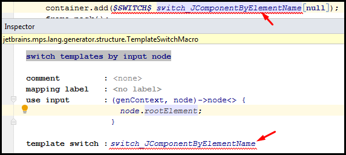
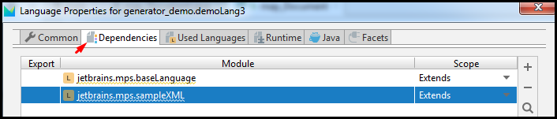
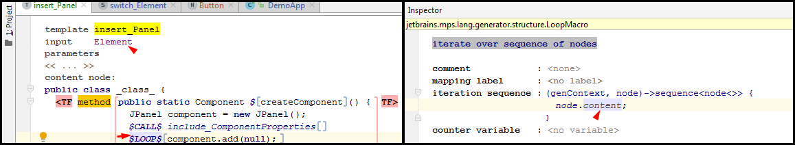
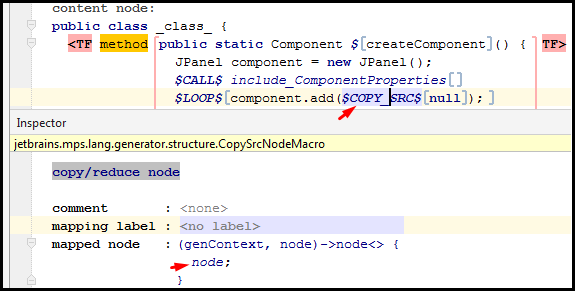
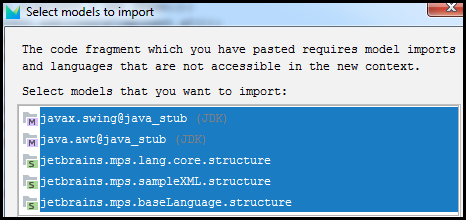
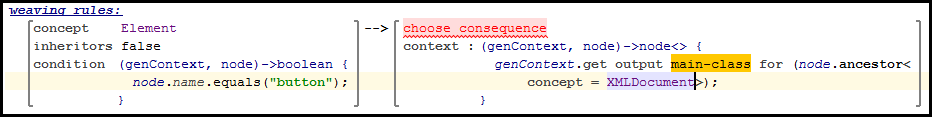

# [←](../README.md) <a id="Home"></a> JetBrains MPS Generators

## Table of Contents:
* [Intro](#intro)
* [TextGen (model-to-text)](#textgen)
* [Generator (model-to-model)](#generator)
 * [Demo 1](#demo1)
   * [Root Mapping Rule](#rootMapping)
   * [Property Macro](#propertyMacro)
   * [Java Swing Stub](#stubs)
   * [Switch macro](#switch)
 * [Demo 2](#demo2)
   * [Conditional Root Rule](#conditional)
   * [Loop Macro](#loop)
   * [Abandon Root Rule](#abandon)
 * [Demo 3](#demo3)
   * [Mapping label](#label)
   * [Template Fragment](#fragment)
   * [If macro](#ifmacro)
   * [INCLUDE / CALL macro](#includemacro)
   * [MAP_SRC macro](#mapmacro)
 * [Demo 4](#demo4)
   * [COPY_SRC macro](#copysrcmacro)
   * [Reduction Rules](#reductionrule)
 * [Demo 5](#demo5)
   * [Pre-processing Script](#preprocessing)
   * [Utility Classes in Generator](#utility)
   * [Post-processing Script](#postprocessing)
 * [Demo 6](#demo6)
   * [Reduction Rules](#reduction)
   * [Transient Model](#transient)
   * [Dividing Generation Process into Steps](#steps)
   * [Using Generation Tracer Tool](#trace)
 * [Demo 7](#demo7)
   * [Weaving Rules](#rules)
   * [Mapping Label](#mappinglabel)


## [↑](#Home) <a name="intro"></a> Intro
JetBrains MPS - это платформа для создания собсвтенных Domain-Specific Language, т.е. предметно-ориентированных языков.
Отличительной особенностью JetBrains MPS от обычных сред разработки (например, от IntelliJ Idea) заключается в том, что в JetBrains MPS мы работаем не с текстом, а с [Абстрактным синтаксическим деревом (AST)](https://www.jetbrains.com/help/mps/basic-notions.html#abstractsyntaxtree(ast).
Это дерево состоит из узлов (**node**). Каждый узел имеет свой тип, который называется на языке JetBrains MPS "**концептом**" ([concepts](https://www.jetbrains.com/help/mps/basic-notions.html#concept)).

Язык в MPS представляет собой набор концептов с набором дополнительной информации (редакторы, ограничения, системой типов и т.д.). Язык позволяет описать некоторую модель. А используя "[Generator](https://www.jetbrains.com/help/mps/basic-notions.html#generator)" выполняется **model-to-model** трансформация. Например, в качестве **target model** может выступать текстовые файлы (например, java код) или текстовые документы, такие как xml, html, latex и другие.

В рамках данного материала будут рассмотрены возможности генератора.
За основу возьмём материал из официального User's Guide: "[Generator Tutorial](https://www.jetbrains.com/help/mps/generator-demos.html#generatortutorial)".

За основу будет использоваться язык **sampleXML** - ``jetbrains.mps.sampleXML``.
Данный язык входит в состав установки JetBrains MPS в "Sample Projects":


И перед тем как углубляться в возможности генератора давайте посмотрим на проект **sampleXML**. Для начала, стоит разобраться в структуре языка:


Концепты описывают модель, которую можно описать при помощи UML следующим образом:
```UML
@startuml
object Document{
rootElement
}
object Element
object Attribute
object ElementPart
object Text
Document*-- "0..1" Element
Element*-- "0..n" Attribute
Element*-- "0..n" ElementPart
ElementPart <|.. Text
ElementPart <|.. Element
@enduml
```
Визуально такое описание будет выглядеть следующим образом:


То есть есть корневой концепт, описывающий корневой node - Document. У документа есть корневой элемент, который может иметь атрибуты и "части". В качестве части может выступать любой наследник ElementPart (Text или сам Element).


## [↑](#Home) <a name="textgen"></a> TextGen
В этом же проекте **sampleXML** есть модуль, который называется **sampleXML.sandbox**. Он имеет иконку с буквой **S** - то есть **Solution**. Это так называемое решение, которое использует язык. Sandbox говорит о том, что это "песочница", в которой можно проверить язык.
Создадим новый корневой **Node** (иконка с буквой N - Node) для документа:


Сделаем описание вроде такого:


И теперь через контекстное меню нашего Node выберем **"Preview Generated Text"**.
В итоге мы получим следующий результат:


И результат такой мы получили благодаря такой возможности MPS как TextGen.
Подробнее про неё рассказывается в "[User's Guide: TextGen](https://www.jetbrains.com/help/mps/textgen.html)".
Как сказано в этой документации, TextGen представляет собой **model-to-text** трансформацию. Состоит TextGen из конструкций, которые описывают, как превратить определённый node в текст.
Так как TextGen является аспектом языка, то и искать его надо там же, где и все остальные аспекты:


TextGen - сокращение от Text Generator. Это самый "низкоуровневый" генератор. Давайте посмотрим на **Document_TextGen**.
Согласно "[TextGen: Root concepts](https://www.jetbrains.com/help/mps/textgen.html#rootconcepts)" наш TextGen предоставляет два типа концептов:
- Text gen component
- Base text gen component

**Document_TextGen** представляет собой как раз обычный **TextGen Component**, который описывает трансформацию концепта (в нашем случае - Document) в текст.
Правила описания TextGen компонент просты:


TextGen срабатывает каждый раз, когда выполняется Rebuild. И мы получим ожидаемый результат:


Интересно так же выражение append by element. Потому что append - это специальное средство для "сдвига" (indent). Таким образом Child сдвинут относительно своего родителя - Root.
А вот by element - это уже часть другого описания - **ElementCreator**.
Он относится ко второму типу концептов TextGen - **Base text gen component**. Их назначение - определить переиспользоуемые textgen операции и утильные методы.
Как раз в этом файле и описан тот самый метод - **byElement**. Именно он используется в append.

На тему TextGen стоит посмотреть так же следующие материалы:
- [Introduction to JetBrains MPS, part 9: TextGen](https://www.youtube.com/watch?v=yNkJSBNrBlU)
- [MPS basics - generating text with TextGen](https://www.youtube.com/watch?v=aMRD9_9qWys)


## [↑](#Home) <a name="generator"></a> Generator
Ранее мы рассмотрели возможность **model-to-text** трансформации. Это хорошо, но основной фокус у JetBrains на другой тип трансформации: **model-to-model**.
Именно такой тип трансформации и позволяют описать генераторы.

В качестве информации нам понадобится "[Generator Tutorial](https://www.jetbrains.com/help/mps/generator-demos.html)". Все примеры из данного Tutorial разделяют один и тот же сценарий - использование языка SampleXML (мы его рассмотрели выше, когда говорили про TextGen) и трансформацию XML кода в Java Swing компоненты.

Для начала, создадим новый проект. Для этого в меню выберем **File → New → Project** или, если у нас нет открытых проектов, то в окне "Welcome to JetBrains MPS" выбираем **Create New Project**.
Выбираем **Empty project** и даём ему название. Например: "generator_demo".
Нажимаем "Ок".

Добавим в наш новый проект теперь знакомый нам проект **sampleXML**.
Для этого выбираем на вкладке "Projects" выбираем наш проект, и в контекстном меню выбираем **"Project Paths"**.
В открывшемся окне нажимаем на кнопку с плюсом. В открывшемся окне "Select Path" нажимаем на кнопку с домиком, чтобы перейти в каталог пользователя. Далее нам нужен подкаталог с название "MPSSamples." с версией установленной JetBrains MPS в названии.
После этого в подкаталоге **"sampleXML/languages/sampleXML"** выбираем файл **jetbrains.mps.sampleXML.mpl**.
Нажимаем кнопку "Apply". Убеждаемся, что на вкладке "Project" у нас появился язык:


Создадим теперь Solution - то есть решение, написанное на каком-то языке. В данном случае - на языке sampleXml. Для этого откроем контекстное меню по проекту на вкладке "Project" и выберем **New → Solutions**.
Назовём его как-нибудь, например: test_models. И нажмём "ОК".

Добавим теперь в Solution новую модель. Для этого выберем на вкладке "Project" наш Solution (запись с иконкой S). В контекстном меню выберем **New → Model**.
Назовём её как-нибудь. Например: "generator_demo.test1". Нажмём "ОК".

Далее нам откроется окно "Model Properties". В нём на вкладке "Used Languages" нажимаем кнопку с плюсом и добавляем язык **sampleXML**.

Теперь в нашей только что добавленной моделе (на вкладке Project имеет запись с иконкой M) через контекстное меню добавим новый документ: **New → Document**:


Теперь мы готовы к знакомству с его величеством генератором! =)


**--------------------------------------------------------------------------------**
### [↑](#Home) <a name="demo1"></a> Demo 1
В первом демо мы познакомимся с базовой функциональностью генератора. Поймём, что такое тэмплэйты (**templates**) и зачем нужны макро (**macro**).
Из базовых понятий мы рассмотрим **Root mapping rules**, **Root template** и **template switch**.

Итак, ранее мы ознакомились с DSL языком (language) с названием **simpleXML**, который предустановлен вместе с JetBrains MPS. Он имеет свою структуру, поэтому мы сможем взять его за основу и сделать акцент на генераторе.

**Генератор является аспектом языка**, поэтому для нового генератора нам понадобится каждый раз создавать новый язык. Чтобы использовать концепты языка **simpleXML** наш новый язык должен являться "расширением" языка **simpleXML**.
Приступим.

В контестном меню нашего проекта выбираем **New → Language**. Назовём наш новый язык. Например, дадим ему имя 'generator_demo.demoLang1'. Нажмём после этого "ОК".
В появившемся новом языке (запись с иконкой S) в контекстном меню выберем **"Module Properties"**.
На вкладке "Dependencies" добавим 2 зависимости:
- jetbrains.mps.sampleXML
- jetbrains.mps.baseLanguage
Scope выставляем - **"Extends"**. Подробнее см. [Module meta information](https://www.jetbrains.com/help/mps/mps-project-structure.html#modulemetainformation).


MPS при создании нового языка создал для нас пустой модуль генератора. Генератор является аспектом языка, поэтому расположен там же, где и другие аспекты (редактор, структура и т.д.).
Модель генератора называется **"main@generator"**.
Окончание **@generator** - это способ сообщить MPS, что это особая модель генератора, чтобы MPS её не путал с другими моделями. Любой Node в моделе генератора воспринимается MPS как шаблон или темплэйт (template), кроме случаев, когда он является частью языка генератора.

Внутри модели генератора есть **mapping configuration node**, который называется **main**. Mapping configuration как раз является частью языка генератора и не является шаблоном.
При необходимости Mapping configuration node можно создать через контекстное меню языка.


Mapping configuration node с именем **main** - похож на main метод в Java. Это своего рода "точка входа" в генератор, где определены правила, по которым генератор выполняет трансформацию модели. Так же здесь указаны темплэйты или шаблоны (templates), которые содержат код и placeholder'ы для значений, который нужны заполнить по входной модели.
Давайте поближе познакомимся с конфигурацией генератора (т.е. с начинкой Mapping Configuration Node).

#### [↑](#Home) <a name="rootMapping"></a> -- Root Mapping Rule
Начать знакомство стоит с "[Root Mapping Rule](https://www.jetbrains.com/help/mps/generator-user-guide-demo1.html#rootmappingrule)".
Как мы помним, генератор - это про model-to-model трансформацию. То есть у нас есть концепты, описанные на одном языке (на языке simpleXML) и мы хотим их превратить во что-то другое (в Java код в нашем случае). Кроме того, мы помним, что наша модель, которую мы трансформируем - это AST, то есть некоторое абстрактное синтаксическое дерево. А если это дерево, то у этого дерева есть корень. Этот корень - это некоторый node, представленный неким Root Concept. В нашем случае таким корневым node является node с концептом Document.
Таким образом **Root Mapping Rule** представляет собой начальную точку генерации. На входе в этой точке у нас есть некоторый концепт.

Откроем **mapping configuration node** с именем **main**.
Далее в нём найдём секцию **root mapping rules** и нажмём в ней Enter. Это добавит новое правило.
Укажем концепт для правила - наш главный/корневой концепт "Document":


Эта запись означает, что мы хотим трансформировать нашу модель так, что на входе у нас есть корневой node с концептом Document, а на выходе у нас будет что-то, что будет создано по некоторому шаблону/темплэйту (template).

Шаблон - это нечто, похожее на Java класс, то есть представляет собой **ClassConcept**, определённый в так называемом [BaseLanguage](https://www.jetbrains.com/help/mps/base-language.html). Это позволяет в MPS использовать Java код. И самый простой способ создать класс темплэйт - встать курсором на красное поле с текстом "no template", нажать Alt+Enter, выбрать **"New Root Template"**, выбрать **"class"**.
Таким образом MPS для нас создаст template, назвав его как **map_[название концепта]**.
Чтобы перейти в template можно кликнуть на него с зажатым Ctrl или нажать Ctrl+B.

Шаблоны, они же темплэйты (templates), называются так не случайно. Благодаря macro шаблоны наполняются содержимым (читай кодом) на основе входящей модели.
Например, посмотрим это на примере такого макро, как [Property Macro](https://www.jetbrains.com/help/mps/generator-user-guide-demo1.html#property-macro).

#### [↑](#Home) <a name="propertyMacro"></a> -- Property Macro
Property Macro - самый простой и понятный макро. Его задача на основе input node (то есть того node, к которому применяется трансформация) вычислить некоторое значение (property value).

Например, мы хотим сделать так, чтобы название нашего класса зависело от входящей модели. Для этого поставим курсор на названии класса. Далее, нам нужно добавить макро.
Для добавления макро удобно использовать Intention Menu, открываемое по Alt + Enter.
В Intention Menu следует выбрать пункт: **"Add Property Macro"**.
Можно так же использовать комбинацию "Ctrl + Shift + M" и выбрать **"Add Property Macro"**.
После этого мы увидим, что отображение названия класса изменится: участвующий в макро node будет обрамлён квадратными скобками, а перед скобками появится обозначение макро - знак $. Кроме того, для настрокйи макро откроется инспектор:


В инспекторе укажем, что мы хотим взять input node (в нашем случае это Document, о чём указано в самом начале темлэйта в квадратных скобках) и заменить название класса значением **node.name**.

#### [↑](#Home) <a name="stubs"></a> -- Stubs
После того, как у нас появился Java класс - надо наполнить его содержимым. Таким содержимым будет код Java Swing приложения. Для того, чтобы использовать Swing в MPS нам понадобятся такие вещи, как стабы или **[stubs](https://confluence.jetbrains.com/display/MPSD2/Stubs)**. Стабы - это такие особые модели, которые позволяют работать с различными библиотеками (которые вне MPS) из среды MPS.

Чтобы использовать Swing импортируем в модель генератора java_stub модели для пакетов:
- java.awt
- javax.swing

Для этого выберем модель генератора **main@generator** и в контекстном меню выбираем **"Model Properties"**. На вкладке **Dependencies** добавим новые зависимости (это называется импортом зависимостей):


После этого мы можем создать main метод в Java коде. Самый простой способ - набрать 'psvm' (от **P**ublic **S**tatic **V**oid **M**ain), что приведёт к автоматическому созданию main метода. Но можно набрать сигнатуру метода и вручную.
Далее, напишем обычный Java код:
```java
public static void main(string[] args) {
  JFrame frame = new JFrame("Demo");
  frame.setDefaultCloseOperation(JFrame.EXIT_ON_CLOSE);
  Container container = frame.getContentPane();
  container.setLayout(new FlowLayout());
  container.add(null);
  frame.pack();
  frame.setLocationRelativeTo(null);
  frame.setVisible(true);
}
```
Как мы помним, мы работаем с шаблоном Java кода. Давайте оживим "оживим" этот код, т.е. сделаем так, чтобы шаблон дополнился кодом во время генерации.
Как мы помним, "оживляется" шаблон при помощи макро.
Мы уже пробовали Property Macro. Давайте попробуем [SWITCH-macro](https://www.jetbrains.com/help/mps/generator-user-guide-demo1.html#switch-macro).

#### [↑](#Home) <a name="switch"></a> -- Switch macro
**Switch macro** - это макро, позволяющий при генерации менять темплэйты в зависимости от каких-то условий. Такая замена называется [Template Switches](https://www.jetbrains.com/help/mps/mps-generator.html#templateswitches).

Ранее мы передали в ``container.add()`` значение null. Вместо null нам нужно передавать или новую Button или новый Label, в зависимости от того, что указано в XML документе.
Мы хотим создавать ``new JButton()`` если root element в документе имеет имя **button** и создавать ``new JLabel()`` если имя **label**. Чтобы это сделать, мы "обернём" значение **null** в **SWITCH-macro**. Данный макро заменяет "обёрнутый" node (в нашем случае это null) на новый node, указанный в макро.

Для начала, нам необходимо создать новый **template switch** через контекстное меню модели **main@generator**:


Назовём наш switch как-нибудь. Например: `switch_JComponentByElementName'.
Далее перейдём в раздел **cases** и нажмём Enter для добавления нового условия.
В качестве **concept** указываем Element.
Далее переходим на **condition** и нажимаем Enter, чтобы заменить условие **always** на более специфичное. В нашем случае: ``node.name.equals("button")``.
Далее, встанем курсором на красное поле с текстом **choose consequence**.
Нажмём ``Ctrl + Space``, чтобы получить подсказку от JetBrains MPS:


Написать **new JButton()** в inline template не так интуитивно, как может показаться. Для того, чтобы это написать введём слово **new** и нажмём Ctrl + Space для подсказки:


Нам нужно **GenericNewExpression**. После этого можем дописать **JButton()**.
Повторим аналогично для Label:


Так же укажем default значение, если ничего из cases не подошло. Встаём курсором на значение для **default**, нажимаем Ctrl + Space и выбираем **dismiss top rule**.
Далее встаём курсором на **no message**, нажимаем Ctrl + Space и выбираем **generator message**. Укажем текст: **"button or label exprected"**. А вместо info укажем error.

Теперь нам осталось добавить наш макро. В моделе **main@generator** открываем наш template, в котором мы описывали ранее **main()** метод.
Выбираем в строке с ``container.add(null)`` параметр **null**.
Нажимаем Alt + Enter для открытия Intention Menu, в котором выбирем **Add Node Macro** (или просто нажать Ctrl + Shift + M). После этого нажмём Ctrl + Space для получения подсказки со списком доступных макро и выберем **$SWITCH$**.

После добавления макро раскроется блок с **инспектором**. В этом инспекторе в поле **template switch** при помощи Ctrl + Space выберем созданный нами template switch. А в **mapped node** получим **node.rootElement**:


Что же теперь будет происходить? Генератор начнёт с файла **main** в моделе **main@generator**, т.к. это точка входа в генератор. Генератор поймёт по списку в **root mapping rules**, что когда он видит в моделе node с концептом **Document**, то надо использовать определённый template (мы его с вами создали).
В этом template генератор будет генерировать Java код. А когда дойдёт до строки с **container.add** генератор поймёт, что если стоит $SWITCH$ макро, то вместо null нужно пойти в указанный template switch и "заинлайнить" (т.е. вставить в эту же строку) результат, согласно выбранному case из нашего template switch. Так как генератор работает с input node концепта Document, то в template switch мы передаём node.rootElement, т.к. наш template switch обрабатывает именно Element.

После любого изменения кода в генераторе нам нужно его собрать. Об этом нам укажет надпись **(generation required)** в дереве на вкладке **Project**. Выберем в этом дереве наш проект языка (с иконкой L) и нажмём для пересборки проекта **Ctrl + F9**.


Осталось только сгенерировать результат - Java код.
Вернёмся в наш solution, где мы создали модель test1. Если сейчас в контекстном меню node из модели выполнить **Preview Generated Text**, то мы получим не Java код, а XML (этот генератор описан в языке **sampleXML**):


Все дело в том, что JetBrains MPS не может сейчас совместить два языка (sampleXML и наше расширения над ним) без дополнительных указаний. Потому что MPS не понимает, что модель test1 написана на двух языках, т.к. мы нигде не используем явно наш язык (в нём не объявлено никаких собственных концептов, только генератор).
Поэтому, мы должны явно указать MPS включить в процесс генерации генератор из нашего языка.
Для этого, выбираем в дереве на вкладке **Project** модель test1 и в контекстном меню выбираем **Model Properties**. На вкладке **Advanced** укажем **Languages Engaged On Generation**:


Если мы снова выполним **Preview Generated Text**, то теперь мы увидим Java код:


Добавим ещё один Node в нашу модель test1 и увидим, что мы можем сгенерировать текст сразу для двоих Node. Для каждого Node будет свой файл.


**--------------------------------------------------------------------------------**
#### [↑](#Home) <a name="demo2"></a> Demo 2
Во втором демо мы будем создавать единое Java приложение для всех найденных Document в моделе, т.е. Java application per input model.

Создадим новый язык. Как мы помним, для этого на вкладке **Project** мы выбираем проект, правой кнопкой мыши открываем по нему контекстное меню и выбираем в нём **New → Language**.
Дадим ему Language Name - 'generator_demo.demoLang2'.

Ранее в [Demo 1](#demo1) (т.е. в demoLang1) мы уже создали template (map_Document). Не будем заново создавать темплэйт, а скопируем этот темплэйт из **'main@generator'** из demoLang1 к нам в **'main@generator'** из demoLang2.

MPS при копировании темплэйта увидит зависимости, которые были указаны в demoLang1 и спросит, какие из них нужно оставить. Оставляем все зависимости, кроме генератора main@generator, т.к. генератор demo2 не должен зависеть от генератора demo1:


Аналогичным образом поступаем с **template switch** из demo1 с названием **'switch_JComponentByElementName'**.
Интересно, что после копирования switch template мы всё равно получим ошибку, когда откроем копию template в проекте demo2 и откроем инспектор макро **$SWITCH$**:



Дело в том, что template в MPS хранится в особом виде. Это не текст, а тоже своего рода модель. Поэтому, когда мы копируем что-то (например, template), то в копии остаются те же ссылки, которые пытаются ссылаться на те же вещи. В нашем случае "те же" - это template switch из языка demoLang1.
Чтобы исправить это, в инспекторе макро из нашей новой копии встанем на значение в **template switch** и при помощи **Ctrl + Space** выберем template switch уже из проекта demo2.
После этого можем выполнить в меню **Build → Rebuild Project**. И теперь ошибок у нас нет, можем приступать к работе над [Generator User Guide Demo2](https://www.jetbrains.com/help/mps/generator-user-guide-demo2.html).

#### [↑](#Home) <a name="conditional"></a> -- Conditional Root Rule
В рамках demo2 нам предстоит познакомится с **Conditional Root Rule**.
Работает он по аналогии с Root Mapping Rule - то есть генерирует в выходной моделе (т.е. в результате) некоторй корневой node. Но в отличии от **Root Mapping Rule** мы можем управлять этим процессом, описывая при каких условиях какой template нужно выбрать.
Кроме того, **Conditional Root Rule** - это специальные правила, которые создают node в output model не на основе концепта, а просто используют некоторый шаблон. У этих правил нет входного концепта, но есть доступ к контексту генерации (genContext).

Перейдём в нашем новом модуле demoLang2 в модель генератора **main@generator** и в конфигурацию **main**. Перейдём в ней в секцию **conditional root rules section** и нажмём Enter для добавления нового правила.
В качестве teplate укажем наш шаблон, который мы скопировали из demoLang1:


Как мы видим, при условии **always** (т.е. всегда, т.к. мы не указали иное) будет применяться шаблон map_Document. Согласно [User Guide's: Generator Rule](https://www.jetbrains.com/help/mps/generator-language.html#generatorrule) данное правило применяется только один раз на прогон генератора.

Далее зажав Ctrl нажмём левой кнопкой мыши по template **"map_Document"**, чтобы перейти в него. Как мы ранее говорили, conditional rules не используют input node, поэтому уберём из input в самом верху нашего скопированного template упоминание про концепт **Document**. Для этого двойным кликом выделим input node:


После этого первым нажатием Delete сотрём node, а вторым нажатием укажем, что node **unspecified**.

Так же нажмём удалим Property Macro из названия нашего класса. Для этого в строке ``pulbic class $[map_Document]`` кликнем на знак $ для выбора макро и нажмём Delete.
Это нам нужно потому, что больше у нас нет входного node и класс мы создаём один на всю входную модель. Поэтому, можем класс назвать просто **DemoApp**.

Получается, что у нас больше нет входного node. Откуда же мы будем наполнять данными наш генерируемый код? А будем мы брать из модели и контекста генерации. И в этом нам поможет [LOOP Macro](https://www.jetbrains.com/help/mps/generator-user-guide-demo2.html#loop-macro).

#### [↑](#Home) <a name="loop"></a> -- Loop Macro
**Loop Macro** позволяет повторять конструкцию внутри макро много раз, итерируясь (т.е. проходя циклом) по некоторой коллекции node.

Выберем строку ``container.add($SWITCH$[null]);``, **включая** точку с запятой.
Для выбора удобно пользоваться комбинацией клавиш **Ctrl + W**, повторной нажатие которой делает выделение больше.

Теперь у нас есть выбранная конструкция. После этого нажмём **Alt + Enter** и выберем **Add Node Macro** (или просто нажмём **Ctrl + Shift + M**).
В качестве макро выберем **$LOOP$** (можно написать вручную или выбрать из подсказки, вызванной по нажатию Ctrl + Space).
В появившемся инспекторе укажем, что мы хотим проходить цикл (LOOP) по корневым элементам входной модели типа Document:


Вот и всё. Остаётся только выбрать наш Language module из demoLang2 и пересобрать его, выполнив **Ctrl + F9** (или через контекстное меню и команду Rebuild).

Чтобы проверить, что мы всё сделали верно, перейдём в модель "test1" в нашем Solution "test_models". В контекстном меню модели выберем пункт **Clone Model** и дадим новое имя модели 'generator_demo.test2'.

Далее в контестном меню склонированной модели выберем **Model Properties** и на вкладке **Advanced** из секции **Languages Engaged on Generation** уберём 'generator_demo.demoLang1' и добавим 'generator_demo.demoLang2'.
Далее через контекстное меню модели test2 выполним rebuild и сделаем **"Preview Generated Text**.
Отлично, наш код готов и обрабатывает все root nodes. Хотя и есть один побочный эффект - мы до сих пор генерируем xml. Давайте это исправим. И в этом нам поможет [Abandon Root Rule](https://www.jetbrains.com/help/mps/generator-user-guide-demo2.html#abandonrootrule).

#### [↑](#Home) <a name="abandon"></a> -- Abandon Root Rule
Abandon Root Rule позволяют исключать input root node из генерации, таким образом указанные в Abandon Root Rule концепты не будут скопированы в выходную модель (т.е. в output model).

В нашем случае, мы при помощи **Abandon Root Rule** можем предотвратить копирование Document'ов в результирующую выходную модель.
Для добавления **Abandon Root Rule** перейдём в **mapping configuration** (в модели **main@generator**) и в секции **abandon rules** добавляем новое правило.
В качестве концепта указываем корневой концепт Document, по которому генератор генерировал xml.
Теперь, пересоберём наш модуль языка (demoLang2) через Ctrl + F9 и теперь при Privew сгенерированного текста мы увидим только java код, без XML. Ура, наши цели достигнуты.


**--------------------------------------------------------------------------------**
#### [↑](#Home) <a name="demo3"></a> Demo 3
В третьем демо мы рассмотрим поддержку параметризации компонентов. Кроме того, эти параметры будут отличаться для разных типов компонентов.

По традиации, создадим новый язык через контекстном меню проекта **New → Language** и назовём новый язык 'generator_demo.demoLang3'.
Через контекстное меню нового языка перейдём к **Module Properties** и на вкладке **"Dependencies"** в зависимостях укажем extended dependency от **jetbrains.mps.baseLanguage** и **jetbrains.mps.sampleXML**.



Генератор в demo3 похож на генератор из demo2.
Поэтому, скопируем, как мы ранее уже делали, template **DemoApp** из модели **main@generator** из demoLang2 в наш новый язык demoLang3.
При предложении выбрать, какие модели нужно импортировать при копировании, как и раньше, выбираем все, кроме **main@generator**, т.к. зависимость от генератора из demoLang2 нам не нужна.

Теперь мы готовы к ознакомлению с [Generator User Guide Demo3](https://www.jetbrains.com/help/mps/generator-user-guide-demo3.html).
Откроем темлэйт **DemoApp** в demoLang3 и домавим новый статический метод:
```java
public static void addContent(Container container) {
}
```
Теперь опишем dummy метод, который будет возвращать Component для добавления. Dummy - потому что фиктивный или метод-болванка. Далее мы вместо него будем подставлять при помощи макро настоящий код. Но всему своё время. Итак, наш dummy метод:
```java
public static Component component() {
	return null;
}
```
Теперь вставим в метод addContent вызов нашей "болванки":
```java
public static void addContent(Container container) {
	container.add(component());
}
```
Далее найдём строчку, где мы ранее использовали $LOOP$ макро.
Заменим ``$LOOP$[container.add($SWITCH$[null]);`` на ``addContent(container);``.
Итого, у нас получается:


Итак, у нас есть метод addContent, где мы в контейнер добавляем компоненты. Каждый компонент представлен node, имеющим концепт Element. Таким образом, мы должны в методе addContent пройтись циклом по элементам и добавить для них Component.

Мы уже умеем пользоваться макро $LOOP$ для итерации по элементам.
Поэтому, становимся в методе **addContent** на вызов метода **add** и нажимаем **Ctrl + W** до тех пор, пока не будет выделена вся строка, от первого символа до точки с запятой в этой же строке.
После этого открываем Intent меню при помощи **Alt + Enter** и выбираем **Add node macro**. Выбираем макро - **$LOOP$**. А в инспекторе указываем итерацию по модели:


Как мы помним, для каждого элемента (т.е. для каждого node), являющимся Element'ом мы хотим выполнять свой метод component(). Таким образом, нам так же нужно в цикле пройтись по элементам и создать для каждого свой код.
Для этого мы снова воспользуемся макро $LOOP$.
Встанем на метод **component()** и нажимаем **Ctrl + W** до тех пор, пока не будет выделен весь метод (от слова public до закрывающей фигурной скобки).
После этого открываем Intent меню при помощи **Alt + Enter** и выбираем **Add node macro**. Выбираем макро - $LOOP$. А в инспекторе указываем итерацию по модели:


Далее, нам нужно узнать про такую вещь, как **Mapping label**.

#### [↑](#Home) <a name="label"></a> -- Mapping label
[Mapping label](https://www.jetbrains.com/help/mps/generator-language.html#mappinglabel) - это специальные объявления в mapping конфигурации (та, которая main в моделе main@generator), которые используются, чтобы находить по известному input node неизвестный output node.
Label переводится как бирка, метка, ярлык. Это поможет дальше понять, что это такое.

Для начала, опишем **mapping label**.
Перейдём в mapping конфигурацию main внутри модели main@generator.
Добавим новый label внутри секции **mapping labels**:


Назовём наш label именем "method" вместо "no name".
В качестве **Input Concept**: укажем Element.
В качестве **Outut Concept**: укажем StaticMethodDeclaration.
Такой label нужен для того, чтобы по входному node с концептом Element находить соответствующий ему StaticMethodDeclaration (т.е. объявление статического метода).

Приступим к замене вызова dummy метода **component()** вызовом реального сгенерированного метода, соответствующем нужном input Element'у.
Для этого в теле метода addContent кликаем мышкой на вызове статического метода component (таким образом выделяется только название метода, без скобок для аргументов метода). Нажимаем **Ctrl + Shif + M** (или открывваем Intent меню через Alt + Enter) и выбираем **Add Reference Macro**.


Теперь, при помощи Reference Macro мы можем выполнить поиск по label для node:


Выбираем **get output by label and input**. В качестве label выбираем созданный нами label c именем "method", а в качестве input node указываем node:


Получается, что в методе addContent мы для каждого node с концептом Element будем вызывать container.add. В качестве аргумента передаётся вызов статического метода. То, какой метод в реальности надо выполнить будет определять label, который связывает входящий node с концептом Element и соответствующий ему статический метод.

Но пока что у нас не описана связь Element'а и соответствующего ему метода. Давайте это сделаем. В этом нам помогут **Template Fragment**'ы.

#### [↑](#Home) <a name="fragment"></a> -- Template Fragment
Template Fragment - как следует из названия, это фрагменты темплэйта. Она нужны для того, чтобы их вставить в основной фрагмент в нужное время и место.

Начнём с того, что нам понадобится **template switch**, т.к. мы хотим иметь разные темплэйты для разных элементов, то есть делать между темплэйтами switch (переключение).
Выбираем в дереве на вкладке **Project** модель генератора (**main@generator**) и в контекстном меню выбираем **New → template switch**.
Назовём наш template switch "switch_Element" и добавим 2 случая (cases) для концепта "Element":


Однако, теперь вместо **consequence** (следствия из condition) мы не можем использовать **inline template**, т.к. наше следствие теперь будет сложнее, чем в demo 2.
Поэтому, через контекстное меню модели генератора (main@generator) выбираем пункт меню **New → template declaration** и создадим 2 template:
- Template для кнопок: "insert_Button"
- Template для лэйблов: "insert_Label"

Начнём с созданного нами template declaration "insert_Button".
Перейдём в **content node**, наберём слово **class** и нажмём Ctrl + Space для подсказки. Выберем в подсказке **ClassConcept**:


В качестве названия класса укажем **_class_** и опишем статический метод:
```java
public static Component createComponent() {
	JButton component = new JButton();
    return component;
}
```
После добавления кода мы увидим ошибку-подсказку от JetBrains MPS:


Опишем теперь **Template Fragment**.
Как мы помним, только метод нам нужен как template fragment. Поэтому, кликнем на название метода "createComponent" и повторяем нажатие **Ctrl + W** пока не будет выбран весь метод (от public до закрывающей фигурной скобки). После этого открываем по нажатию Alt + Enter знакомое нам Intention меню и выбираем в нём **"Create Template Fragmet"**.
Кроме того, сделаем ссылку на этот фрагмент, чтобы этот фрагмент можно было получить. Для этого мы как раз и воспользуемся нашим mapping label'ом.
Кликнем по ``<TF`` и в появившемся инспекторе укажем label **"method"**:


То есть мы привязали к label с одной стороны тот самый StaticMethodDeclaration.
Таким образом наш фрагмент выглядит следующим образом (отображает label):


Сейчас правда есть небольшоая проблема - у нас для всех input элементов будут генерироваться элементы с одинаковыми именами, что приведёт к ошибке компиляции java кода в том случае, если input элементов будет более, чем один.
Чтобы это исправить нужно сгенерировать уникальные имена через **Property Macro**.
Для этого выберем название метода "createComponent", нажмём **Alt + Enter** и в Intention меню выберем **"Add property macro"**.


В качестве **"baseName"** укажем основу генерируемых имён. Эта основа будет одинакова в именах всех сгенерированных имён. В нашем случае мы укажем в качестве основы значение **templateValue** - это специальное значение, которое возвращает то, над чем указано property macro, то есть в нашем случае это "createComponent".

После того, как мы закончили с JButton, аналогично нужно поступить для JLabel.
Переходим в template с название "insert_Label".

Как мы помним, нам нужно создать класс, статический метод которого станет template фрагментом. Поэтому в content node пишем "class" и при помощи подсказки по Ctrl + Space выбираем **"Class Concept"**.
Объявленный класс нужно как-нибудь назвать. Например, как и ранее: **_class_**.

Далее, в "insert_Label" так же опишем статический метод:
```java
public static Component createComponent() {
  JLabel component = new JLabel();
  return component;
}
```
Далее при помощи **Ctrl + W** выбираем весь метод (от public до закрывающей фигурной скобки) и через Intention меню (по Alt + Enter) выбираем **Create Template Fragment**.
Кликаем после этого ``<TF`` и в инспекторе указываем **mapping label**: "method".
Завершаем это всё кликом по названию метода "createComponent" и через Intention меню по Alt + Enter выбираем **"Add Property Macro"**. В инспекторе Property Macro выбираем ``genContext.uniqie name from (templateValue)``.


Теперь, дозаполним наш template switch:


Теперь мы можем вернуться в **DemoApp**, выбрать при помощи **Ctrl + W** метод **component()** (от public до закрывающей фигурной скобки) и при помощи Intent меню по Alt + Enter выбрать **"Add Node Macro"**. В качестве макро указать **$SWITCH$**.
В качестве **template switch** указать наш свитчер элементов:


Напоследок в mapping конфигурации, как это было в demoLang2, в разделе **Conditional Rules Mapping** добавим правило с условием always для темплэйта **DemoApp**.
Кроме этого, так же как в demoLang2, добавим в **abandon rules** концепт Document.
Выполним Rebuild для нашего языка demoLang3.

Теперь остаётся только перейти в модуль Solution, который мы ранее назвали "test_models". Создадим в нём новую модель "test3".
В качестве используемого языка (Used Language) указать "jetbrains.mps.sampleXML".
На вкладке "Advanced" в 'Languages engaged on generation' указать language "demoLang3" (see Generator User Guide Demo2 for details).

Создадим теперь два корневых Node:


Теперь можем выбрать наш **Solution** и посмотреть, какой код сгенерируется:


Добавим теперь ещё немного макро.

#### [↑](#Home) <a name="ifmacro"></a> -- IF macro
Посмотрим на то, как можно применить другие макро.
Например, рассмотрим применение [IF Macro](https://www.jetbrains.com/help/mps/generator-user-guide-demo3.html#addingan$if$macro).

Перейдём в template "insert_Label".
Давайте сделаем так, чтобы мы могли указать текст для компонента.
Поэтому, модифицируем наш метод, добавив вызов **component.setText**:
```java
public static Component $[createComponent]() {
  JLabel component = new JLabel();
  component.setText("text");
  return component;
}
```
Как мы понимаем, текст для компонента может быть указан, а может быть не указан. Поэтому, нам нужно обработать это условие. Поэтому, добавим IF macro.
Выделим всю строку с component.setText (включая точку с запятой) при помощи Ctrl + W.
Нажмём **Alt + Enter** и выберем **"Add Node Macro"** и укажем макро **$IF$**.
Нам нужно среди всех аттрибутов **node** типа **Element** найти первый атрибут с текстом "text":


Здесь интересная особенность. Мы **"attribute"** получаем у выражения **node as Element**. По результату это похоже к приведению типов из Java. Так вышло потому, что мы не указали Input node для теплэйта. Если мы его укажем - то необходимость в таком "касте" отпадёт.

Остаётся теперь выделить литерал **"text"** и получить вместо него значение из входной модели.
При помощи Alt + Enter открываем Intention меню и выбираем **"Add Property Macro"**. Получаем значение аналогично If Macro:


Аналогично, мы можем сделать для темплэйта "insert_Button".

Далее, стоит поговорить про переиспользование шаблонов.

#### [↑](#Home) <a name="includemacro"></a> -- INCLUDE / CALL macro
Поговорим теперь про [Reusable template](https://www.jetbrains.com/help/mps/generator-user-guide-demo3.html#reusabletemplate), то есть про переиспользование шаблонов.
А поможет нам в этом INCLUDE Macro.

Проблема, которую решит переиспользование шаблонов, создание всё большего количества компонентов и роста дублирующегося кода.
Лучшее решение - создать шаблон, который будет содержать общий код и переиспользовать один шаблон для каждого компонента.

Реализуем пример - мы хотим добавить поддержку property "enabled".
Создадим "shared" (общий) темлэйт и будем его переиспользовать в других темплэйтах используя макро INCLUDE-macro.

Перейдём в модель генератора **"main@generator"** в языке demoLang3.
Создадим новый темплэйт через контекстное меню модели генератора, выбрав в нём пункт **"New → Template Declaration"**.
Дадим новому template имя "include_ComponentProperties", а в качестве input node укажем "Element".
В качестве **"content node"** выберем **StatementList**:


Далее в этот Statement List добавим следующее объявление:
```java
JComponent component = null;
```
В Generator demo 3 по этому поводу сделано особое замечание:
> The name of variable is important - generator will resolve references by this name.

Далее добавим блок после объявление переменной компонента.
Встанем на точку с запятой после null, наберём '{', нажмём Ctrl+Space и выберем "block statement":


Добавим в этом block statement следующую строку:
```java
component.setEnabled(false);
```
Далее кликаем по открывающей фигурной скобке для выбора всего block statent и через Alt+Enter в Intention меню выбираем **"Create Template Fragment"**:


Осталось теперь добавить сам $INCLUDE$ макро.
Откроем template 'insert_Button'. Встанем курсором перед словом **return** и нажмём Enter для добавления пустой строки. Именно сюда мы сейчас добавим макро.
На пустой строке нажимаем Alt + Enter для открытия Intention меню и выбираем "Add node macro". Выбираем макро - **$INCLUDE$**.
Тадам - сюрприз. Макро $INCLUDE$ теперь deprecated, т.е. он устарел и будет удален в следующих версиях. Но на момент версии **2019.1.5** он ещё остаётся жить.
Но мы, как люди идущие в ногу со временем, можем прочитать в [WHAT'S NEW IN MPS 2018.3](https://www.jetbrains.com/mps/whatsnew/2018.3/#v2018-3-generator), что макро $INCLUDE$ заменяется на макро $CALL$:


Аналогичным образом поступаем в другом темплэйте - 'insert_Label'.
Теперь почувствуем всю полезность сделанного. Нам нужно сделать так, чтобы setEnabled выставлялся не всегда false. Теперь нам достаточно поправить код в одном месте!

Чтобы воплотить это в жизнь познакомимся с новым макро - $MAP_SRC$.

#### [↑](#Home) <a name="mapmacro"></a> -- MAP_SRC macro
Познакомимся с последним в рамках demo 3 макро - [MAP_SRC](https://www.jetbrains.com/help/mps/generator-user-guide-demo3.html#map_src-macro).

Перейдём в Template "include_ComponentProperties" и выберем всю строку с методом setEnabled, включая точку с запятой. При помощи Alt + Enter открываем Intention меню и выбираем "Add node macro". Укажем макро - $MAP_SRC$. И укажем, как смапить выражение на node:


Данный макро позволяет смапить данное выражение не просто на Element, но на его атрибут с именем "enabled".
Теперь мы можем в методе component.setEnabled выбрать аргумент "false". При помощи Alt + Enter открываем Intention меню и выбираем "Add property macro".


Теперь можем выполнить для нашего Language модуля demoLang3 и Solution. Если мы сейчас посмотрим "Preview generated text" модели в Solution, то должны увидеть, как у нас появился в коде код, вызывающий setEnabled, если такой параметр был задан в моделе.


**--------------------------------------------------------------------------------**
### [↑](#Home) <a name="demo4"></a> Demo 4
В четвёртой части демо мы будем дальше развивать генератор из языка [demoLang3](#demo3). Мы добавим компонент панели (JPanel). В отличии от кнопок или лэйблов панели могут содержать другие компоненты, включая другие панели.
Поэтому, нам нужно научиться справляться с такой рекурсией.
А поможет нам в этом [Generator User Guide Demo4](https://www.jetbrains.com/help/mps/generator-user-guide-demo4.html).

Традиционно через контекстное меню проекта создаём новый язык.
Даём новому языку имя - **'generator_demo.demoLang4'**.
Через контекстное меню языка открываем "Module Properties".
В Module Properties на вкладке "Dependencies" традиционно добавляем:
- jetbrains.mps.sampleXML
- jetbrains.mps.baseLanguage

Scope выставляем **"extends"**. Подробнее см. [Module meta information](https://www.jetbrains.com/help/mps/mps-project-structure.html#modulemetainformation).
Далее в моделе генератора **"main@generator"** удаляем все дочерние элементы и копируем **ВСЕ** дочерние элементы из моделя генератора **"main@generator"** из demoLang3. Все из предложенных зависимостей импортируем.

Теперь самое время приступить к созданию [Template for Panel](https://www.jetbrains.com/help/mps/generator-user-guide-demo4.html#templateforpanel).

Ранее у нас уже были темплэйты для генерации кода для компонентов. По аналогии создадим темплэйт для компонента JPanel.
Ранее мы в наш новый проект demoLang4 скопировали темплэйты из demoLang3, в том числе и темплэйт insert_Label. Давайте его выберем в дереве проекта:


Правой кнопкой мыши открываем по данному темплэйту контекстное меню и выбираем пункт контекстного меню **"Clone Root"**. После чего переименуем копию в **insert_Panel**.
В самом темплэйты заменим JLabel на JPanel. А так же удалим строчку с вызовом метода **component.setText**, т.к. у JPanel нет параметра "текст".

Вспоминаем, что в demoLang3 у нас был template switch, который назывался **switch_Element**. У нас добавляется новый case для панелей, поэтому добавим:


Создадим теперь для нашего четвёртого демо свою тестовую модель. Перейдём в Solution, который мы ранее назвали **test_models** и склонируем (при помощи пункта контекстного меню **Clone Model**) модель **test3**, которую мы создавали для demoLang3.
Назовём новую модель **generator_demo.test4**. Выбрав новую модель в контекстном меню выберем "Model Properties". Перейдём на вкладку "Advanced" и заменим "language engaged on generation" c demoLang3 на demoLang4.
После чего создадим Node для описания панели:


Теперь мы можем сделать Rebuild для нашего языка demoLang4 и для модели test4.
После этого на модели test4 можем выполнить **Preview Generated text**. Если мы посмотрим на сгенерированный код, то увидим, что в методе **addComponent** панель и её содержимое добавляется напрямую в контейнер, игнорируя тот факт, что некоторые компоненты вложены в панель. Это нам и предстоит исправить.

Начнём с того, что вернёмся к темплэйту **DemoApp**, который содержит наш основной Java код. Там есть описание метода добавления компонентов:
```java
public static void addComponent(Container container) {
  $LOOP$container.add(->$component());
}
```
Кликнем по макро $LOOP$ и в инспекторе изменим итерацию с итерации по Element на итерацию по **genContext.inputModel.roots(Document)**.
Это сломает нам соседний reference macro, поэтому починим и его:


Но теперь компоненты, вложенные в панель не будут добавляться вообще. И это то, с чем мы теперь будет бороться. А поможет нам в этом макро COPY_SRC.

#### [↑](#Home) <a name="copysrcmacro"></a> -- COPY_SRC macro
[COPY_SRC](https://www.jetbrains.com/help/mps/generator-user-guide-demo4.html#copy_src-macro) макро заменяет тот участок кода, над которым этот макро объявлен, определённым node. Если для этого node указан reduction rule, то такое rule будет применено до того, как node попадёт в результат.

Откроем снова наш темплэйт **insert_Panel**.
Добавим перед return новую строчку:
```java
component.add(null);
return component;
```
Далее встанем на строку с вызовом метода **component.add** и при помощи Ctrl + W выделяем всю строку (включая точку с запятой) и в Intention меню (Alt + Enter) выбираем **Add node macro**. Выбираем макро LOOP и указываем итерацию по содержимому панели. Чтобы мы смогли сослаться на содержимое Element, в самом верху темплэйта укажем в качестве input node концепт Element.



Естественно, null добавлять мы не хотим. Поэтому, выделим null и при помощи Intention меню (Alt + Enter) выберем **Add node macro** и укажем макро **COPY_SRC**. В качестве **mapped node** укажем просто node:



Интересно, что сейчас, если мы сделаем Rebuild языка и попробуем сделать Rebuild нашего Solution, то мы получим ошибку


Дело в том, что node на момент генерации должен во что-то превратиться. По умолчанию, будет выполнена попытка испльзовать textGen. Но мы хотим превратить node не просто в текст, а в код. Поэтому, нам нужно описать так называемые **Reduction Rules**.

#### [↑](#Home) <a name="reductionrule"></a> -- Reduction Rules
Итак, что же такое [Reduction Rule](https://www.jetbrains.com/help/mps/generator-user-guide-demo4.html#reductionrule)?
Reduction Rules - это правила, описывающие трансформацию из языка-источника в язык-назначение (или в конечный язык). Например, трансформация нашего XML элемента в Java swing компонент.

Перейдём в mapping конфигурацию в языке demoLang4 и создадим Reduction Rule, которое будет применяться к Elements. После чего через Intention меню создадим новый темплэйт для этого rule:


Теперь зажав Ctrl кликнем по имени добавленного template, указанного для reduction rule. Таким образом мы в него перейдём.
После создания в темплэйте в **content node** будет пусто.
Укажем в content node текст **"ClassConcept"**:


Добавим статический метод:


Далее выберем как на скриншоте выше только **"\_method\_()"** (т.е. со скобками, но без точки с запятой), и через intention меню (Alt + Enter) выберем **Create Template Fragment**. Выбираем без точки с запятой потому что мы хотим сделать template fragment для вызова метода (method call), а не для всего выражения (не Statement):
> The rightmost ';' symbol should be outside the template fragment, otherwise, you'd be wrapping a Statement not a MethodCall.

Остаётся теперь в template fragment выделить только текст **"\_method\_"** (т.е. без скобок) и добавить через Intention меню (по Alt + Enter) **reference macro** и через **genContext** выбрать **get output by label and input**:


В качестве лэйбла используем "method", а в качестве нода - node.
Пересоберём (т.е. сделаем Rebuild) наш demoLang4. После чего пересоберём модель test4 в нашем solution "test models".
В контекстном меню модели test4 выбираем **Preview Generated Text**.
Мы получаем тот результат, которого и добивались. Дочерние элементы создаются внутри панели, а не снаружи:


**--------------------------------------------------------------------------------**
#### [↑](#Home) <a name="demo5"></a> Demo 5
Наше пятое демо про использование скриптов и утильных классов (utility classes).

Говоря про скрипты генерации (generation scripts) стоит отметить, что существует два типа скриптов:
- **Pre-processing scripts**
Вызываются _ДО_ применения правил и обычно изменяют input model для удобства её использования в правилах
- **Post-processing scripts**
Вызываются _ПОСЛЕ_ применения всех правил и применяются к output model

Кроме того, на порядок выполнения скриптов мы можем повлиять. Давайте теперь это увидим на практике.
Для начала, традиционно, созадим новый Language. Через контекстное меню проекта выберем **New → Language** и назовём новый язык: **generator_demo.demoLang5**.
Далее, выберем новый язык (модуль с иконкой L) и перейдём при помощи контекстного меню в **"Module Properties"**. На вкладке "**Dependencies**" добавим со scope=extends две зависимости: **'jetbrains.mps.sampleXML'** и **'jetbrains.mps.baseLanguage'**.
Далее займёмся генератором. Удалим mapping конфигурацию **main** из модели генератора **main@generator** нашего demoLang5 и скопируем сюда всё содержимое модели генератора из demoLang4. При копировании импортируем все предложенные зависимости:



Далее перейдём в Solution модуль (с иконкой S) с именем "test_models", выберем модель "test4" и через контекстное меню выполним "clone model". Новую модель назовём test5.
Выберем после этого склонированную модель test5 и через контекстное меню откроем Model Properties. На вкладке "Advanced" заменим в 'engaged on generation' язык demoLang4 на язык demoLang5.
После чего в моделе test5 откроем узел документа "Panel" и добавим текстовый node:


Теперь мы готовы к знакомству со скриптами генерации.

#### [↑](#Home) <a name="preprocessing"></a> -- Pre-processing Script
Как мы сказали ранее, [Pre-processing скрипты](https://www.jetbrains.com/help/mps/generator-user-guide-demo5.html#pre-processingscript) помогают подготовить input model к применению к ней generation rules.
Например, в нашем случае, генератор языка demoLang5 не поддерживает текстовые node, хотя они имеют такое же значение, как label элементы с атриубутом text.
Вместо того, чтобы добавить ещё новые правила в генератор мы добавим pre-processing скрипт, который сконвертирует все текстовые ноды в input model'е в label элементы и тогда наши ранее описанные правила смогут обработать и текстовые ноды (т.к. они уже станут не текстовыми, а обычными label элементами).

Скрипты являются частью процесса генерации, поэтому живут там же где и всё остальное - в модели 'main@generator'. Поэтому, через контекстное меню модели генерации выберем **New → Mapping script**.
Назовём созданный скрипт 'fix_text' и укажем script kind 'pre-process input model'.
Значение флага "modifies model" ставим true, т.к. мы собираемся изменять модель.
Остаётся только ввести код, который выполняет поиск и замену всех текстовых элементов в input model.
Выглядеть будет это следующим образом:
```java
nlist<Text> texts = model.nodes(Text);
foreach text in texts {
  // Replace with a label element
  node<Element> label = text.replace with new(Element);
  label.name = "label";
  // Add the text attribute
  node<Attribute> attribute = label.attribute.add new(<default>);
  attribute.name = "text";
  attribute.value = text.text;
}
```
Остаётся только добавить скрипт в mapping конфигурацию 'main' в секцию pre-processing скриптов:


Выполним Rebuild для нашего demoLang5 и соответствующей ему модели test5 в solution test_models.
Если мы сейчас сделаем Preview Generated Text для модели test5, то увидим, что для текста "Hello everybody!" успешно создан Label. Ура, цель достигнута.

#### [↑](#Home) <a name="utility"></a> -- Utility Classes in Generator
Иногда может появиться необходимость вынести код из самого скрипта. Это позволит его переиспользовать при необходимости.

Утильный класс не может быть создан непосредственно в модели генератора 'main@generator', т.к. в этом случае он был бы воспринят как ещё один template, так же как и остальные элементы, находящиеся внутри main@generator.
Поэтому, создадим отдельную модель для утильных классов.
Выберем модуль **"generator"** и в контекстном меню выберем **New → Model**.
Назовём модель "util" и убедимся, что поле Stereotype пустое:


Внутри нашей новой модели util создадим класс TextUtil. Внутри класса создадим статический метод fixText:
```java
public class TextUtil {

  public static void fixText(model model) {
    // Get all strings from model
    nlist<StringLiteral> strings = model.nodes(StringLiteral);
    // Get all MPS string
	sequence<node<StringLiteral>> mpses;
	mpses = strings.where({~it => it.value.startsWith("MPS"); });
	foreach mps in mpses {
  		// Convert MPS to JetBrains MPS
  		mps.value = "JetBrains " + mps.value;
	}
  }
}
```
Мы собираемся вызывать утильный метод fixText в пост-процессинговом скрипте и передавать в этот метод output model, чтобы в этой output model заменить все строки, начинающиеся на "MPS" строкой, которая будет начинаться с "JetBrains MPS".

#### [↑](#Home) <a name="postprocessing"></a> -- Post-processing Script
По аналогии с Pre-processing Script'ом для нашего [Post-processing Script](https://www.jetbrains.com/help/mps/generator-user-guide-demo5.html#post-processingscript)

В моделе генератора 'main@generator' в языке demoLang5 создадим новый mapping script (по аналогии с тем, как мы это сделали для Pre-processing Script).
Назовём скрипт "refine_text".
Далее, необходимо иметь возможность использовать в моделе генератора наш утильный класс. Для этого выберем модель 'main@generator' и через контекстное меню откроем "Model properties".
На вкладке Dependencies добавим **generator_demo.demoLang5.generator.util**.

После импорта util модели мы можем использовать наш класс в скрипте:


Осталось только добавить скрипт "refine_text" в файл mapping конфигурации, в секцию post-processing скриптов:


Остаётся только выполнить Rebuild для demoLang5 и соответствующей модели test5 в solution модуле. И проверить через Preview Generated Text, что скрипты действительно отработали.

**--------------------------------------------------------------------------------**
#### [↑](#Home) <a name="demo6"></a> Demo 6
В 6 части демо мы собираемся расширить возможности jetbrains.mps.sampleXML, внеся некоторые изменения в "базовый" синтаксис языка. Мы хотим сделать так, чтобы demo6 добавило новый синтаксис, который будет готов к обработке генератором, который мы написали в demo5.
Выглядеть новый синтаксис будет следующий образом:


Итак, приступим к реализации [Generator User Guide Demo6](https://www.jetbrains.com/help/mps/generator-user-guide-demo6.html).

Начнём, как обычно, с создания нового языка. Через контекстное меню проекта выберем **New → Language**. По традиции назовём его:  **generator_demo.demoLang6**.
Далее выберем добавленный язык (модуль с иконкой с символом L - Language) и через контекстное меню откроем **Module Properties**.
На вкладке **Dependencies** добавим 'jetbrains.mps.sampleXML' and 'jetbrains.mps.baseLanguage' со scope равным "Extends".

Далее, перейдём в модуле demoLanguage6 в модель **"structure"** и создадим новый концепт, который назовём **'Button'**. В данном концепте объявим property с типом string и именем text. И для концепта укажем alias. Унаследуем концепт от ElementPart.
То есть выйдет что-то вроде:


В нижней части окна перейдём на вкладку "Editor", добавим "Concept Editor" и опишем редактор следующим образом:


По аналогии выполнить для концепта 'Label'. Для удобства мы можем вспомнить, что мы можем выбрать концепт Button в дереве проекта и через контекстное меню выполнить "Clone Root". К сожалению, editor не копируется вместе с концептом, поэтому придётся editor скопировать вручную из Button в Label, не забыв изменить текст.
После чего выбираем модуль языка и в контекстном меню выбираем **Rebuild**.

#### [↑](#Home) <a name="reduction"></a> -- Reduction Rules
Итак, начнём с Reduction Rule, который помогут нам конвертировать наши новые концепты в XML Elements из базового языка sampleXML. Помним, что согласно **[Generator Language: Generator Rule](https://www.jetbrains.com/help/mps/generator-language.html#generatorrule)**, Reduction Rule - это правила, которые описывают по которым input node будет трансформирован в момент копирования этого node в output model.

Откроем модель `main@generator` в нашем языке demoLang6. Мы сейчас будем создавать Reduction Rule для превращения наших концептов в концепты sampleXML. Следовательно, чтобы использовать концепты sampleXML нужно указать, что мы хотим использовать язык sampleXML. Для этого через контекстное меню модели `main@generator` откроем "Model Properties" и на вкладке "Used Languages" добавим sampleXML.

После этого в mapping конфигурации 'main' в моделе `main@generator` в нашем языке demoLang6 создадим новое reduction rule с inline template (как мы помним, Ctrl + Space нам покажет подскажу):


Теперь мы можем в inline template описать Element, в который превратится Button:


В самом template укажем Property Macro для текста:


Аналогичное делаем для концепта "Label".
После этого делаем Rebuild нашего языка demoLang6.

Теперь испытаем написанное нами. Для этого перейдём в наш solution модуль 'test_models' и склонируем **test5** модель (при помощи пункта **clone model** контекстного меню модели **test5**).
Назовём новую модель **test6**.
Теперь через контекстное меню модели **test6** откроем "Model properties". На вкладке "Used Languages" добавим наш новый язык demoLang6.
Далее на вкладке "Advanced" добавим demoLang6 к demoLang5, т.к. мы хотим использовать одновременно два генератора. Генератор из demoLang5 - основной генератор, который знает как трансформировать основной DSL и генератор из demoLang6 - который знает, как трансформировать новый DSL.

Теперь, опишем Panel на новом DSL:


Выполним Rebuild через контекстное меню нашей новой модели **test6**. И тут мы получим ошибки:


Чтобы понять, что происходит необходимо выбрать node "Panel" (тот, в котором мы использовали новый DSL) и через его контекстное меню выполнить "Preview Generated Text".
Мы получим ту же ошибку (что ожидаемо). Но теперь если мы кликнем по красному тексту ошибки в Message View, то MPS нам покажет, где же она случилась:


Текст ошибки будет гласит:
``No textgen for jetbrains.mps.SamleXML.structure.Element``

Если посмотреть на mapping конфигурацию из demoLang5 (как мы помним, мы в том числе используем генератор из demoLang5 для нашего Solution), то увидим, что у нас там описан Reduction Rule для Element.
Если посмотреть на описание, то мы увидим, что там используется Reference Macro, при помощи которого выполняется поиск объявления статического метода с помощью mapping label "method":
``genContext.get output method for (node)``

Лэйбл "method" присваивается в темлэйтах "insert_Label" и "insert_Button". Но что-то пошло не так. Почему мы не можем найти методы теперь?
Чтобы ответить на этот вопрос нам следует познакомиться ближе с процессом генерации.
И начнём мы с такого понятия, как **"transient model"**.

#### [↑](#Home) <a name="transient"></a> -- Transient Model
Что вообще такое Transient Model? Согласно [JetBrains MPS Generator Cookbook](https://www.jetbrains.com/help/mps/generator-cookbook.html#generator-cookbook.xml) основанная на template'ах "transformation phase" состоит из одного или более микро-шагов. Один такой шаг - это одиночная трансформация входной модели (input model) в выходную модель (output model). То есть Transient Model - это output model для текущей generation phase.
JetBrains MPS позволяет сохранять Transient Model. Для этого нужнов главном меню выбрать **Build → Save transient model**.
Теперь, выполнив rebuild мы увидим, как в дереве проекта отображается Transient Model:


В Transient Model мы видим **'test6@0'** - это первый шаг.
Мы можем раскрыть этот первый шаг и увидеть, что на нём генератор создаёт transient model. Если приглядеться к node "Panel", то мы увидим, что текст во входной модели был заменён на Label элемент. То есть на этом шаге у нас отработал pre-process скрипт из demoLang5.

Затем на следующем шаге (**'test6@2_0'**) мы видим, что в output model появляется класс "DemoApp", а следовательно - генератор из demoLang5 применил conditional root rules.
Кроме этого, мы видим, что вызван шаблон **insert_Panel** и его LOOP-макро будет выполнен. В insert_Panel мы в LOOP создаём выражение 'component.add()' для каждого доечернего элемента внутри panel и выполняем reduce (т.к. применяем макро $COPY_SRC$) для child. Благодаря этому задействуются Reduction Rules из mapping конфигурации генератора из demoLang5.

Далее, сравнение двух разных этапов генерации поможет нам понять, что происходит с нашей Transient моделью:


Далее откроется окно с разницей в Transient модели на разных этапах:


Таким образом, на одном из этапов (generator_demo.test6@6_6) элементы нашего нового DSL, описанного в demoLang6 превращаются в XML Elements, т.е. срабатывают reduction rules из demoLang6.
Как видно, здесь то и пошло всё не так. И тут стоит помнить про особенность процесса генерации. Когда заканчивается одна фаза генерации и начинается другая фаза, генератор создаёт новую transient model, которая становится новой output model. Прошлая output model становится же наоборот, input model. То есть таким образом все transient model как бы выстраиваются в цепочку.
Генератор выполняет генерацию каждой новой transient model считая, что это этого ничего не было, то есть он не запоминает, что он делал до этого. Но есть одна оговорка - conditional root rules никогда не применяются дважды.

Получается, что сначала сработал генератор из demoLang5 и благодаря единичному выполнению conditional root rules у нас появился 'DemoApp' класс, при этом текст был успешно сконвертирован в Label и был превращён в метод. Однако, наши Button и Label не были обработаны, т.к. они представлены на момент выполнения генератора из demoLang5 концептами demoLang6, о которых никто в demoLang5 не знает.
Получается, ошибка во времени выполнения генераторов. Нам необходимо описать, каким образом выполнять шаги генерации.

#### [↑](#Home) <a name="steps"></a> -- Dividing Generation Process into Steps
Итак, как нам предлагают в шестом демо, нам необходимо процесс генерации [Divide Generation Process into Steps ](https://www.jetbrains.com/help/mps/generator-user-guide-demo6.html#dividinggenerationprocessintosteps).

Перейдём в аспекту "generator" из demoLang6 и откроем его Module Properties через контекстное меню. На вкладке "dependencies" добавим генератор из demoLang5:


Генератор в качестве dependency имеет символ G (Generator). Scope выставляем Extends.
Далее нам необходимо указать приоритет. Для этого перейдём на вкладку "Generators priorities". Нажимаем кнопку с плюсом для добавления нового описания приоритета. После чего при помощи двойного клика левой кнопкой мыши по содержимому столбца "Extended Generators" настраиваем приоритет следующим образом:


Теперь, мы можем выполнить Rebuild нашего demoLang6 и соответствующей модели в solution модуле. Если всё выполнено правильно - все ранее полученные ошибки уйдут.

#### [↑](#Home) <a name="trace"></a> -- Using Generation Tracer Tool
Напоследок стоит поговорить про такую вещь, как [Generation Tracer Tool](https://www.jetbrains.com/help/mps/generator-user-guide-demo6.html#usinggenerationtracertool).

MPS сохраняет не только transient модель, но и различную информацию о процессе трансформации. Эти данные могут быть просмотрены при помощи **Generation Tracer Tool**.
Например, выберем в transient model кусочек этой model:


Теперь в контекстном меню выберем **Language Debug → Show Generation Traceback**.
После этого мы увидим трассировку процесса генерации:


По двойному клику мы увидим, что на каждом этапе (stage) генерации происходило. Например, на самом первом этапе у нас было просто ``label ( MPS! )``. Далее применялось reduce rule, по которому концепт label превращался в inline template.
И в самом конце этот inline template инлайнится (то есть вставляется) в основной DSL, но уже на языке demoLang5.


**--------------------------------------------------------------------------------**
### [↑](#Home) <a name="demo7"></a> Demo 7
Вот и пришла пора для финального, седьмого демо, описанного в **[Generator User Guide Demo7](https://www.jetbrains.com/help/mps/generator-user-guide-demo7.html)**.
В этом финальном демо мы сможем узнать, как используется weaving rules и root mapping rule.

По традиции через контекстное меню нашего проекта создаём новый Language и назовём его 'generator_demo.demoLang7'. Через контекстное меню нового language модуля (который мы только что добавили) открываем "Module Properties". На вкладке "Dependencies" добавляем две зависимости: **'jetbrains.mps.sampleXML'** и **'jetbrains.mps.baseLanguage'**. Выставляем им scope - Extends. Подробнее про Extends можем вспомнить прочитав про [Module meta information](https://www.jetbrains.com/help/mps/mps-project-structure.html#modulemetainformation).
Далее переходим в аспект generator нашего нового language модуля и удаляем из него пустую mapping конфигурацию с названием "main". Вместо неё скопируем маппинг конфигурацию "main" из ранее созданного нами demoLang2. При копировании исключаем добавление импорта генератора (main@generator) из demoLang2. Кроме этого, из demoLang2 скопируем темплэйт 'DemoApp'.

Далее, вместо того, чтобы иметь все XML Elements в виде отдельных root элементов в input моделе мы их "обернём" в один root концепт, который будет называться XMLDocument. Концепт наш будет выглядеть следующим образом:


Далее, опишем Editor для нового концепта. Написать его просто. Editor должен описывать коллекцию (collection) элементов. Эта коллекция должна быть vertical.
Таким образом мы получим:


Далее перейдём в наш темплэйт `DemoApp` (который мы скопировали из demoLang2) в самом начале. Сейчас у нас есть строчка с ошибкой (в этой строчке мы использовали LOOP и SWITCH макро). Давайте изменим наш код темплэйта. Для начала, создадим пустой статический метод addContent:
```java
private static void addContent(Container container) {
  <no statements>
}
```
Теперь мы можем очистить всё содержимое строки с ошибкой и вместо неё вставить вызов статического метода, который мы только что описали: ``addContent(container);``.

Теперь перейдём в наш Solution модуль 'test_models' и создадим в нём новую модель 'test7'. На вкладке "Used Languages" добавим **'jetbrains.mps.sampleXML'** and **'jetbrains.mps.samples.generator_demo.demoLang7'**.
Чтобы продолжить сделаем Rebuild для модуля языка demoLang7. Скорей всего, у вас упадёт с ошибкой из-за того, что скопированная mapping конфигурация имеет неправильную ссылку на demoApp темплэйт (на тот, что лежит в demoLang2, а не на тот, что лежит в demoLang7). При помощи Ctrl + Space исправим ссылку и повторим rebuilt для language модуля demoLang7.

После этого в новой моделе добавим корневой node для XMLDocument:


В прошлых демо для инстанциирования темплэйта класса DemoApp мы использовали **conditional root rules**. В этот раз для Demo 7 мы будем использовать другой механизм - **root mapping rules**:


Теперь, самое время перейти к знакомсту с **[Weaving Rules](https://www.jetbrains.com/help/mps/generator-user-guide-demo7.html#weavingrules)**.

#### [↑](#Home) <a name="rules"></a> -- Weaving Rules
Что же такое эти Weaving rules и для чего они нужны? Согласно [User Guide: Generator Language](https://www.jetbrains.com/help/mps/generator-language.html#generatorrule), эти Weaving rules позволяют добавлять дополнительные child ноды в output модель. Эти правила обрабатываются в конце микрошага генерации, перед выполнением map_src и reference макро. Эти rule применяются на каждом input node указанного концепта.

В нашем случае weaving rules позволят нам вставить код добавления swing компонентов в их контейнеры.
Откроем маппинг конфигурацию 'main' и создадим новое Weaving Rule:


#### [↑](#Home) <a name="mappinglabel"></a> -- Mapping Label
Мы будем использовать [Mapping label](https://www.jetbrains.com/help/mps/generator-user-guide-demo7.html#mappinglabel) для того, чтобы найти сгенерированный 'DemoApp' node в output моделе. Как уже обсуждалось в Demo 3, mapping label служат в качестве своего рода регистров для сгенерированных node, чтобы эти сгенерированные node можно было получить из других частей генератора. Это позволяет ослабить связь между независимыми частями генератора.
Чтобы использовать mapping label его необходимо описать в маппинг конфигурации:


В нашем случае, мы собираемся применять mapping label к правила, которое генерирует DemoApp класс (Root mapping rule). По этой причине мы выбрали именно ClassConcept.
Далее прикрепим label к root mapping rule:


Теперь перейдём обратно к Weaving Rule и укажем следующий код:



Таким образом, теперь мы корректное получаем DemoApp class соответствующий обрабатываемому XMLDocument'у и передаём его в weaving rule и тогда мы можем добавить в него новые методы.

Остаётся теперь создать темплэйт для weaving rule (который будет использован для генерации добавляемого в DemoApp кода).
В красном поле 'choose consequence' наберём 'weave_Button', нажмём Alt + Enter и выберем пункт меню: 'New Template'. После чего перейдём в созданный template при помощи компбинации Ctrl + B или при помощи клика с зажатым Ctrl.
Добавим в темплэйт кусок кода:


Выбрав всё описание метода (см. скриншот) при помощи Alt + Enter открываем Intention меню и выбираем в нём пункт **"Create Template Fragment"**.

Далее добавим IF макро вокруг выражения ```component.setText("text");```.
Выберем для этого выражение и при помощи Intention меню (Alt + Enter) добавим Node макро:


Далее кликнем на текстовый литерал "text" и через Intention меню добавим Property макро:


Чтобы закончить этап с генератором необходимо создать другое Weaving Rule, которое будет применено к 'label' Element.
Для этого откроем маппинг конфигурацию 'main'.
Выбеем weaving правило, которое мы создали для 'button' (выберем всё правило при помощи Ctrl + W), нажмём Ctrl + D (D - Duplicate) для создания дубликата правила.
Выполним следующие изменения для нового правила (т.е. для дубликата):
- В правиле в condition исправим button на label
- В дереве проекта выберем 'weave_Button' и в контекстном меню выберем Clone Root
- Клон, сделанный по 'weave_Button', переименуем в 'weave_Label'
- В 'weave_Label' заменим все JButton на JLabel
- re-auto-complete 'setText' если method call не определён автоматически
- Указать 'weave_Label' template для нового weaving rule (который для label)
- Выполнить Rebuild для language модуля demoLang7

Но если мы сейчас выполним Rebuild для test7 модели в solution, то получим ошибку компиляции. Потому что наши оба weaving rule отработают успешно, но создадут код с одинаковым названием метода:


Чтобы это исправить нужно сгенерировать уникальные имена для методов. Для этого откроем темплэйт 'weave_Button', выделим название метода ``createComponent`` и при помощи Intention меню (Alt + Enter) добавим Property Macro.
В качестве значения укажем в инспекторе:
```
genContext.unique name from (templateValue) in context (<no node>)
```
Выполним аналогичные действия для темплэйта 'weave_Label'. После чего выполним Rebuild нашего language модуля. После этого выполним Rebuild и для модели test7 в нашем Solution 'test_models'. На этот раз никаких ошибок быть не должно.

Мы описали создание компонентов, но не описали вставку этих компонентов. Как мы помним, мы создали метод addContent. Но этот метод сейчас пуст. Давайте исправим это, создав [second template fragment](https://www.jetbrains.com/help/mps/generator-user-guide-demo7.html#secondtemplatefragment).

Для начала, нам необходимо сохранить метод 'addContent()' в label, чтобы иметь возможность сослаться на этот метод из weaving rules.


Теперь, укажем привязку генерируемого метода к LABEL node macro. Перейдём в DemoApp.
Выделим полностью метод, от private до закрывающей фигурной скобки:
```
private static void addContent(Container container) {
  <no statements>
}
```
Через Intention меню добавим node макро **$LABEL$**:


Теперь необходимо добавить новое weaving rule в секции weaving rules в маппинг конфигурации 'main'. Это правило будет вставлять вызов 'createComponent()' в метод 'addContent()':


Теперь нужно добавить новый template. Выберем один из ранее созданных template'ов, например "weave_Label" и через контекстное меню выполним **"clone root"**.
Назовём новый темплэйт **"weave_ElementInitialization"** и напишем небольшой кусок кода:


Теперь выберем всю строчку (от первого символа до точки запятой включительно) вызова ```container.add``` и через Intention меню выберем **"Create Template Fragment"**.
Далее кликнем в вызове ```container.add``` по container и добавим через Intention меню новый **Reference macro**.


Настоящий 'createComponent()' метод должен будет получен откуда-то - mapping label отработает. Поэтому, создадим новый mapping label:


LABEL node-макро поможет нам сохранить 'createComponent()' метод в лэйбл createComponentMethods как для Button, так и для Label в их weaving rules/templates.
Выполним одинаковые действия в weave_Button и weave_Label:


Теперь мы можем вернуться в темплэйт **weave_ElementInitialization** и указать reference макро на вызове 'createComponent()' для получения соответствующего 'createComponent()' метода из маппинг лэйбла 'createComponentMethods':


Не забудем указать темплэйт weave_ElementInitialization для weave rule, для которого мы его создавали. Теперь, выоплняем rebuild для language модуля и модели test7 в solution.

Теперь можем выделить XMLDocument в test7 и в контекстном меню выбираем "Preview generated text". Проверим, что всё работает:


Как мы видим, теперь всё правильно. Наше demo 7 выполнена. Теперь можно выдохнуть, так как все 7 демо мы смогли выполнить.