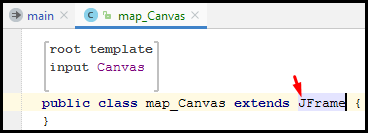
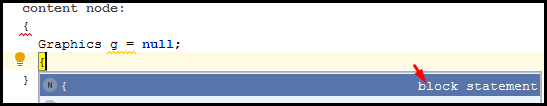
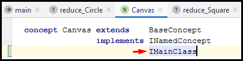

# [←](../README.md) <a id="Home"></a> JetBrains MPS Shapes project

## Table of Contents:
- [JetBrains MPS Intro](#intro)
- [New Project](#newproject)
- [Concept (Концепты)](#concepts)
- [Root concept (корневой концепт)](#rootconcepts)
- [Editor (редактор)](#editor)
- [Accessory models(вспомогательные модели)](#accessory)
- [Reference(ссылки)](#reference)
- [Editor Component](#editorcomponent)
- [Generator](#generator)
    - [Root mapping rules](#rootrules)
    - [Параметризация шаблонов](#parametrizingthetemplate)
- [Generating code (Генерация кода)](#generation)
- [Выполнение кода](#runningthecode)
- [Генерация XML](#xmlgeneration)
- [Дополнительно](#additional)


## [↑](#Home) <a name="intro"></a> JetBrains MPS Intro
JetBrains предоставляют множество IDE для написания программ на различных языках программирования. Но есть один проект, который выделяется - JetBrains MPS.
JetBrains MPS - это платформа для разработки собственных DSL, то есть "**Domain-specific Language**" или предметно-ориентированного языка.
Отличное объяснение цели - в "[Intro Video of JetBrains MPS](https://www.youtube.com/watch?v=1yQ5kj6svRM)".
Например, у нас есть задача - написать программу, которая будет по описанию динамически рисовать элементы. Переписывать каждый раз программу для разного рисования - очень затрано. Значит, нужно чтобы программа рисовала по входному описанию. Придётся разработать для этого свой синтаксис. Это и будет наш DSL - предметно-ориентированный язык. Например:
```
Painting MyDrawing
circle x: 200 y: 300 radius: 100 color: BLUE
square x: 50 y: 150 size: 100 color: GREEN
square x: 350 y: 150 size: 100 color: RED

```
Но кроме этого нам придётся написать парсер для этого синтаксиса, средства редактирования и могут появиться ещё другие накладные расходы в ходе разработки, доработки и развития. Эти проблемы и пытается снять с наших плеч JetBrains MPS.
**MPS** - от "**Meta programming system**", то есть система для метапрограммирования.
Метапрограммирование - это программирование, при котором разработчик создаёт не конечный продукт (программу), а другую программу (например, предметно-ориентированный язык), при помощи которой будет получен конечный результат.

Давайте перейдём на страницу [JetBrains MPS](https://www.jetbrains.com/mps/), скачаем последнюю версию и запустим JetBrains MPS. Теперь, нам необходимо создать проект.

## [↑](#Home) <a name="newproject"></a> New Project
Разработка начинается с создания проекта. После запуска JetBrains MPS мы увидим окно приветствия - "Welcome to JetBrains MPS". В этом окне есть пункт "**Create New Project**", при помощи которого мы можем создать новый проект.
JetBrains MPS позволяет создать "Language project" и "Solution project".
Language - это "язык", то есть это проект с описанием нашего DSL.
Solution - это "решение", то есть проект, который использует DSL для решения задач.

Так как мы будем описывать язык, то выбираем для нового проекта тип - Language.
Назовём проект и язык "Shapes".
Кроме этого укажеи флаг "Create sandbox solution". Sandbox - это "песочница", в которой мы можем поэксперементировать и протестировать наш язык. Нажмём "ОК".
Какое-то время JetBrains MPS будет выполнять индексацию содержимого проекта (для быстрого поиска, переключения и т.д.). После чего мы увидим структуру проекта:


Как мы видим, корневой элемент в дереве проекта - сам проект Shapes. Он состоит из двух модулей (**module**): solution для "песочницы" и language "Shapes" для DSL.
Модуль языка содержит дочерние элементы. Эти элементы - аспекты языка. Каждый такой аспект - являются частью описания модели нашего языка.
Более подробно про структуру проекта - "[MPS project structure](https://www.jetbrains.com/help/mps/mps-project-structure.html)".

Кроме того, мы видим подпись - "generation required". Каждый раз, когда мы такое видим, означает, что в моделе языка были сделаны изменения. Чтобы эти изменения можно было использовать в solution'ах нужно "пересобрать" (**Rebuild**) модуль языка. Для этого нужно выделить модуль языка (с иконкой L - Language) в дереве проекта и в контекстном меню выбрать "**Rebuild**":


**Дополнительно:** Сохраняя JetBrains MPS проект в git стоит воспользоваться советами из темы с форума MPS: "[Any advices for GIT .ignored ?](https://mps-support.jetbrains.com/hc/en-us/community/posts/360000518080-Any-advices-for-GIT-ignored-)".

Теперь мы готовы начать. И на нашем пути нам поможет официальный tutorial - "[Shapes - an introductory MPS tutorial](https://www.jetbrains.com/help/mps/shapes-an-introductory-mps-tutorial.html)". А начинается путь - с концептов.

## [↑](#Home) <a name="concepts"></a> Концепты (concepts)
Концепты - это то, из чего состоит наш **DSL**. Концепты представляют какие-то понятия, сущности языка. Как сказано в [Languages and programs under the hood](https://www.jetbrains.com/help/mps/shapes-an-introductory-mps-tutorial.html#languagesandprogramsunderthehood), концепты определяют абстрактный синтаксис языка.
Концепты в MPS похожи на классы в Java. А если быть точным, то классы в Java являются концептами языка Java.

Начнём мы с концепта "**Shape**", т.е. "**Фигура**". Фигура будет у нас общим супер-концептом (super-concept) и будет содержать общие свойства (property), такие как цвет. Остальные фигуры будут наследоваться от этой.
Для создания концепта необходимо в дереве проекта выбрать аспект языка "structure" (т.е. структура языка) и через контекстное меню данного аспекта языка выбрать "**New → Concept**".
Сразу после создания мы увидим в редакторе "no name", подсвеченное красным:


При наведении мы увидим подсказку, что для property "name" нарушено ограничение (constraint). В данном случае, имя концепта не может быть пустым. Укажем имя - Shape.
После того, как название для концепта выбрано мы можем заметить слева изображение лампочки:


Она говорит о том, что с текущим элементом (т.е. с концептом) доступны какие-то действия. И предлагает нажать на лампочку или нажать комбинацию ``Alt + Enter``.
Комбинация Alt + Enter открывает "**Intention Menu**", т.е. меню действий.
Мы хотим сделать концепт Shape абстрактным. Для этого в Intention Menu выберем пункт "**Make abstract**".
Теперь, у нас есть общий концепт для фигур. Давайте их и опишем.

Начнём с описания круга. Создадим в аспекте "structure" новый концепт "**Circle**".
После созданиея концепта для круга нужно унаследовать его от концепта Shape.
Для этого кликаем на "**BaseConcept**". Теперь мы можем нажать ``Ctrl + Space`` чтобы открыть меню автодополния, оно же "**code completion**". Варианты, которые нам предложит code completion, зависят от того, в каком положении стоит курсор. Например, если курсор стоит после "BaseC", то нам предложат все варианты, которые начинаются именно с этой последовательности. Повторное нажатие комбинации Ctrl + Space сместит курсор к началу элемента и тогда мы сможем выбрать все доступные варианты. Если мы начнём набирать теперь имя "Shape", то code completion будет подсказывать нам доступные варианты:


Соответственно, выбираем в качестве родителя концепт Shape.
Далее рекомендуется заполнить в концепте Circle значение для "alias". Это позволит пользователям нашего DSL видеть красивое текстовое название для концепта.

Как мы видим, у концептов есть секция "properties". Эта секция позволяет для концептов описать некоторые свойства.
В секции "properties" мы видим ``<< ... >>``. Это означает, что сейчас коллекция элементов (в данном случае коллекция properties) пуста. Для добавления элемента кликаем на это обозначение и нажимаем Enter.
Укажем имя свойства - **x**. Для перехода к выбору типа данных в этом свойстве нажимаем Tab. Тип данных можно выбрать из списка. Как обычно, для этого можно нажать Ctrl + Space для открытия code completion меню:


Если набрать int и нажать Ctrl + Space, то так как есть единственный вариант, он и будет выбран автоматически и вместо int наш JetBrains MPS поставит integer.
Добавим в концепт круга ещё 2 integer поля: **y** и **radius**.
Итого, наш первый не абстрактный концепт выглядит так:


По аналогии создадим концепт для другой фигуры - квадрат:


## [↑](#Home) <a name="rootconcepts"></a> Root concept (корневой концепт)
Итак, у нас есть фигуры. Нужно их где-то рисовать. Часто то, на чём размещают графические изображения, называют "холст" (**canvas**). Пусть пользователь нашего DSL сможет создавать различные canvas'ы, которые будут независимы друг от друга и не будут "видеть" фигуры друг друга. Таким образом, каждый canvas будет иметь собственное имя и список фигур, которые на нём изображены.

Как мы понимаем, это новый концепт.
Cоздадим новый концепт в аспекте "structure" нашего языка. Назовём его "Canvas".
Ранее мы сказали, что по нашей задумке каждый canvas имеет своё имя. Этого можно добиться при помощи стандартного интерфейса **INamedConcept**, который нам предоставлен MPS по умолчанию. Чтобы его добавить кликнем на ``<none>`` после слова **implements**. Давайте снова при помощи code completion (как мы это ранее делали для extends) выберем интерфейс INamedConcept. Для этого после того, как мы встали курсором на ``<none>`` нажимаем ``Ctrl + Space`` и выберем INamedConcept:


Canvas представляет собой своего рода виртуальный холст, на котором будут риосваться другие концепты. Поэтому, сам canvas не будет иметь родителя, а будут являться родителем для дочерних элементов - фигур (shapes). Т.к. концепт Canvas не имеет родителей и является родительским, то он является **Root concept**.
Поэтому, для концепта укажем для свойства "**instance can be root**" значение **true**.
Осталось описать, что концепт Canvas содержит концепты фигур, являясь для них родителем. Поступаем аналогично тому, как мы это делали с **properties**, но уже для секции **children**. Кликаем по "<< ... >>" в секции **children**, нажимаем Enter для добавления нового элемента.
Название переменной, в которой будут храниться дочерние элементы в MPS называется **role**. Назовём эту переменную **shapes**. Далее нажмём Tab.
При помощи Ctrl + Space откроем code completion меню для target и выберем в нём **Shape**. Укажем cardinality равную **0..n**, то есть фигур может быть от 0 до n.
Таким образом, наш концепт Canvas будет иметь следующий вид:


Таким образом у нас есть описание концепта холста и фигур. Минимальный синтаксис нашего DSL готов. Давайте посмотрим, как это работает.
Как мы уже говорили ранее [при создании проекта](#newproject), для того, чтобы использовать язык нужно собрать все сделанные изменения, то есть выполнить **Rebuild**. Для этого выберем модуль языка Shapes (с иконкой L - Language) и через контекстное меню выполним Rebuild. Если ошибок в логе нет, а подпись "generation required" рядом с модулем исчезла - значит пока что мы всё делаем верно.

Переходим в модуль с нашим sandbox solution. Так как это решение, т.е. Solution, то около этого модуля стоит иконка S - Solution. Внутри модуля мы видим модель с названием sandbox. Так как это модель, то на иконке мы видим m - model.
Через контекстное меню модели sandbox перейдём в "Model properties", т.е. в свойства модели. Там на вкладке "Used languages" должен быть добавлен наш language "Shapes".
Теперь мы можем выбрать модель и через контекстное меню выбрать "**New → Canvas**":


Концепт Canvas здесь доступен именно потому, что он является корневым.
Так как мы работаем в Solution и указали используемый язык Shapes, то мы теперь пользуемся нашим DSL. Работа с нашим DSL точно такая же, как работа в JetBrains MPS. Например, коллекция shapes пустая и вместо неё отображается значение по умолчанию: ``<< ... >>``
Если в ней нажать Enter - появится новый элемент. Ctrl + Space откроет code completion, в котором будет выбор из доступных элементов, т.е. указаны названия всех дочерних для Shape концетов:


Как мы видим, редактирование выглядит не очень красиво. Это потому что мы не описали, как пользователь нашего языка будут редактировать модель нашего языка. Мы описали аспект структуры, но не описали аспект редактирование - "**editor**".

## [↑](#Home) <a name="editor"></a> Editor (редактор)
JetBrains MPS представляет язык не как текст, а как модель в виде AST - абстрактного синтаксического дерева, состоящего из node (узлов). Для этого JetBrains представляет так называемый [MPS Projectional Editor](https://www.youtube.com/watch?v=iN2PflvXUqQ), т.е. редактор проекции этого AST. Давайте воспользуемся им.
Так как Shape - это абстрактный концепт, то ему редактор не нужен. Начнём с Circle.


Из редактора концептов при помощи вкладки "**Editor**" можно перейти в описание аспекта **editor** для данного концепта.
Перейдя на вкладку **editor** мы увидим пустое место с предложением создать новый аспект. При клике в любом месте в пустом окне откроется меню, где мы должны выбрать пункт меню "****" для создания нового аспекта **editor** для данного концепта:


Данное действие можно так же выполнить через кнопку с плюсом:


Редактор концептов состоит из cells (ячеек), каждая из который представляет часть информации, пренадлежащей редактируемому концепту.
Для Circle мы хотим отображать свойства x, y и radius в одну строку. Приступим:


Ячейки могут быть вложены друг в друга. По этой причине часто начинают с группирующих ячеек. JetBrains MPS даже предоставляет подсказку в виде блоков с возможными действиями. В данном случае нам предлагают только 1 вариант: **Cell Collection**.
Можно кликнуть левой кнопкой мыши по подсказке "Cell collection", а можно выполнить то же действие, но вручную.
Чтобы выполнить его вручную кликнем на красное поле "choose cell model". Выделена красным она потому что мы не можем не выбрать, какую ячейку использовать. Введём с клавиатуры символ ``[-`` или ``-``. Далее чтоб узнать, какие у нас есть варианты, вызовем "**completion menu**" при помощи **Ctrl + Space**. Так можно поступать всякий раз, когда мы хотим узнать доступные варианты, которые можно применить в выбранной ячейке. Итак, нажимаем Ctrl + Space и смотрим, что мы можем выбрать:


Далее нам нужно ввести текст, который является константным значением (т.е. не будет изменяться пользователем).
Один из вариантов - использовать **constant** ячейку. Для этого введём ``const``:


У каждого типа ячеек свой набор свойств. Чтобы редактировать свойства ячейки нужно перейти в "**Inspector**". Находится он в правом нижнем углу окна JetBrains MPS:


Как видно, инспектор позволяет задать текст ячейки. Укажем текст: **circle**.
Чтобы добавить следующую ячейку просто нажмём **Enter**.
Другой способ создать константную ячейку - просто ввести текст констатной ячейки. JetBrains MPS в этом случае поймёт, что этот текст ничему другому не соответствует (например, не соответствует символу коллекции ячеек ``[-``) и следовательно данный текст является константным значением, а не чем-то другим.
Введём значение ``x:`` и JetBrains создаст сам константную ячейку с таким значением.
Добавим новую ячейку при помощи клавиши Enter.
Теперь нам нужно создать ячейку для редактирования значения x. Сделать это очень просто. Вводим значение ``x`` и вызываем **completion menu** при помощи Ctrl + Space:


Как видим, MPS предлагает нам использовать **propertyDeclaration**, то есть представление/объявление переменной. Благодаря этому пользователь сможет отредактировать значение x для концепта circle.
Повторим для остальных свойств то же самое, чтобы получить следующий результат:


Для концепта **Square** так же сможем без труда повторить аналогичные действия:


Далее опишем редактирование концепта **Canvas**. Начнём с привычного нам:


Далее начинаются интересные отличия. Ранее мы добавляли properties (это поля концепта, которые имеют тип string, integer или boolean). Canvas же имеет список chil'ов, то есть дочерних элементов, которые представлены конкретными реализациями абстрактного концепта shape. Поэтому, мы хотим иметь возможность редактировать список child'ов и отображать список вертикально. Поэтому, выберем соответствующую ячейку.
Как мы помним, мы можем ввести ``(/`` и вызвать completion menu по Ctrl + Space:


Вместо символьного обозначения (т.е. ``(/``) можно ввести просто ``child`` и выбрать тот же пункт: "**child node cell list (vertical)**".
Теперь, для созданной ячейки укажем вместе ``<no link>`` ссылку на коллекцию shapes:


Теперь у нас есть коллекция фигур. Но она начинается на одной строке с названием холста, что неправильно и некрасиво. Необходимо начать коллекцию shapes с новой строки. Для этого встанем курсором на коллекцию shapes и откроем **Intention Menu**. Чтобы открыть **Intention Menu** нажмём **Alt + Enter**.
В **Intention Menu** выберем пункт "**Add On New Line**":


Итого, наш редактор должен иметь следующий вид:


Теперь можно в дереве проекта выбрать модуль языка (с иконкой L - Language) и через контекстное меню выбрать "**Rebuild Language**". После этого в нашем Solution мы больше не увидим в том ужасном виде, что был прежде, а увидим то, что мы описали в наших аспектах editor для концептов:


Как мы помним, мы так же хотели иметь возможность указать цвет. Тут нам поможет такая возможность в JetBrains MPS как **Accessory models** (вспомогательные/дополнительные модели).

## [↑](#Home) <a name="accessory"></a> Accessory models (вспомогательные модели)
Итак, нам нужно описать цвет. Прежде чем мы будем использовать **Accessory models**, нам нужно эту модель как-то получить. Модель представляется в MPS в виде дерева, состоящего из node. А node должны представлять некоторый концепт. Поэтому, начнём с того, что создадим концепт **Color**:


Мы должны указать, что концепт **Color** реализует интерфейс **INamedConcept**, потому что цвет должен иметь имя. Кроме того, мы должны иметь возможность создавать цвет сам по себе, а не как дочерний элемент. Поэтому, помечаем его **can be root**.
Создадим концепту **Color** простой editor:


Теперь, мы можем начинать создавать **Accessory models**.
В контекстном меню модуля нашего DSL выберем "**Accessory Model**":


При создании укажем название модели: "Shapes.colors". Поле stereotype оставим пустым:


При создании модели JetBrains MPS откроет нам окно **Model Properties**. Укажем в этом окне на вкладке **Used Languages** DSL, который мы будем использовать в нашей Accessory Model:


Кроме этого, перейдём на вкладку **Advanced** и поставим флаг **Do Not Generate**.
Выполним Rebuild нашего Language модуля, чтобы концепт Color точно был доступен.
Теперь мы сможем создать цвета:


В созданном node концепта Color укажем: ``Color white``.
Осталось добавить Color в концетпы фигур. Так как цвета - это самостоятельные node, то есть экземпляры концепта, то получается они уже созданы. То есть на них нужно сделать ссылку, то есть описать **Reference**.


## [↑](#Home) <a name="reference"></a> Reference (ссылки)
Итак, у нас есть концепты фигур. У нас есть различные цвета. Необходимо описать [Concept reference](https://www.jetbrains.com/help/mps/shapes-an-introductory-mps-tutorial.html#conceptforcolorreference), т.е. ссылку из одного node на другой node.
Создадим для этого концепт - ссылку на Color:


И опишем для ColorReference редактор, т.к. пользователь должен иметь возможно редактировать ссылку на цвет:


Благодаря тому, что у нас cardinality указана не более чем 1 элемент (cardinality это то, что указано в квадратных скобках для reference и child в концепте), то MPS может показывать не целиком node, а только его часть. Покажем только name из target:


Осталось теперь добавить ссылку на цвет в концепт Shape:


Отлично, мы описали ссылку на Color. Осталось её добавить. Но у нас есть небольшая загвоздка. У нас есть разные фигуры и каждая в своём editor хочет описать цвет. Не хочется каждый раз повторять одно и то же. Что же делать? Нам на помощь спешит такая возможность в JetBrains MPS как "**Editor component**".


## [↑](#Home) <a name="editorcomponent"></a> Editor Component
Аспект языка "editor" у каждого концепта свой. Но мы можем вынести описание ячейки аспекта editor в отдельный компонент. Этот компонент называется соответствующе - "**Editor Component**".
Создать его можно через контекстное меню аспекта editor или по кнопке плюса:


После создания, по аналогии с тем, как мы описывали аспект editor опишем компонент:


И теперь его сможем использовать в редакторах концептов:


Как видно, Editor Component начинаются и заканчиваются со знака ``#``. Это их отличительная черта. Аналогичное выполним и для концепта ``Square``.
После этого выполним **Rebuild language** для нашего модуля языка (с иконкой L).
Теперь мы сможем указать в нашем Solution цвет:


Как видно, цвет теперь доступен в Solution через completion menu. Кроме того, так как мы указали cardinality равную ``[1]``, это означает, что цвет обязателен. Поэтому MPS показывает красным те места, где color не указан, т.к. это теперь считается ошибкой (об этом так же говорит восклицательный знак в красном круге).

Отлично, мы описали наш DSL. Теперь нам нужно описать, как имя описания на нашем DSL получить конечный результат - Java программу. В этом нам поможет [Generator](https://www.jetbrains.com/help/mps/shapes-an-introductory-mps-tutorial.html#generator).


## [↑](#Home) <a name="generator"></a> Generator
Ранее мы описали наш предметно-ориентированный язык (т.е. DSL). Наш язык оперировал понятиями круг, квадрат, фигура, холст. Но сам по себе DSL бесполезен. На этом языке мы описываем некоторый конечный продукт, который мы хотим получить. Если это перефразировать немного, то на нашем DSL мы можем смоделировать конечный результат. JetBrains MPS как раз предоставляет возможность имея модель описанную на нашем DSL трансформировать её в конечную модель (например, в Java код). Такой трансформацией в JetBrains MPS занимается **Generator**.

Начнём с того, что перейдём в аспект языка - generator:


Как видно, генератор - это отдельный аспект модели. Внутри он имеет модель, которая называется **main@generator**. Он специально называется через символ ``@``, так как это особая модель, которая работает на основе шаблонов (**template**). Именно по этой причине эта модель помечена иконкой **T - Template**.
Итак, generator как аспект языка содержит модель генератора - main@generator. Это своего рода точка входа в процесс генерации. По этой причине он называется main@generator. Похоже на main класс в Java.

Внутри модели генератора по умолчанию при создании языка автоматически уже создаётся **mapping configuration**. Данная конфигурация описывает процесс генерации, как и что должно выполняться.

Перейдём в эту mapping конфигурацию. Начнём с описания **root mapping rules**.

### [↑](#Home) <a name="rootrules"></a> -- root mapping rules
Итак, у нас есть корневые концепты. Так как дерево начинается с них, то и процесс генерации начинается с них. По этой причине у нас есть описание того, как начинать генерацию с корневых узлов. Поэтому секция так и называется: **root mapping rules**.
Добавим новое корневое правило (root mapping rule):


Далее, как показано выше, перейдём на незаполненное поле с ``no template`` и в Intention Menu (Alt + Enter) выберем **New Root Template**.
После этого Intention Menu сменится на меню создания, в котором выбираем **class**:


Чтобы перейти в созданный template (шаблон) из mapping конфигурации генератора можно кликнуть по его названию левой кнопкой мыши с зажатым Ctrl или нажать комбинацию клавиш **Ctrl + B**. После чего мы увидим содержимое темплэйта:


Но прежде чем начать заполнять шаблон нужно настроить зависимости модуля генератора. Наш модуль генератора должен иметь в зависимостях модуль **JDK**, иначе мы не сможем скомпилировать solution, в котором будет использован наш DSL.
Чтобы указать зависимости от модуля **JDK** кликнем на модуль генератора (с иконкой G - Generator) и в контекстном меню выберем **Module Properties** (или просто выбрав модуль нажмём **Alt + Enter**):


Аналогичным образом для модели **main@generator** укажем зависимость от **java.swing** и **java.awt**, т.к. они необходимы для построения UI на Java:


Благодаря тому, что мы подключили **dependency** мы сможем использовать классы из **java.swing** и **java.awt**. Давайте начнём с JFrame:



Чтобы создать стандартный ``public static void main`` воспользуемся так называемым live template. Для этого наберём ``psvm``:


Заполним теперь метод main. Укажем создание instance класса и его инициализацию:


Метода ``initialize`` у нас ещё нет. Но JetBrains MPS показывает нам лампочку (bulb), намекая на то, что мы можем открыть Intention Menu. Нажимаем Alt + Enter для открытия Intention Menu и выбираем в нём пункт: "**Create method declaration**".
JetBrains создаст новый метод. Единственное - необходимо за JetBrains MPS поправить возвращаемый новым методом тип на значение **void**. Мы можем получить ошибку при этом:


Иногда сам JetBrains MPS может помочь нам решить проблему. Кликнем по void, после чего нажмём Alt + Enter для открытия Intention Menu. Выберем в меню import:


В случае, если JetBrains MPS будет до сих пор видеть ошибку, то необходимо кликнуть по ``void``, нажать Ctrl + Space для вызова **completion menu** и выбрать ``void``:


Так как все фигуры будут рисоваться на JPanel, то нам нужно добавить такое поле:
```java
private JPanel panel = new JPanel() {

};
```
После чего установим курсор внутри фигурных скобок и нажмём **Ctrl + O** (O - Override) для переопределения метода **paintComponent**:


Теперь напишем код в наш переопределённый метод. После ``super.paintComponent(g)`` используя live template ``sout`` допишем вывод в консоль:
```java
private JPanel panel = new JPanel() {
  @Override
  protected void paintComponent(Graphics g) {
    super.paintComponent(g);
    System.out.println("Draw here");
  }
};
```
Закончим заполнение нашего template кодом в методе initialize:
```java
private void initialize() {
  this.setTitle("Title");
  this.setDefaultCloseOperation(JFrame.EXIT_ON_CLOSE);
  this.add(panel);
  panel.setPreferredSize(new Dimension(500, 500));
  this.pack();
  this.setVisible(true);
}
```
(!) Чтобы вставить код в JetBrains MPS правильно нужно воспользоваться особым пунктом из контекстного меню:


Наш шаблон готов. Он готов к тому, чтобы мы его "оживили". В этом и заключается вся прелесть и сила шаблонов.


### [↑](#Home) <a name="parametrizingthetemplate"></a> -- Параметризация шаблонов
Сейчас в нашем template указан код, который никак не учитывает то, как пользователь описал содержимое холста. А это как раз и отличает template от обычного кода. JetBrains MPS на основе входной модели (т.е. на основании того, что описали на нашем DSL) умеет заполнять шаблон. Для этого мы можем параметризировать шаблон.

**Параметризация шаблонов** ([Parametrizing the template](https://www.jetbrains.com/help/mps/shapes-an-introductory-mps-tutorial.html#parametrizingthetemplate)) в JetBrains MPS выполняется при помощи **Macro**.
JetBrains MPS предоставляет следующие типы макро:
- property macros : вставляют свойства из входной модели (из input model)
- node macros : заменяют node в шаблоне нодой из входной модели
- reference macro : устанавливает ссылки из шаблона на ноду в входной моделе

Начнём с самого простого - с **property macro**. Заменим название класса.
Кликнем по **map_Canvas**, чтобы выбрать название класса в шаблоне. Далее нажмём **Alt + Enter** для открытия **Intention Menu**. И выберем "**Add Property Macro**":


Как мы видим, название класса теперь изменено на ``$[map_Canvas]``, что означает, что это не просто названия, а макро. Если кликнуть по знаку ``$``, то в инспекторе будут доступны настройки для данного макро.
В нашем случае, вместо ``no statements`` в инспекторе мы укажем ``node.name``, то есть взять значение из node. Node в данном случае - это input, то есть Canvas.

Иногда можно не заполнять самому, а воспользоваться вариантом, предложенным нам самим JetBrains MPS. Давайте добавим Property Macro по node.name для литерала "Title":


Теперь давайте перейдём к Node Macro. У нас есть интересная строчка:
```
System.out.println("Draw here");
```
Это так называемый **placeholder**. Этот плэйсхолдер будет заменяться реальным кодом в процессе генерации. Мы хотим рисовать все доступные shapes в методе **paintComponent**. Мы заранее не знаем сколько будет фигур, только на момент генерации. Поэтому, чтобы повторить placeholder сколько нужно раз мы воспользуемся node макро типа LOOP. Выделим всю строчку с System.out.println (от первого символа до точки с запятой включительно) при помощи комбинации Ctrl + W.
После этого при помощи Alt + Enter откроем Intention Menu и добавим LOOP макро:


JetBrains MPS создаст нам LOOP макро с итерированием по всем node.shapes.
Теперь нам нужно создать новый Node макро внутри LOOP макро, что будет означать, что мы хотим при генерации сгенерировать для каждого shape сгенерировать свой node. Снова выделим встрю строчку с выводом на консоль текста "Draw here" и в Intention Menu выберем **Add Node Macro**:


После добавления нового Node macro укажем для него текст ``$COPY_SRC$``:


Как мы видим, сейчас SRC макро копирует текущий node вместо system.out.println. Так как src макро находится внутри LOOP макро, то текущим node будет тот, для которого выполняется итерация, т.е. shape. Но пока что это не сработает, т.к. нельзя просто взять и скопировать shape. Хотя бы потому что непонятно, как скопировать. Нам нужно рассказать про это генератору.

Чтобы рассказать, как выполнять трансформацию node из одной модели в другую необходимо описать так называемые **reduction rule**. Описываются они там же, где и **root rule**, т.е. в mapping конфигурации:


Создадим reduction rule для node, выраженных концептами **Circle**. Создадим для reduction rule по аналогии с тем, как мы делали ранее, новый template через Intention Menu (по Alt + Enter). Аналогично поступим и для **Square**:


Сейчас JetBrains MPS расстраивается, что не заданы template фрагменты, которые должны будут заменить node при генерации. Перейдём для начала в темплэйт **reduce_Circle**. Как мы помним, мы можем это сделать кликом мыши с зажатым Ctrl или по Ctrl + B.

Создание **content node** немного специфичное. Нельзя просто написать что-то. Для начала нужно указать, что мы хотим. Иными словами, наш фрагмент тоже выражен в виде какого-то концепта какого-то языка.
Например, нам нужен блок кода. Поэтому, укажем:


Нам нужно внутри объявить локальную переменную типа Graphics как placeholder для параметра из paintComponent с таким же именем. И ещё один BlockStatement:



Внутри вложенного Block statement опишем:
```java
g.setColor(Color.red);
g.drawOval(10, 10, 10, 10);
```
После чего сделаем это template фрагментом:


Это будет означать, что то, что помечено как TemplateFragment будет вставлено в map_Canvas. Стоит помнить про именование. Так как это просто кусок когда, то надо не забывать, что переменная **g** должна иметь то же имя, что и в основном шаблоне (что логично).

Остаётся только [параметризировать](https://www.jetbrains.com/help/mps/shapes-an-introductory-mps-tutorial.html#parametrization) при помощи Property Macro (как мы помним, делается это через Intention Menu по Alt + Enter) наш Template Fragment. Вместо ``(10,10,10,10)`` должна быть ``(x,y,radius,radius)``:


Последние 2 параметра - это width and height, но т.к. у нас круг - то мы указываем для них одинаковое значение указанного пользователем радиуса.
Остаётся только указать, как заменять placeholder "Color.red". Здесь должна быть ссылка на цвет. А если ссылка, то нам понадобится **Reference Macro**.

Кликнем по части ".red" плэйсхолдера "Color.red", нажмём Alt + Enter и в Intention menu выберем пункт: "**Add reference macro**":


Мы видим, что функция может возвращать как значение типа string или node типа  StaticFieldDeclaration. Потому что java.awt.Color в MPS сам объявлен как StaticFieldDeclarations. В этом можно убедиться самостоятельно, нажав Ctrl + N и найдя Color:


Таким образом, наша цель - получить внутри reference macro тот StaticFieldDeclaration внутри класса Color, который будет соответствовать цвету, который указан как child для нашего концепта Circle.

И начнём мы с того, что выберем модуль генератора (тот самыйя, который с иконкой G - Generator) и через контекстное меню откроем "Module properties".
Здесь, на вкладке "Dependencies" укажем зависимость от BaseLanguage:


Кроме этого, модель генератора должна иметь возможность ссылаться на концепты указанные в структуре языка Shapes. Поэтому, добавим эти зависимости в модель. Для этого выберем модель генератора (НЕ модуль) и откроем через контекстное меню модели пункт "Model Properties". После чего на вкладке "Dependencies" убедимся, что структура языка Shapes указана в зависимостях:


Вернёмся теперь обратно в наш темплэйт "reduce_Circle" и выберем наш незаполненный в прошлый раз reference macro. Как мы помним, мы хотим получить указатель (pointer) на node. И в этом нам поможет конструкция **node-prt/.../**:


Node pointer представляет общность ссылок на node. Чтобы получить ссылку на настоящий node необходимо выполнить resolve в model repository.
Для того, чтобы получить репозиторий и найти в нём node типа Color выполним:


Downcast в данном случае позволяет нам "спуститься" от model к нижележащему или нижнеуровнему (underlying) API, который позволит получить тот самый model repository:


Далее выполним следующую операцию, используя collections language:


Почему так. Node у нас здесь - это instance концепта Color. Следовательно, node.color - это ссылка на цвет, т.е. ColorReference. А значит и node.color.target - это instance нашего концепта Shapes.Color из Accessory model.

При помощи collection language мы получили все статические поля в java.awt.Color и нашли среди них первое совпадение по имени.
При этом мы использовали интересное выражение: ``:eq:`` (от equals).
**:eq:** - это null-safe аналог выражения сравнения:
```java
(it.name !=null && it.name.equals(node.color.target.name))
```
MPS имеет обратный аналог - оператор **:ne:**.

Отлично, работы с Circle мы завершили. Теперь надо и для Square так же описать [Reducing rules](https://www.jetbrains.com/help/mps/shapes-an-introductory-mps-tutorial.html#reducingsquares).

Попробуем снова проговорить последовательность. Модуль генератора описывает процесс генерации нашей модели, описанной на нашем DSL, во что-то другое (в нашем случае это Java код). Модуль генераратора (с иконкой G - generator) содержит модель генерации с особым названием - **main@generator**. В этой модели есть конфигурация маппинга, то есть соотнесения отдной и другой моделей. Эта конфигурация называется **mapping configuration**, которая имеет имя **main**. В неё есть описание **reduction rules**, т.е. правил превращения node определённых концептов из нашей модели во что-то другое.
Мы хотим описать, как превращать node концепта Square в Java код:


Перейдём при помощи **Ctrl + Left click** или **Ctrl + B** в шаблон reduce_Square.
Описание content node в шаблоне описывает содержание node в output model, то есть в какой node нужно превратить node концепта Square.
Кликнем на подсвеченное красным поле, наберём **BlockS** и нажмём Ctrl + Space. Это приведёт к открытию меню автодополнения (completion menu) c доступными вариантами для выбора:


BlockStatement - это концепт "Выражение внутри фигурных скобок", которое предоставляет нам сам JetBrains MPS. Выбираем его.
Если мы посмотрим в основной шаблон "map_Canvas", то мы всомним, где вообще будут отрабатывать наши reduction rules:


В момент копирование node для макро COPY_SRC мы хотим подставить наше выражение. Соответственно, нам нужно подставить туда что-то про Graphics и обязательно, чтобы на этот Graphics ссылались по такому же имени, то есть по g. Следовательно:


Но так как у нас не полноценный темплэйт (как map_Canvas), а лишь кусочек, который мы хотим вставить в полноценный темплэйт, то нам нужно отметить часть темплэйта, указанного в reduction rule, как часть, которую мы хотим вставить в полноценный темплэйт. Переменная g у нас уже объявлена, следовательно нам не нужно её вставлять. Таким образом, нам нужно вставить только две строчки настройки цвета и рисования. Выберем их при помощи комбинации **Shift** и стрелок, нажмём **Alt + Enter** для открытия Intention Menu. И видим, что не работает. Потому что фрагмент создаётся из какого-то одного элемента.
Поэтому, создадим внутри ещё один **BlockStatement**. Для этого наберём символ ``{`` открывающейся фигурной скобки, нажмём Ctrl + Space для открытия completion menu и выберем в нём **block statement**:


Перенесём в этот блок те самые строчки настройки цвета и рисования. После чего выберем созданный нами вложенный блок с этими строчками, нажмём Alt + Enter для вызова Intention меню и выберем в нём "**Create Template Fragment**". Итог:


Далее "оживляем" наш темплэйт. Хардкодные placeholder'ы заменяем на property из входной модели (будут получены из node концепта Square). На каждом значении нажимаем Alt + Enter и выбираем "**Add property macro**":


Вместо **10,10,10,10** должно получиться **upperLeftX, upperLeftY, size, size**.
И теперь самое интересное - Reference Macro, которым мы завершили в прошлый раз reduction rule для концепта Circle.
Так же как и в прошлый раз кликаем на часть **.red** в "Color.red", открываем Intention Menu (при помощи Alt + Enter) и выбираем "**Add Reference Macro**".
Заполняем его по аналогии с тем, как мы это делали для концепта Circle:


Теперь мы можем выбрать наш Language модуль (с иконкой L в дереве MPS проекта) и выполнить через контекстное меню "**Rebuild Language**".
После успешной генерации остаётся только сгенерировать код.


## [↑](#Home) <a name="generation"></a> Generating code (Генерация кода)
Приступим теперь непосредственно к [генерации кода](https://www.jetbrains.com/help/mps/shapes-an-introductory-mps-tutorial.html#generatingcode).

Увидеть сгенерированный код просто. Во-первых, генерация выполняется всякий раз, когда выполняется **rebuild** для модулей **solution**.
Для генерации результата через контекстное меню конкретного node или через контекстное меню модели в solution модуля выполним "**Preview generated text**":


В результате у нас откроется конечный артефакт - сгенерированный Java код:


Но на этом мы можем не останавливаться, а чуть улучшить нашу генерацию, прочитав материал: "[A more robust generation for Squares](https://www.jetbrains.com/help/mps/shapes-an-introductory-mps-tutorial.html#amorerobustgenerationforsquares)". И помогут нам в этом **mapping labels**.

## [↑](#Home) <a name="mappinglabel"></a> Mapping Label
В текущей нашей реализации мы опираемся на тот факт, что название переменной, в которой содержится Graphics будет одинаковой. Это не совсем правильно, т.к. одно неловкое переименование может всё сломать. Нужно более устойчивое решение.

Чтобы улучшить такое поведение, нам нужно:
- Описать хранилище для созданных Graphics
- Сохранить Graphics из map_Canvas шаблона
- Получить нужный Graphics в reduce_Square шаблоне

Начинаем с создание "**Mapping Label**" конфигурации. Перейдём в дереве проекта в модуле генератора в модель генератора **main@generator**, откроем mapping configuration "**main**" и создадим новый label:


В данном случаем мы определяем label (метку) под названием "graphicParam". По этой метке доступно хранлище, в котором будут храниться ParameterDeclaration, которые определены для входящего node концепта "Canvas".
Давайте теперь сохраним этот самый ParameterDeclaration по label.
Сделать это должен map_Canvas (т.к. его input - это Canvas). Поможет ему в этом макро **MAP_SRC**, которое для этого отлично подходит.
Перейдём в темплэйт "map_Canvas". Выделим "Parameter Declaration":


Выделив **Graphics g** (именно это и является объявлением параметра, т.е. Parameter Declaration) нажимаем **Alt + Enter** и выбираем "**Add node macro**".
Между символами ``$`` укажем макро **MAP_SRC**.
Благодаря данному макро мы можем указать **mapping label**:


И здесь важно понять, что в этот момент происходит.
1) Мы находимся в шаблоне (в темплэйте), для которого **input node**, он же **SRC**, он же **SOURCE** - это node концепта "Canvas". Так как генерация происходит в контексте Canvas, то source node будет тоже Canvas. Этот факт изменяется только внутри LOOP Macro, назначение которого как раз указать, что внутри этого самого LOOP макро нужно определённым образом итерироваться, и для каждой итерации node будет своим. Вне LOOP Macro мы остаёмся в рамках source Canvas
2) Обернув "**Graphics g**" в макро MAP_SRC мы указали, что текущий SRC (т.е. source node, т.е. node концепта Canvas) будет являться ключём для поиска по label "graphicParam".

Теперь нам нужно получить по данному label сохранённый "Graphics g".
Для этого перейдём в шаблон "reduce_Square". Чтобы быть уверенными, что мы действительно всё делаем правильно можем даже переименовать переменную, через которую мы вызываем методы Graphics во что-нибудь, что не будет совпадать с именем в основном шаблоне "map_Canvas". Например, в "graphics".
После чего в выражении вызова методов у graphics, нажимаем Alt + Enter для вызова Intention menu и выбираем "**Add reference macro**":


В Reference Macro мы должны обратиться к контексту текущего процесса генерации и получить от туда что-нибудь (output) по указанному имени (label) и указанному ключу (input). Таким образом, можно сформулировать фразу: "**get output for label and input**":


Как мы уже поняли, в качестве mapping label указываем "graphicsParam", а в качестве inputNode укажем родительский node концепта Canvas:


Аналогичное повторяем для вызова метода **drawRect**. А затем повторяем аналогичное и для шаблона "**reduce_Circle**".
После чего выполним Rebuild нашего Language модуля.
Если мы всё сделали верно, то мы не получим никаких ошибок.


## [↑](#Home) <a name="runningthecode"></a> Выполнение кода
Сгенерированный код хорошо, но плохо, когда мы его не можем выполнить сразу. И JetBrains MPS готов нам помочь и в этом. Нам нужно только указать MPS'у, что наш темплэйт для Canvas должен трактоваться или восприниматься MPS'ом как запускаемый класс (или как "main" класс).
Для этого достаточно указать интерфейс **IMainClass**, который предоставлен в рамках language "**jetbrains.mps.execution.util**". Его то нам и нужно подключить как зависимость к нашему языку.
Для этого в дереве проекта выберем модуль нашего Language (с иконкой L - Language) и через контекстное меню откроем "**Module properties**". Здесь, на вкладке "**Dependencies**" добавим вышеуказанную зависимость со scope "**Extends**":


После этого нам станет доступен интерфейс **IMainClass**, который мы и добавим:



Теперь необходимо снова выполнить Rebuild нашего Language модуля.
После этого выберем node в Solution и выберем в "Run" меню опицю "Run":


После этого выберем нужный node в появившемся меню:


Аналогичные действия можно выполнить и просто через контекстное меню нужного node.
Нужный node - это корневой node, который реализует интерфейс **IMainClass**.
Но при запуске может возникнуть ошибка следующего характера:


Это означает, что мы запускались на одной java (как видно в самом верху - 1.8.0_191), но при Rebuild код был скомпилирован для другой версии Java (55.0 - это Java 11).
Чтобы это исправить нажмём **Ctrl + Alt + S** или выберем пункт меню **"File -> Settings"**. Так как нас интересует компилятор, то его и найдём:


Но на новыых версиях JetBrains MPS такое не поможет, т.к. мы встретим ошибку:


То есть нам придётся скачать JDK версии не ниже 11. Например, отсюда: [jdk.java.net](https://jdk.java.net/).
Можно даже не перезапускать MPS, а просто зайти через главное меню в "**Run -> Edit Configuration**" и указать, какой JDK использовать:


## [↑](#Home) <a name="xmlgeneration"></a> Генерация XML
Итак, ранее мы научились генерировать Java код. Можем ли мы превратить нашу модель во что-то ещё? Да, может. И поможет нам в этом раздел tutorial: "[An alternative generator - generating XML](https://www.jetbrains.com/help/mps/shapes-an-introductory-mps-tutorial.html#analternativegenerator-generatingxml)".

Для начала перейдём в mapping конфигурацию "main" из модели генерации "main@generator". Для XML нам нужно импортировать свой язык (так же как для Java у нас импортирован baseLanguage). Для импорта мы можем упростить себе жизнь и воспользоваться комбинацией Ctrl + L, после чего указать **jetbrains.mps.core.xml**:


Как мы помним, "root mapping rule" описывают то, как root node во входной модели (input model) трансформировать в node в выходной модели (output model). Выходная модель у нас - XML. Добавим новое "root mapping rule":


При помощи Intention Menu (как мы помним, вызывается по Alt + Enter) добавим новый Root Template, но уже для XML:


Перейдём в новый темплэйт. Можно его даже переименовать в "map_CanvasXml".
На этот темплэйт распространяются все те же правила работы в JetBrains MPS. Например, при помощи Ctrl + Space мы можем вызвать completion menu с возможными вариантами:


Укажем название тэга "painting". После чего встанем в конец названия открывающего тэга, нажмём пробел, после чего вызовем completion menu (по Ctrl + Space):


Так же как Java мы добавляли макро, так же мы можем делать и для XML:


Добавим новый дочерний элемент "shape":


Далее добавим COPY_SRC макро по коллекции node.shapes, чтобы вызвать для каждого shape свой reduction rule:


Имя XML файла так же можем изменить при помощи property macro:


Теперь остаётся описать reduction rule:


Перейдём в новый template, назовём его "reduce_CircleXml" и добавим node context:


Теперь опишем XML структуру и сделаем её template фрагментом:


Далее при помощи всё тех же Property Macro заполним координаты:


Не забываем обернуть наши int значения в String, как показано на скриншоте. Поступаем так для значений ``x``, ``y`` и ``radius``.
С цветом нам тоже поможет property macro:


Похожее делаем для Square:


После этого выполняем Rebuild нашего Language модуля (с иконкой L в дереве проекта JetBrains MPS), после чего переходим в Solution и через контекстное меню корневого node вызываем "**Preview Generated Text**":


В итоге мы получим что-то похожее на это:


На скриншоте видно, что так как в mapping конфигурацию добавлялись новые rule, а старые rule (для Java) не удалялись, то выполнились оба root mapping rule, что привело к генерации как Java кода, так и XML.


## [↑](#Home) <a name="additional"></a> Дополнительно
Вот и подошёл к концу путь знакомства с базовыми возможностями JetBrains MPS.
Немного дополнительных источников информации:
- [Heavy Meta. Программирование, моделирование и DSL](https://www.youtube.com/watch?v=Opu8iKkS6lo)
- [Introduction to JetBrains MPS from JetBrainsTV](https://www.youtube.com/watch?v=5dldSNaibrA&list=PLQ176FUIyIUY9rAcAH6MNOxJqGfau0Jb1)
- [The introductory Shapes MPS tutorial video](https://www.youtube.com/watch?v=Mb1QzHx83M4)
- [The introductory Calculator MPS tutorial video](https://www.youtube.com/watch?v=T1RErEvbgRc)
- [Voice Menu tutorial](https://github.com/vaclav/voicemenu)
- [Creating a simple language using JetBrains MPS](https://dev.to/antoine/creating-a-simple-language-using-jetbrains-mps-c7d)
- [MPS. Делаем простое расширение для языка JAVA](https://habr.com/ru/company/JetBrains/blog/180723/)