# <a name="Home"></a> JetBrains MPS Intro

## Table of Content:
- [Intro](#intro)
- [Знакомство с MPS](#mps)
- [Концепты](#concepts)
- [Редактор концептов](#editor)
- [Base Language](#base)
- [Generator](#generator)
- [Реализация Generator'а](#generatorImpl)
-- [Добавление Swing](#swing)
-- [Использование макро](#macro)
-- [Field Declaration](#fielddecl)
-- [Reduction Rules](#reduction)
- [Scope](#scope)


## [↑](#Home) <a name="intro"></a> Intro
Предлагаю окунуться в дебри одной интересной темы - разработка своего **DSL**.
Представим себе несколько утрированную ситуацию, но если её масштабировать - поймём зачем всё это нам нужно.

Итак, представим себе программиста Василия, к которому обратился кто-то (назовём его заказчиком) с просьбой написать калькулятор некоторых величин. Программист вынужден вникнуть в то, какие величины нужно посчитать заказчику и для чего и реализовать это. Далее, появился другой заказчик, который захотел в калькулятор добавить что-то. А потом это повторялось снова и снова. И тогда Василий подумал, что было бы здорово, чтобы заказчик мог сам смог сделать то, что он хочет, не трогая программиста. Было бы здорово, чтобы заказчик говоря в терминах своей предметной области смог не умея программировать как-то получить результат.
И тогда на помощь решил прийти **JetBrains MPS**:

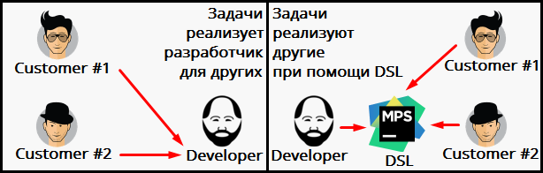

Таким образом JetBrains MPS позволяет предоставить заказчику понятный этому заказчику предметно-ориентирированный язык (DSL - Domain-specific Language), на котором заказчик может описать свою задачу и получить результат.
Про это можно посмотреть промо ролик от JetBrains: [Intro Video of JetBrains MPS](https://www.youtube.com/watch?v=1yQ5kj6svRM).

Чтобы понять, как это работаем, воспользуемся офицальным материалом:
"[MPS Calculator Language Tutorial](https://www.jetbrains.com/help/mps/mps-calculator-language-tutorial.html)".


## [↑](#Home) <a name="mps"></a> Знакомство с MPS
Итак, нам понадобится с вами среда разработки - JetBrains MPS. Её можно скачать с официального сайта, из раздела: "[Download MPS](https://www.jetbrains.com/mps/download/#section=windows)".

Итак, собсвтенно, начать можно с того, почему оно называется MPS. А называется оно так от Meta Programming System - то есть система метапрограммирования. Мета - означает, что мы пишем данные, которые описывают данные. То есть при помощи JetBrains MPS мы можем описать то, как должен выглядеть язык.

JetBrains MPS отличается от IDE для программирования (например, от IntelliJ Idea) тем, что мы работаем с языком не в его текстовом представлении, а работая с ним при помощи такой штуки, как **Abstract Syntax Tree (AST)**, т.е. Абстрактное синтаксическое дерево. Это абстрактное синтаксическое дерево состоит из узлов (**node**) и является моделью языка.
Если проводить аналогию, то можно сравнить с DOM деревом, который является моделью веб-страницы. Именно с этим деревом работает браузер.

Редактор в JetBrains MPS называется **"Projection Editor"** (проекционный редактор), т.к. в этом редакторе мы редактируем проекцию AST на экран, а не код.
Есть хорошее короткое видео про это от JetBrains: "[MPS Projectional Editor](https://www.youtube.com/watch?v=iN2PflvXUqQ)". Там подробно рассказывается про AST.
А ещё про AST и мета программирование есть шикарное видео:
"[Heavy Meta. Программирование, моделирование и предметно-ориентированные языки](https://youtu.be/Opu8iKkS6lo?t=5089)".

Пожалуй, с теорией хватит и можно вернуться к практике.
Запускаем JetBrains MPS и создаём новый проект: **"Create New Project"**.
Так как мы собираемся создавать Domain Specific Language, то очевидно, что нам нужно создать именно **"Language Project"**.

Имя проекта (**Project Name**) укажем "Calculator".
Название языка (**Language Name**) укажем в стиле, как мы именуем пакеты в Java:
``` com.github.veselroger.calculator ```
Так же поставим галку на **"Create Sandbox Solution"**.
Sandbox Solution - это так называемая "песочница", в которой мы сможем протестировать наш язык.
Нажимаем "ОК" и начинаем наш путь познания JetBrains MPS.
Перед нами появляется дерево нашего проекта:

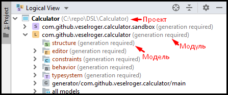

Всё, что находится в модуле описывает модель, но с разных сторон. Например, editor описывает как модель показать в редакторе. Но наш путь начинается с секции **"structure"**. Данная секция содержит структуру нашего языка, то есть описывает синтаксис нашего языка.
В MPS структура языка описывается при помощи "кирпичиков", которые называются "концептами" (**Concept**). Как мы помним, в MPS мы работаем с AST, которое состоит из node. Так вот каждая node как раз таки и выражена определённым концептом.

Так что, вооружившись "[MPS Calculator Language Tutorial](https://www.jetbrains.com/help/mps/mps-calculator-language-tutorial.html)" начинаем наше погружение в мета программирование со структуры языка, а именно с концептов.


## [↑](#Home) <a name="concepts"></a> Концепты
Итак, cтруктуру DSL, описываемого в JetBrains MPS, формируют так называемые концепты (**concepts**). Сгруппированные концепты формируют модель языка, описывающую структуру. Поэтому, в JetBrains MPS мы увидим в дереве на вкладке "Project", а в нём раздел "Structure".
В нём мы сейчас начнём описывать концепты, из которых состоит наш калькулятор.
Калькулятор состоит из полей ввода и поля вывода. На языке UML можно записать:
```
@startuml
object Calculator
object InputField
object OutputField
Calculator *-- "0..n" InputField
Calculator *-- "0..n" OutputField
@enduml
```
Вот так это выглядит визуально:


Начнём с создания нашего главного, центрального, коренвого концепта - Калькулятор.
Через контекстное меню модели "structure" выберем **"New → Concept"**. Получим:

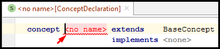

Мы не можем писать текст там, где захотим. Мы можем редактировать только элементы. Например, нам предлагают заменить ``<no name`` на название концетпа. Это и есть Projection Editor. То есть у нас есть концепт, который представляет часть модели нашего языка. И мы редактируем этот концепт через его представление или проекцию.

Вместо **"no name"** укажем название "Calculator". Как и классы в Java, будем называть концепты с большой буквы. Стоит так же привыкнуть к тому, что JetBrains MPS подобно IntelliJ Idea IDE умеет подсказывать варианты, которыми можно использовать в том или ином месте.
Получим подсказку, встав курсором в место, где нужна подсказка, нажмём **Ctrl + Space**:

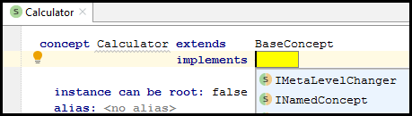

Выберем для концепта калькулятора интерфес **INamedConcept**, что будет означать, что наш концепт будет именованным. Если мы с Ctrl кликнем по названию интерфейса, то мы откроем его представление (как в IntelliJ Idea открыли бы код). Мы видим, что INamedConcept добавляет параметро (property) с названием name, то есть и калькулятор (т.к. реализует INamedConcept) будет иметь property с названием name, т.е. имя.

Узлы, представленные концептами, формируют AST нашего языка. А если у нас дерево, то нам нужен корневой узел, из которого это дерево "растёт". Этим корневым узлом будет наш калькулятор. Поэтому, встанем курсором перед первым символом значения для **"Instance can be root"** и нажмём Ctrl + Space. Мы получим ту самую подсказку и выберем **true**.

Теперь, калькулятору нужны поля. Создадим концепты для полей ввода и вывода:

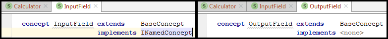

Концепт Input поля именованный, т.к. мы захотим как-то обращаться к ним из других полей (т.е. из Output). Самим Output полям имя не нужно, т.к. к ним никто не будет обращаться.

Теперь, опишем связь между калькулятором и полями.
Для этого, переходим в концепт калькулятора, находим раздел **children** и нажимая Enter для добавления новых элементов опишем связь концептов:

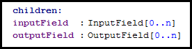

Хорошо, у нас появилась структура нашего языка, описанная концептами. Но как их смогут использовать? Какие property можно редактировать? Чтобы предоставить пользователю нашего языка удобный механизм редактирования node, которые будут выражены определённым концептам в MPS используется **Concept Editor**.


## [↑](#Home) <a name="editor"></a> Редактор концептов
Итак, как сказано в JetBrains MPS User Guide в разделе "[Editor](https://www.jetbrains.com/help/mps/editor.html)", разработчик DSL должен предоставить для каждого концепта свой Editor.

Итак, начнём с концепта поля ввода, то есть InputField'а.
Чтобы создать редактор концепта необходимо перейти в сам концепт, а потом из него перейти на вкладку Editor и кликнув на пустом месте выбрать **Concept Editor**:

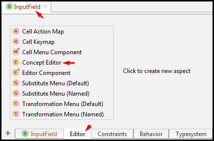

Перед нами откроется новый редактор, где будет предложено **choose cell model**. Редактор концептов представляет информацию в виде ячеек. Ячейки в свою очередь могут содержать различную информацию или другие ячейки. Типы ячеек описаны в User Guide в разделе "[Types Of Cell Models](https://www.jetbrains.com/help/mps/editor.html#typesofcellmodels)".

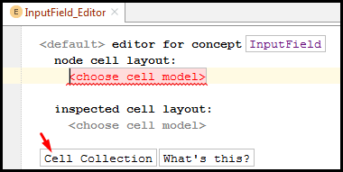

Воспользуемся замечательной кнопкой **Cell Collection**, чтобы создать коллекцию ячеек. После нажатия будет добавлено описание (description) коллекции и будет предложено определить, из каких ячеек состоит эта коллекция.
Вместо ``chose cell model`` напишем **const** и воспользуемся подсказкой MPS, нажав **Ctrl + Space**:

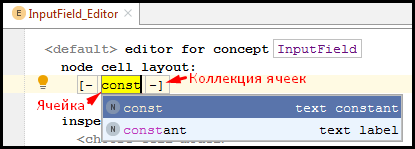

Выберем из списка **constant**. Это означает, что ячейка хранит постоянное, константное значение. Например, пусть это будет указание, что это входное поле, то есть просто поставим курсор на ячейку с ``constant`` и напишем **input**. MPS при выборе constant поняла, что это ячейка с константным значением. А дальше мы просто указали это значение.
Далее мы хотим, чтобы пользователь нашего DSL мог указать имя входного поля, по которому к этому полю можно было бы обратиться. Как мы помним, наш концепт InputField именованный, т.е. имеет property с названием name.
Итак, встанем курсорм на ячейку с константным значением и нажмём **Enter** для добавления новой ячейки.
Напечатаем символ открывающейся фигурной скобки ``{`` и нажмём Ctrl + Space для получения подсказки:

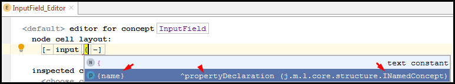

Выберем нашу проперти name, которая в нашем концетпе InputField есть благодаря тому, что он наследуется от INamedConcept.

Аналогичные действия выполним для OutputField, только без действий с property. Как мы помним, наш OutputField не именованный концепт, т.к. нам не нужно ссылаться на OutputField, только из него нужно будет ссылаться.
Таким образом, редактор концепта OutputField будет выглядеть так:

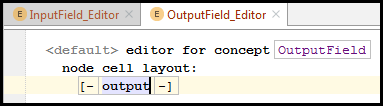

Теперь, опишем редактор калькулятора. Ведь именно в нём содержаться поля. Следовательно, нужно описать в редакторе концепта Calculator, как же пользователь может описывать калькулятор.
Начнём описание калькулятора аналогично редактору InputField. Мы хотим, чтобы калькулятор имел имя:

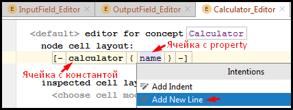

Мы хотим, чтобы после указания названия калькулятора следующий элемент шёл с новой строки. Поэтому, выбрав ячейку после которой будет новая строка (ячейку с property), нажимаем **Alt + Enter**, что приведёт к открытию **Intention Menu** (меню намерений). В нём выбираем, что мы хотим **Add New Line**.
Нажимаем Enter и следующая ячейка добавится строкой ниже, а не в той же строке.

Теперь, опишем работу с дочерними элементами калькулятора, то есть с полями ввода.
Если property начинаются на ``{``, то коллекции дочерних элементов на ``%``:

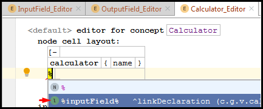

Кроме того, так как input полей будет несколько, то мы хотим, чтобы они добавлялись друг под другой, то есть каждый children на новой строке. Поэтому встаём на ячейке с указанием InputField, нажимаем Alt + Enter для вызова Intention Menu и выбираем **Add New Line for Children**:

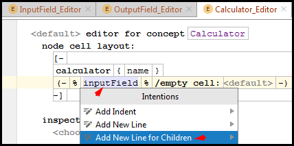

Далее, выбрав ячейку с ``-)`` нажимаем Enter для добавления новой строки. В ней повторяем те же действия, но для outputField.
Осталось только разделить эти строки пустой строкой.
Для этого встаём на символ ``-)`` заверешния первой коллекции inputField, нажимаем Enter. Это добавит ячейку, но правда она будет на одной строке с outputField. Это мы сейчас исправим. Зададим пустое значение constant для ячейки (так же, как делали для inputField, но оставляет без текста), после чего вызываем Intention меню (через Alt + Enter) и выбираем **Add new line**:

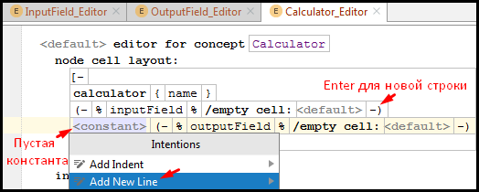

После всех наших махинаций у нас должен получиться следующий результат:

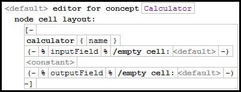

Ура, вот мы с вами немного подружились с концептами. Давайте опробуем, как же мы будем работать с нашим языком. Вспоминаем, что у нас был не только Language модуль, но ещё и Solution sandbox модуль, то есть песочница:

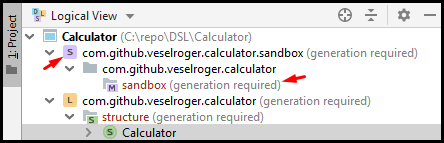

Кстати, мы у модулей видим приписку - **generation required**. Это очень замечание от JetBrains MPS. Это означает, что в нашем языке были сделаны изменения и нужно модуль пересобрать. Чтобы пересобрать модуль, выбираем его в дереве проекта Calculator, вызываем при помощи правой кнопки мыши контекстное меню и выбираем **Rebuild**.

После пересборки языка мы можем перейти в модуль нашего Solution и выбрать модель с названием **sandbox**. Через контекстное меню можем выбрать **New → Calculator**.
Таким образом мы добавили в Solution корневой node, который описан концептом Calculator. Можно сравнить это с тем, как создаётся экземпляр (node) объекта некоторого класса (концепта). Благодаря нашему описанию редакторов мы можем написать на нашем собственном DSL первый код:

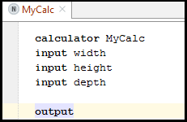

Как мы понимаем, нам нужно научиться как-то в output поле указывать какое-то выражение, которое мы будем выводить. И в этом нам поможет **Base Language**.


## [↑](#Home) <a name="base"></a> Base Language
Итак, наша цель - научиться в output поле использовать выражения. Например, мы хотим иметь возможность указать выражение суммирования. Как мы говорили в самом начале, для IntelliJ Idea язык Java тоже может быть представлен в виде синтаксического дерева, а следовательно может быть рассмотрен как некоторая модель, состоящая из концептов. JetBrains так и делает, а язык этот называет Base Language, то есть базовый язык. Вся прелесть в том, что мы можем переиспользовать концепты языка Java. Например, мы можем переиспользовать выражения из Java для нашего output поля.

Чтобы использовать Base Language в нашем языке, выберем наш модуль языка (он с иконкой L) и в контекстном меню перейдём в **Module Properties**.
После этого на вкладке **"Dependencies"** мы добавляем **"jetbrains.mps.baseLanguage"** и указываем, что **Scope - Extends**.

После этого добавляем концепт из BaseLanguage в свой концепт OutputField:

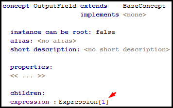

Теперь мы можем в OutputField использовать выражения, как в Java, но в своём DSL.
Вернёмся в концепт OutputField и перейдём в его Concept Editor. Встанем на ячейку с константой, нажмём Enter для добавления новой ячейки и так же, как мы указывали ранее ячейки children укажем для ячейки значение %expression%:


Как Вы могли догадаться, для OutputField мы хотим иметь возможность описать выражение, которое укажет, что же нужно вывести.
Теперь в OutputField Editor мы можем нажать Enter на ячейке с константой output, чтоб добавить новую, как мы делали ранее. И как мы делали ранее, сошлёмся на expression как на children элемент, то есть через символ "%":


Теперь мы можем в solution указать что-нибудь вроде:
> output 2 + 2 + 5

Это хорошо, но этого недостаточно. Мы хотим из output ссылаться на другие поля, чтобы выполнить различные операции с данными из этих полей. Так как концепта Expression для этого недостаточно, нам нужно создать "расширение" для него.

Опишем новый концепт "Ссылка на поле ввода", т.е. **InputFieldReference**:

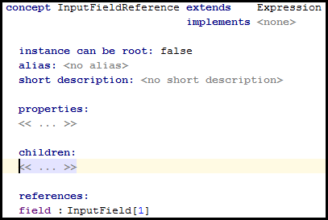

Как мы видим, в концепте теперь есть ссылка (reference) на другой node.
Теперь перейдём в Concept Editor для InputFieldReference. Сначала, как обычно, создадим новую Cell Collection.
Для добавленной ячейки при помощи ``%`` укажем в концепте использование reference:

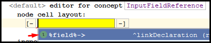

В качестве node укажем **{name}**. Таким образом мы получим:

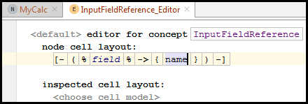

Такая хитрая конструкция позволяет через редактор указать имя node, на который ссылается наша FieldReference.

**Важно** ещё сказать, что концепты, которые имеют только одну ссылку на 1-cardinality (т.е. такие, где указано [1]) называются **smart references** и имеют особую поддержку редактором.

Теперь, выберем наш Language модуль и нажмём **Ctrl + F9** для пересборки.
После этого в нашем Sandbox Solution мы можем в output использовать выражения:

Теперь мы можем использовать в sandbox'е выражение вида:
> output height \* width \* depth

Такое возможно из-за этих самых **"smart reference"**. Так как концепт который является smart reference доступен в текущем контексте MPS, то MPS попробует пройтись по списку возможных узлов (node), на которые MPS смог бы сделать ссылку (reference). И добавляет их в "completion list", т.е. в список, из которого мы можем выбрать. Немного кажется магией, но её в JetBrains MPS много )


## [↑](#Home) <a name="generator"></a> Generator
Наш DSL - не является самоцелью. Нам нужен DSL чтобы описать какой-то результат. JetBrains MPS использует для этого генератор (**generator**). То есть на основе описания DSL генерируется некоторый результат и мы должны описать, каким образом.
Для этого мы должны написать генератор.
Тема генератора подробно описана в User's Guide: "[Generator](https://www.jetbrains.com/help/mps/mps-generator.html)"

Чтобы описать процесс генерации напишем генератор для калькулятора.
По умолчанию при создании проекта уже есть генератор:

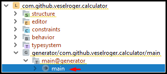

Нас интересует внутри элемента **"main@generator"** элемент **main**.
Это - точка входа (**entry point**, как main метод в Java) в генератор. Здесь указано какие узлы нужны трансфорировать и как.

Давайте реализовывать генератор калькулятора. Выберем **main@generator** и в контекстном меню выберем **"New → j.mps.baseLanguage → class"**. Мы увидим интересную конструкцию:


Укажем название нашего класса. Например: **CalculatorImpl**.
В **input** мы указываем тот node, для которого будет выполняться генерация. В нашем случае наш input node - это Calculator.

Теперь, нужно описать правило (**rule**), по которому будет использовать данный шаблон (template). Вернёмся к точке входа в генератор и добавим правило:


В правиле мы указали, для какого концепта какой шаблон использовать.
Чтобы увидеть, что наш генератор работает выполним Rebuild нашего Language модуля.
Далее, выбираем в Sandbox Solution наш node калькулятора и через контекстное меню выбираем: **"Preview Generated Text"**.
И вуаля, магия произошла. Мы получаем Java код:

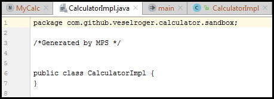

Но просто класс - это не интересно. Давайте добавим main метод в наш код CalculatorImpl:
```java
public static void main(String[] args) {
  System.out.println("Hello, World!");
}
```

Теперь, нам нужно сделать так, чтобы генерируемый код можно было запустить в MPS. Для этого, согласно tutorial от MPS ("[Running the code](https://www.jetbrains.com/help/mps/shapes-an-introductory-mps-tutorial.html#runningthecode)") нам надо перейти в **Language Module Properties**.
Выбираем для этого в дереве проекта модуль нашего языка (с иконкой L) и в контекстном меню выбираем **Module Properties**. Можно так же выбрать модуль и просто нажать **Alt+Enter**.

На вкладке **dependencies** добавляем ещё одну зависимость:
``jetbrains.mps.execution.util``
Scope ей нужно выставить **Extends**:

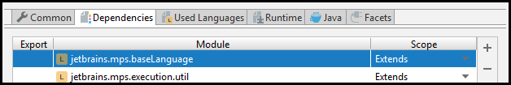

Теперь, осталось дело за малым. Т.к. наш класс CalculatorImpl получает в качестве input концепт калькулятора (Calculator), то именно он должен реализовывать интерфейс IMainClass, который и позволит там запускать код прямо из MPS.

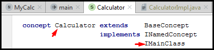

После этого выполняем Rebuild для Language Module (с иконкой L) и Solution Module (с иконкой S). После этого в контекстном меню нашего калькулятора, который мы создали в Solution модуле появились 2 пункта: Run и Debug.
Выполним **Run** и посмотрим, отработала ли наша задумка.
Если всё сделано правильно, то JetBrains MPS покажет нам наше Hello World:

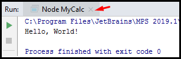

А теперь приступаем к реализации нашего калькулятора, то есть к наполнению CalculatorImpl.


## [↑](#Home) <a name="generatorImpl"></a> Реализация Generator'а
Наконец мы можем приступить к реализации CalculatorImpl.

#### [↑](#Home) <a name="swing"></a> >> Добавление Swing
Для начала, вспомним, что наш Java код - это приложение со Swing GUI.
При использовании Java Swing наш проект начинает требовать следующие зависимости:
- javax.swing@java_stub
- javax.swing.event@java_stub
- java.awt@java_stub
- javax.swing.text@java_stub

Чтобы их импортировать откроем контекстное меню для **main@generator** и выберем **"Model Properties"**. Зависимости - это не язык. Поэтому, воспользуемся вкладкой **"Dependencies"**. Добавим там вышеуказанные зависимости.

Теперь, наш класс CalculatorImpl может наследоваться от JFrame:

```java
public class CalculatorImpl extends JFrame {
```

Добавим метод update, который будет вызываться при обновлении полей:
```java
public void update() {
}
```
Добавим далее DocumentListener, который будет сообщать о изменениях в полях ввода:
```java
private DocumentListener listener = new DocumentListener() {
	public void insertUpdate(DocumentEvent event) { update(); }
    public void removeUpdate(DocumentEvent event) { update(); }
    public void changeUpdate(DocumentEvent event) { update(); }
}
```
Добавим описания полей ввода и вывода, добавим их следующим образом:
```java
private JTextField inputField = new JTextField();
private JTextField outputField = new JTextField();
```
Пусть вас не удивляет, что мы их объявляем один раз. Дальше поймём, почему так.

Теперь реализуем конструктор калькулятора, который настроит наш JFrame:
```java
public CalculatorImpl() {
	setTitle("Calculator");
    setLayout(new GridLayout(0, 2));
    {
		inputField.getDocument().addDocumentListener(listener);
		add(new JLabel("Title"));
		add(inputField);
	}
    update();
    setDefaultCloseOperation(JFrame.EXIT_ON_CLOSE);
    pack();
    setVisible(true);
}
```
И теперь изменим наш main метод:
```java
public static void main(string[] args) {
	SwingUtilities.invokeLater(new Runnable() {
    	public void run() {
        	new CalculatorImpl();
        }
    })
}
```
На этом основной код добавлен. Теперь, его нужно приправить "магией" макро.

#### [↑](#Home) <a name="macro"></a> >> Использование макро
Как мы помним, в самом верху нашего CalculatorImpl написано, что это **root template**, то есть некий шаблон. Поэтому, генератор использует тот код, который мы написали, как шаблон. Генерацию по этому шаблону можно изменять, добавляя в этот код **macro**. Использовать их легко. Для их использования необходимо выбрать элемент, для которого нужно добавить макро, нажать **Alt + Enter** и в открывшемся **Intention Menu** выбрать нужный макро (т.к. макро бывают разные).

И для начала, давайте воспользуемся такой штукой, как **Property Macro**.
Выделим название класса CalculatorImpl, нажмём Alt+Enter и выберем **"Add property Macro"**:

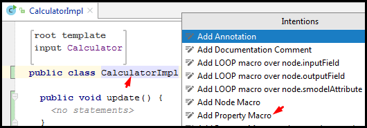

Имя класса изменится на ``${CalculatorImpl}``, а внизу в окне инспектора (**Inspector**) появится возможность настроить Property Macro:


Вместо ``no statements`` укажем **node.name**. Мы добавляем property macro для node, который указан как input, т.е. Calculator. То есть **node.name** будет обращаться к параметру **name** нашего калькулятора Calculator. Он является **INamedConcept**, т.е. у него есть name. Соответственно, его мы и получим как Property Macro.

Далее, переходим к конструктору CalculatorImpl.
Обратим внимание на ``setTitle("Calculator");``.
Не очень хорошо, что заголовок окна калькулятор. Было бы здорово, чтобы калькулятор назывался так, как мы это указали в Editor.
Мы уже пользовались Property Macro. Давайте повторим.
Встаём внутрь кавычек в методе setTitle, нажимаем Alt+Enter, выбираем в Intention меню пункт **Add Property Macro** и выбираем **node.name**:

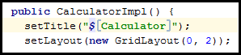

Теперь, обратим внимание на наши поля ввода и вывода. Как мы помним, у нас их может быть несколько. Их количество неизвестно на момент написания кода. Использование шаблона позволяет сделать динамическое объявление, с использованием макро **LOOP**.
Поэтому, выбираем inputField, нажимаем Alt+Enter и в Intention меню выбираем **"Add Node Macro"**:


Между двумя знаками доллара введём **LOOP**. Инспектор отобразит сразу настройки:

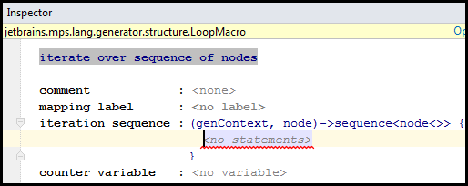

Укажем вместо ``no statement`` значение **node.inputField**. Как мы помним, node для нас - концепт Calculator (указан у нас в input). А inputField указан в блоке children (т.е. там хранится коллекция всех inputField'ов):

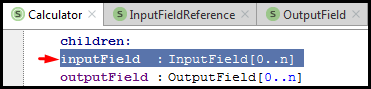

Таким образом, генератор теперь, согласно макро, создаст для каждого экземпляра в inputField строку объявления inputField. Аналогично повторим действия для outputField, с тем отличием, что LOOP будет использовать **node.outputField**.

Но тут есть проблема. Название полей, согласно объявлению, будет одинаково для всех полей. То есть, если будет 3 входных поля, то все они будут называться inputField.
Естественно, компиляция такого кода не сработает, т.к. компилятор упадёт с ошибкой "Duplicate Field". Исправим это при помощи макро.

Для создания уникального имени для каждого inputField снова добавим Property Macro (Alt+Enter на inputField, "Add Property Macro"). Тут нам поможет такая штука, как genContext или контекст генерации. Подробнее про правила генерации можно прочитать в документации к генератору: "[Generator Rule](https://www.jetbrains.com/help/mps/generator-language.html#generatorrule)".

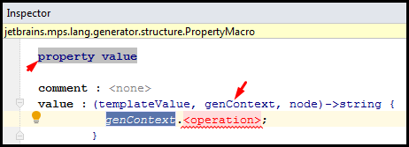

Теперь выберем необходимую операцию. Нам нужно уникальное имя. Наберём **name** и нажмём для получения подсказки Ctrl + Space:

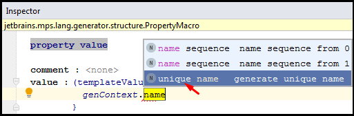

Выбираем **unique name** и на месте ``<base name>`` указываем **"inputField"**. Base name указывает на то, что это основа имени, т.е. префикс, с которого имя будет называться. Таким образом генератор будет создавать имена вроде inputField_a, inputField_b и т.д.
Аналогично необходимо поступить и с outputField:

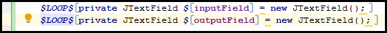

Теперь снова вернёмся к конструктору CalculatorImpl.
Мы часть кода поместили в фигурные скобки не просто так. Мы так сделали потому, что хотим иметь возможность оперировать этим блоком кода как единым целым.
Выделим скобку и через меню Intention (**Alt + Enter**) выберем **Add Node Macro**:

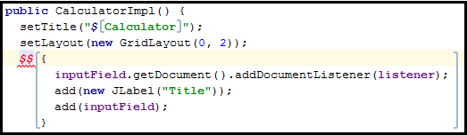

Мы хотим данный блок кода выполнять для каждого inputField.
Поэтому выбираем макро **LOOP** с итерацией по **node.inputField**.

Кроме того, вам уже должен бросится в глаза ``new JLabel("Title")``. Для "**Title**" укажем Property Macro по **node.name**.

Далее нам предстоит определить такую интересную вещь, как **"Field Declaration"**.

#### [↑](#Home) <a name="fielddecl"></a> >> Field Declaration
Пришло время познакомиться с такой вещью, как **"Field Declaration"**.
Как сказано в ["MPS Calculator Language Tutorial"](https://www.jetbrains.com/help/mps/mps-calculator-language-tutorial.html#1698c834), сложнее ситуация обстоит с созданием ссылки (reference) на объявление поля (Field Declaration), в котором текущее поле хранится. Необходимо из ссылки на inputField сгенерировать ссылку на соответствующий JTextField, сгенерированный из текущего inputField. Для этого нужно создать label для Field Declaration и использовать этот label для того, чтобы находить поле.

Это объяснение может быть непонятно. Проще говоря, мы ранее в LOOP макро сгенерировали пачку inputField по коллекции node и в момент генерации кода MPS для каждого node создаёт FieldDeclaration.
Далее, мы снова выполняем LOOP по node типа InputField. В этом цикле мы зная node хотим получить ссылку на те самые поля, которые мы создали ранее. Вот именно для этого нам этого FieldDeclaration'ы нам и нужны.

Возвращаемся в main@generator и выбираем **mapping labels**. Согласно ["User's Guide: Mapping Label"](https://www.jetbrains.com/help/mps/generator-language.html#mappinglabel), данный раздел предназначен для создания **label**, которые позволяют по input node найти output node.
Встанем на ``` << ... >> ```, нажмём Enter и теперь заполним:


Данная запись говорит, что используя label InputFieldDeclaration мы можем по входному node типа InputField получить сгенерированный для него FieldDeclaration.
Теперь, добавим этот label в LOOP макро для InputField'а:

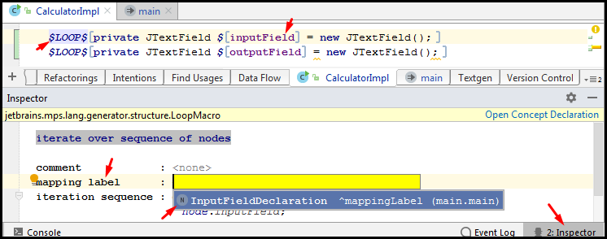

Теперь, необходимо изменить ссылку на inputField на ссылку, найденную по label. Для этого используем **Reference Macro**:

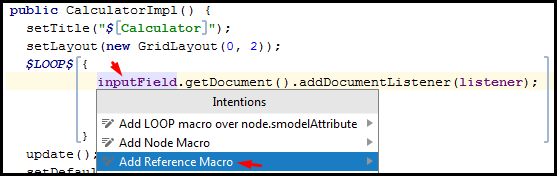

Опять воспользуемся контекстом генерации и выберем **get output by label and input**:

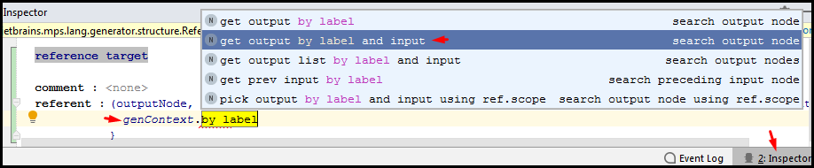

В качестве **mapping label** указываем InputFieldDeclaration (через Ctrl+Space подсказка выдаст только 1 вариант в нашем случае), а для **inputNode** укажем node.

У нас ссылка осталась ещё во втором месте, перед закрытием блока. Повторим для неё:

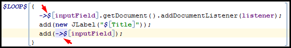

Теперь, давайте выберем наш Language Module и выполним для него Rebuild.
Теперь выполним Rebuild нашего Solution, после чего выберем наш калькулятор в Solution и откроем через контекстное меню "Preview Generated Text":

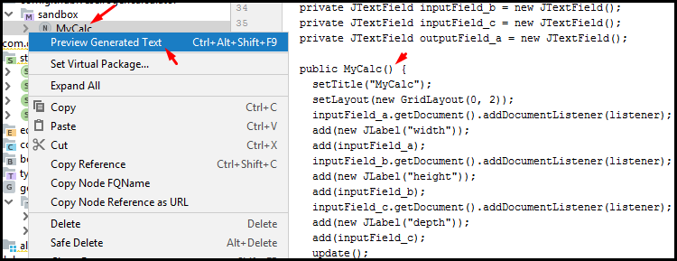

Далее мы должны аналогичное повторить и для OutputField.
Добавим ниже блока кода для inputField блок кода для outputField в фигурных скобках:
```java
{
  add(new JLabel("Output"));
  add(outputField);
}
```
Повторяем:
- В main@generator в **mapping labels** добавляем OutputFieldDeclaration

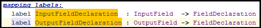
- Выделяем фигурную скобку, Node макро типа LOOP по node.outputField
- Выбираем outputField в объявлении JTextField, указываем label для $LOOP$
- Выбираем outputField в скобках, создаём Reference Macro для OutputFieldDeclaration

Итого, результат будет внешне выглядеть следующим образом:

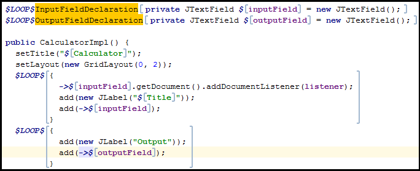

Убедимся, что нет никаких ошибок. Для этого достаточно выполнить **"Build → Rebuild Project"**.


#### [↑](#Home) <a name="calculate"></a> >> Вычисление значений
Теперь, нам остаётся только реализовать код, который обновляет результат расчёта.
Нас интересует метод update.
Добавим в метод update инициализацию локальной переменной:
```java
public void update() {
	int i = 0;
}
```
После этого выделяем строчку целиком (вместе с точкой с запятой на конец), выбираем **Add Node Macro**:

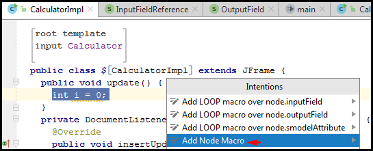

В качестве Macro выбираем $LOOP$. В обучающей статье "[MPS Calculator Language Tutorial](https://www.jetbrains.com/help/mps/mps-calculator-language-tutorial.html#1698c834)" немного упустили, что задавать в LOOP. Но т.к. сказано, что "int local variable for each input node", то наш LOOP будет по **node.inputField**.

Как мы понимаем, просто цикл сгенерирует 4 одинаковые по названию переменные, что приведёт к падению компиляции. Поэтому, зададим уникальные имена, как мы это делали раньше. Выберем переменную i, в Intention меню (по Atl + Enter) выберем **Property Macro**. Как мы помним, в инспекторе надо взять из контекста генерации genContext уникальные название по некоторому основанию. Сделаем это:

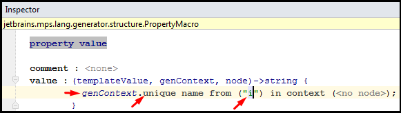

Теперь, нужно это переменные как-то иницилизировать. Для этого на них нужно будет как-то ссылаться. А это значит, что нам понадобятся снова Label'ы:

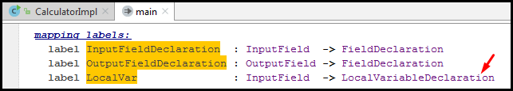

Как мы уже понимаем, добавленная запись означает, что с каждым InputField будет сопоставлено объявление локальной переменной (LocalVariableDeclaration), которое можно найти через label c названием LocalVar.

Чтобы добавить к node нужный нам label мы должны использовать макро ``$MAP_SRC$``.
В качестве node выступает переменная i. Поэтому, выделяем её, нажимаем Alt + Enter для вызова Intention меню и выбираем "Add Node Macro".
В качестве макро указываем **$MAP_SRC$**.
В качестве **mapping label** указываем лэйбл LocalVar:

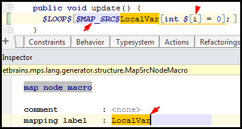

Теперь ниже нам понадобится код, который будет инициализировать это локальные переменные значениями, полученными из input полей.
Добавим новый try-catch блок. Для этого удобно написать try и воспользоваться подсказкой от MPS по Ctrl + Space:

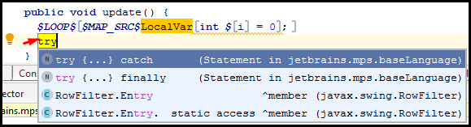

Перехватываться будем **NumberFormatException**, а в try блоке добавим:
```java
i = Integer.parseInt(inputField.getText());
```
Выделяем полностью эту строчку (от i до точки запятой включительно) и через Intention меню (Alt + Enter) добавляем Node Macro **$LOOP$** с циклом по **node.inputField**.

Далее, как мы делали ранее, делаем Reference Macro для i, чтобы сослаться на переменную i, созданную ранее в цикле, и для inputField, чтобы сослаться на соответствующее этой i поле ввода:

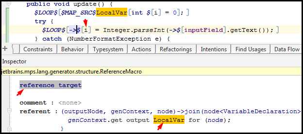

Добавим теперь под try-catch блоком строку:
```java
outputField.setText(null);
```
Выберем всю строчку с outputField (включая точку с запятой) и добавим для неё Node Macro типа $LOOP$ по **node.outputField**.

Далее выбираем outputField и указываем Reference Macro:

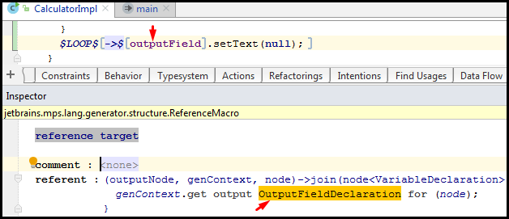

Теперь, заменим null аргумент в методе setText на ``"" + (null)``.
Далее выберем null и через Intention меню (Alt + Enter) добавим Node Macro **$COPY_SRC$**:

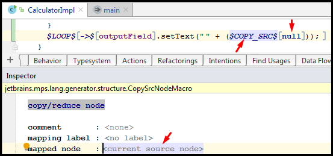

Макро $COPY_SRC$ заменяет Node значением, указанным в инспекторе. Выберем в инспекторе ``current source node`` и нажмём Enter.
Вместо появившегося ``no statements`` указать **node.expression**.

Теперь нам осталось сделать обработку InputFieldReference. И для этого нам понадобится узнать, что такое Reduction Rules.

#### [↑](#Home) <a name="reduction"></a> >> Reduction Rules
У нас на текущий момент нет обработки InputFieldReference, т.к. у нас для этого нет генератора. Нам нужно заменить ссылку на значение, полученное из JTextField соответствующего input field.

Чтобы создать генератор для InputFieldReference определим **reduction rule**.
Reduction rules применяются ко всем узлам, которые копируются во время генерации. Например, для node из макро $COPY_SRC$.

Итак, создадим Reduction Rule в main@generator:


Ранее, мы указали template для root mapping rules как файл CalculatorImpl. Это было сделано потому, что описание template большое. Если же описание template небольшое, то его можно не выносить в отдельный файл, а сделать **inline**.
Для этого встанем ``choose consequence``, нажмём Ctrl + Space для подсказки от JetBrains MPS и выберем **Inline template with context**:


В качестве **content node** напишем **BlockStatement**, который при выборе превратится в блок кода между фигурными скобками:
```java
{
< no statement >
}
```
Заполним блок следующим простым кодом:
```java
int i;
i = 1 + i;
```

Нам нужно пометить локальную переменную i как **template fragment**, т.к. хотим использовать ссылку на локальную переменную i как результат in-line template.
Выбираем i и в Intention меню (Alt + Enter) выбираем **Create Template Fragment**:


После этого выбираем i и создаём по ней Reference Macro со следующим referent:
```
genContext.get output LocalVar for (node.field);
```

Теперь, давайте проверим, всё ли мы правильно написали.
В главном меню выбираем **"Build → Rebuild Project"**.
Никаких ошибок при этом возникнуть в логе не должно.

Теперь мы можем запустить наш калькулятор. Для этого перейдём в модуль Solution. В нём мы до этого уже описали новую модель используя наш DSL язык:


Благодаря тому, что Calculator мы объявили имплементирующим IMainClass, то теперь в контекстном меню у нас есть возможность через Run и Debug запустить наш калькулятор, собранный по модели, которую мы описали на нашем новом DSL!

## [↑](#Home) <a name="scope"></a> Scope
