# <a name="Home"></a> JetBrains MPS Intro

## Table of Content:
- [Intro](#intro)
- [Знакомство с MPS](#mps)
- [Концепты](#concepts)
- [Редактор концептов](#editor)
- [Base Language](#base)
- [Generator](#generator)
- [Запуск генератора](#run)


## [↑](#Home) <a name="intro"></a> Intro
Предлагаю окунуться в дебри одной интересной темы - разработка своего **DSL**.
Представим себе несколько утрированную ситуацию, но если её масштабировать - поймём зачем всё это нам нужно.

Итак, представим себе программиста Василия, к которому обратился кто-то (назовём его заказчиком) с просьбой написать калькулятор некоторых величин. Программист вынужден вникнуть в то, какие величины нужно посчитать заказчику и для чего и реализовать это. Далее, появился другой заказчик, который захотел в калькулятор добавить что-то. А потом это повторялось снова и снова. И тогда Василий подумал, что было бы здорово, чтобы заказчик мог сам смог сделать то, что он хочет, не трогая программиста. Было бы здорово, чтобы заказчик говоря в терминах своей предметной области смог не умея программировать как-то получить результат.
И тогда на помощь решил прийти **JetBrains MPS**:


Таким образом JetBrains MPS позволяет предоставить заказчику понятный этому заказчику предметно-ориентирированный язык (DSL - Domain-specific Language), на котором заказчик может описать свою задачу и получить результат.
Про это можно посмотреть промо ролик от JetBrains: [Intro Video of JetBrains MPS](https://www.youtube.com/watch?v=1yQ5kj6svRM).

Чтобы понять, как это работаем, воспользуемся офицальным материалом:
"[MPS Calculator Language Tutorial](https://www.jetbrains.com/help/mps/mps-calculator-language-tutorial.html)".


## [↑](#Home) <a name="mps"></a> Знакомство с MPS
Итак, нам понадобится с вами среда разработки - JetBrains MPS. Её можно скачать с официального сайта, из раздела: "[Download MPS](https://www.jetbrains.com/mps/download/#section=windows)".

Итак, собсвтенно, начать можно с того, почему оно называется MPS. А называется оно так от Meta Programming System - то есть система метапрограммирования. Мета - означает, что мы пишем данные, которые описывают данные. То есть при помощи JetBrains MPS мы можем описать то, как должен выглядеть язык.

JetBrains MPS отличается от IDE для программирования (например, от IntelliJ Idea) тем, что мы работаем с языком не в его текстовом представлении, а работая с ним при помощи такой штуки, как **Abstract Syntax Tree (AST)**, т.е. Абстрактное синтаксическое дерево. Это абстрактное синтаксическое дерево состоит из узлов (**node**) и является моделью языка.
Если проводить аналогию, то можно сравнить с DOM деревом, который является моделью веб-страницы. Именно с этим деревом работает браузер.

Редактор в JetBrains MPS называется **"Projection Editor"** (проекционный редактор), т.к. в этом редакторе мы редактируем проекцию AST на экран, а не код.
Есть хорошее короткое видео про это от JetBrains: "[MPS Projectional Editor](https://www.youtube.com/watch?v=iN2PflvXUqQ)". Там подробно рассказывается про AST.
А ещё про AST и мета программирование есть шикарное видео:
"[Heavy Meta. Программирование, моделирование и предметно-ориентированные языки](https://youtu.be/Opu8iKkS6lo?t=5089)".

Пожалуй, с теорией хватит и можно вернуться к практике.
Запускаем JetBrains MPS и создаём новый проект: **"Create New Project"**.
Так как мы собираемся создавать Domain Specific Language, то очевидно, что нам нужно создать именно **"Language Project"**.

Имя проекта (**Project Name**) укажем "Calculator".
Название языка (**Language Name**) укажем в стиле, как мы именуем пакеты в Java:
``` com.github.veselroger.calculator ```
Так же поставим галку на **"Create Sandbox Solution"**.
Sandbox Solution - это так называемая "песочница", в которой мы сможем протестировать наш язык.
Нажимаем "ОК" и начинаем наш путь познания JetBrains MPS.
Перед нами появляется дерево нашего проекта:


Всё, что находится в модуле описывает модель, но с разных сторон. Например, editor описывает как модель показать в редакторе. Но наш путь начинается с секции **"structure"**. Данная секция содержит структуру нашего языка, то есть описывает синтаксис нашего языка.
В MPS структура языка описывается при помощи "кирпичиков", которые называются "концептами" (**Concept**). Как мы помним, в MPS мы работаем с AST, которое состоит из node. Так вот каждая node как раз таки и выражена определённым концептом.

Так что, вооружившись "[MPS Calculator Language Tutorial](https://www.jetbrains.com/help/mps/mps-calculator-language-tutorial.html)" начинаем наше погружение в мета программирование со структуры языка, а именно с концептов.


## [↑](#Home) <a name="concepts"></a> Концепты
Итак, cтруктуру DSL, описываемого в JetBrains MPS, формируют так называемые концепты (**concepts**). Сгруппированные концепты формируют модель языка, описывающую структуру. Поэтому, в JetBrains MPS мы увидим в дереве на вкладке "Project", а в нём раздел "Structure".
В нём мы сейчас начнём описывать концепты, из которых состоит наш калькулятор.
Калькулятор состоит из полей ввода и поля вывода. На языке UML можно записать:
```
@startuml
object Calculator
object InputField
object OutputField
Calculator *-- "0..n" InputField
Calculator *-- "0..n" OutputField
@enduml
```
Вот так это выглядит визуально:
[//]: # "Чтобы увидеть содержимое UML нужно открыть ссылку, но заменить png на uml"


Начнём с создания нашего главного, центрального, коренвого концепта - Калькулятор.
Через контекстное меню модели "structure" выберем **"New → Concept"**. Получим:


Мы не можем писать текст там, где захотим. Мы можем редактировать только элементы. Например, нам предлагают заменить ``<no name`` на название концетпа. Это и есть Projection Editor. То есть у нас есть концепт, который представляет часть модели нашего языка. И мы редактируем этот концепт через его представление или проекцию.

Вместо **"no name"** укажем название "Calculator". Как и классы в Java, будем называть концепты с большой буквы. Стоит так же привыкнуть к тому, что JetBrains MPS подобно IntelliJ Idea IDE умеет подсказывать варианты, которыми можно использовать в том или ином месте.
Получим подсказку, встав курсором в место, где нужна подсказка, нажмём **Ctrl + Space**:


Выберем для концепта калькулятора интерфес **INamedConcept**, что будет означать, что наш концепт будет именованным. Если мы с Ctrl кликнем по названию интерфейса, то мы откроем его представление (как в IntelliJ Idea открыли бы код). Мы видим, что INamedConcept добавляет параметро (property) с названием name, то есть и калькулятор (т.к. реализует INamedConcept) будет иметь property с названием name, т.е. имя.

Узлы, представленные концептами, формируют AST нашего языка. А если у нас дерево, то нам нужен корневой узел, из которого это дерево "растёт". Этим корневым узлом будет наш калькулятор. Поэтому, встанем курсором перед первым символом значения для **"Instance can be root"** и нажмём Ctrl + Space. Мы получим ту самую подсказку и выберем **true**.

Теперь, калькулятору нужны поля. Создадим концепты для полей ввода и вывода:


Концепт Input поля именованный, т.к. мы захотим как-то обращаться к ним из других полей (т.е. из Output). Самим Output полям имя не нужно, т.к. к ним никто не будет обращаться.

Теперь, опишем связь между калькулятором и полями.
Для этого, переходим в концепт калькулятора, находим раздел **children** и нажимая Enter для добавления новых элементов опишем связь концептов:


Хорошо, у нас появилась структура нашего языка, описанная концептами. Но как их смогут использовать? Какие property можно редактировать? Чтобы предоставить пользователю нашего языка удобный механизм редактирования node, которые будут выражены определённым концептам в MPS используется **Concept Editor**.


## [↑](#Home) <a name="editor"></a> Редактор концептов
Итак, как сказано в JetBrains MPS User Guide в разделе "[Editor](https://www.jetbrains.com/help/mps/editor.html)", разработчик DSL должен предоставить для каждого концепта свой Editor.

Итак, начнём с концепта поля ввода, то есть InputField'а.
Чтобы создать редактор концепта необходимо перейти в сам концепт, а потом из него перейти на вкладку Editor и кликнув на пустом месте выбрать **Concept Editor**:


Перед нами откроется новый редактор, где будет предложено **choose cell model**. Редактор концептов представляет информацию в виде ячеек. Ячейки в свою очередь могут содержать различную информацию или другие ячейки. Типы ячеек описаны в User Guide в разделе "[Types Of Cell Models](https://www.jetbrains.com/help/mps/editor.html#typesofcellmodels)".


Воспользуемся замечательной кнопкой **Cell Collection**, чтобы создать коллекцию ячеек. После нажатия будет добавлено описание (description) коллекции и будет предложено определить, из каких ячеек состоит эта коллекция.
Вместо ``chose cell model`` напишем **const** и воспользуемся подсказкой MPS, нажав **Ctrl + Space**:


Выберем из списка **constant**. Это означает, что ячейка хранит постоянное, константное значение. Например, пусть это будет указание, что это входное поле, то есть просто поставим курсор на ячейку с ``constant`` и напишем **input**. MPS при выборе constant поняла, что это ячейка с константным значением. А дальше мы просто указали это значение.
Далее мы хотим, чтобы пользователь нашего DSL мог указать имя входного поля, по которому к этому полю можно было бы обратиться. Как мы помним, наш концепт InputField именованный, т.е. имеет property с названием name.
Итак, встанем курсорм на ячейку с константным значением и нажмём **Enter** для добавления новой ячейки.
Напечатаем символ открывающейся фигурной скобки ``{`` и нажмём Ctrl + Space для получения подсказки:


Выберем нашу проперти name, которая в нашем концетпе InputField есть благодаря тому, что он наследуется от INamedConcept.

Аналогичные действия выполним для OutputField, только без действий с property. Как мы помним, наш OutputField не именованный концепт, т.к. нам не нужно ссылаться на OutputField, только из него нужно будет ссылаться.
Таким образом, редактор концепта OutputField будет выглядеть так:


Теперь, опишем редактор калькулятора. Ведь именно в нём содержаться поля. Следовательно, нужно описать в редакторе концепта Calculator, как же пользователь может описывать калькулятор.
Начнём описание калькулятора аналогично редактору InputField. Мы хотим, чтобы калькулятор имел имя:


Мы хотим, чтобы после указания названия калькулятора следующий элемент шёл с новой строки. Поэтому, выбрав ячейку после которой будет новая строка (ячейку с property), нажимаем **Alt + Enter**, что приведёт к открытию **Intention Menu** (меню намерений). В нём выбираем, что мы хотим **Add New Line**.
Нажимаем Enter и следующая ячейка добавится строкой ниже, а не в той же строке.

Теперь, опишем работу с дочерними элементами калькулятора, то есть с полями ввода.
Если property начинаются на ``{``, то коллекции дочерних элементов на ``%``:


Кроме того, так как input полей будет несколько, то мы хотим, чтобы они добавлялись друг под другой, то есть каждый children на новой строке. Поэтому встаём на ячейке с указанием InputField, нажимаем Alt + Enter для вызова Intention Menu и выбираем **Add New Line for Children**:


Далее, выбрав ячейку с ``-)`` нажимаем Enter для добавления новой строки. В ней повторяем те же действия, но для outputField.
Осталось только разделить эти строки пустой строкой.
Для этого встаём на символ ``-)`` заверешния первой коллекции inputField, нажимаем Enter. Это добавит ячейку, но правда она будет на одной строке с outputField. Это мы сейчас исправим. Зададим пустое значение constant для ячейки (так же, как делали для inputField, но оставляет без текста), после чего вызываем Intention меню (через Alt + Enter) и выбираем **Add new line**:


После всех наших махинаций у нас должен получиться следующий результат:


Ура, вот мы с вами немного подружились с концептами. Давайте опробуем, как же мы будем работать с нашим языком. Вспоминаем, что у нас был не только Language модуль, но ещё и Solution sandbox модуль, то есть песочница:


Кстати, мы у модулей видим приписку - **generation required**. Это очень замечание от JetBrains MPS. Это означает, что в нашем языке были сделаны изменения и нужно модуль пересобрать. Чтобы пересобрать модуль, выбираем его в дереве проекта Calculator, вызываем при помощи правой кнопки мыши контекстное меню и выбираем **Rebuild**.

После пересборки языка мы можем перейти в модуль нашего Solution и выбрать модель с названием **sandbox**. Через контекстное меню можем выбрать **New → Calculator**.
Таким образом мы добавили в Solution корневой node, который описан концептом Calculator. Можно сравнить это с тем, как создаётся экземпляр (node) объекта некоторого класса (концепта). Благодаря нашему описанию редакторов мы можем написать на нашем собственном DSL первый код:


Как мы понимаем, нам нужно научиться как-то в output поле указывать какое-то выражение, которое мы будем выводить. И в этом нам поможет **Base Language**.


## [↑](#Home) <a name="base"></a> Base Language
Итак, наша цель - научиться в output поле использовать выражения. Например, мы хотим иметь возможность указать выражение суммирования. Как мы говорили в самом начале, для IntelliJ Idea язык Java тоже может быть представлен в виде синтаксического дерева, а следовательно может быть рассмотрен как некоторая модель, состоящая из концептов. JetBrains так и делает, а язык этот называет Base Language, то есть базовый язык. Вся прелесть в том, что мы можем переиспользовать концепты языка Java. Например, мы можем переиспользовать выражения из Java для нашего output поля.

Чтобы использовать Base Language в нашем языке, выберем наш модуль языка (он с иконкой L) и в контекстном меню перейдём в **Module Properties**.
После этого на вкладке **"Dependencies"** мы добавляем **"jetbrains.mps.baseLanguage"** и указываем, что **Scope - Extends**.

После этого добавляем концепт из BaseLanguage в свой концепт OutputField:


Теперь мы можем в OutputField использовать выражения, как в Java, но в своём DSL.
Вернёмся в концепт OutputField и перейдём в его Concept Editor. Встанем на ячейку с константой, нажмём Enter для добавления новой ячейки и так же, как мы указывали ранее ячейки children укажем для ячейки значение %expression%:


Как Вы могли догадаться, для OutputField мы хотим иметь возможность описать выражение, которое укажет, что же нужно вывести.
Теперь в OutputField Editor мы можем нажать Enter на ячейке с константой output, чтоб добавить новую, как мы делали ранее. И как мы делали ранее, сошлёмся на expression как на children элемент, то есть через символ "%":


Теперь мы можем в solution указать что-нибудь вроде:
> output 2 + 2 + 5

Это хорошо, но этого недостаточно. Мы хотим из output ссылаться на другие поля, чтобы выполнить различные операции с данными из этих полей. Так как концепта Expression для этого недостаточно, нам нужно создать "расширение" для него.

Опишем новый концепт "Ссылка на поле ввода", т.е. **InputFieldReference**:


Как мы видим, в концепте теперь есть ссылка (reference) на другой node.
Теперь перейдём в Concept Editor для InputFieldReference. Сначала, как обычно, создадим новую Cell Collection.
Для добавленной ячейки при помощи ``%`` укажем в концепте использование reference:


В качестве node укажем **{name}**. Таким образом мы получим:


Такая хитрая конструкция позволяет через редактор указать имя node, на который ссылается наша FieldReference.

**Важно** ещё сказать, что концепты, которые имеют только одну ссылку на 1-cardinality (т.е. такие, где указано [1]) называются **smart references** и имеют особую поддержку редактором.

Теперь, выберем наш Language модуль и нажмём **Ctrl + F9** для пересборки.
После этого в нашем Sandbox Solution мы можем в output использовать выражения:

Теперь мы можем использовать в sandbox'е выражение вида:
> output height \* width \* depth

Такое возможно из-за этих самых **"smart reference"**. Так как концепт который является smart reference доступен в текущем контексте MPS, то MPS попробует пройтись по списку возможных узлов (node), на которые MPS смог бы сделать ссылку (reference). И добавляет их в "completion list", т.е. в список, из которого мы можем выбрать. Немного кажется магией, но её в JetBrains MPS много )


## [↑](#Home) <a name="generator"></a> Generator
Наш DSL - не является самоцелью. Нам нужен DSL чтобы описать какой-то результат. JetBrains MPS использует для этого генератор (**generator**). То есть на основе описания DSL генерируется некоторый результат и мы должны описать, каким образом.
Для этого мы должны написать генератор.
Тема генератора подробно описана в User's Guide: "[Generator](https://www.jetbrains.com/help/mps/mps-generator.html)"

Чтобы описать процесс генерации напишем генератор для калькулятора.
По умолчанию при создании проекта уже есть генератор:


Нас интересует внутри элемента **"main@generator"** элемент **main**.
Это - точка входа (**entry point**, как main метод в Java) в генератор. Здесь указано какие узлы нужны трансфорировать и как.

Давайте реализовывать генератор калькулятора. Выберем **main@generator** и в контекстном меню выберем **"New → j.mps.baseLanguage → class"**. Мы увидим интересную конструкцию:


Укажем название нашего класса. Например: **CalculatorImpl**.
В **input** мы указываем тот node, для которого будет выполняться генерация. В нашем случае наш input node - это Calculator.

Теперь, нужно описать правило (**rule**), по которому будет использовать данный шаблон (template). Вернёмся к точке входа в генератор и добавим правило:


В правиле мы указали, для какого концепта какой шаблон использовать.
Чтобы увидеть, что наш генератор работает выполним Rebuild нашего Language модуля.
Далее, выбираем в Sandbox Solution наш node калькулятора и через контекстное меню выбираем: **"Preview Generated Text"**.
И вуаля, магия произошла. Мы получаем Java код:


**TODO:**
"[Running the code](https://www.jetbrains.com/help/mps/shapes-an-introductory-mps-tutorial.html#runningthecode)"


**-----------------------------------------------------------**

А теперь приступаем к реализации CalculatorImpl.
Для начала, давайте воспользуемся такой штукой, как Property Macro.
Выделим название класса CalculatorImpl, нажмём Alt+Enter и выберем **"Add property Macro"**. Имя класса изменится на ${CalculatorImpl}, а внизу в окне инспектора (Inspector) появится возможность настроить Property Macro:

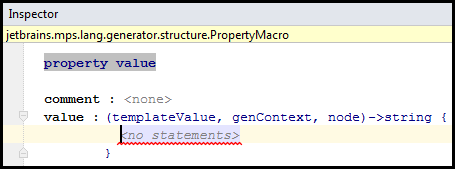

Вместо no statements укажем node.name. Как указано в нашем CalculatorImpl, на вход мы получаем узел Calculator. Он является INamedConcept, т.е. у него есть name. Соответственно, его мы и получим как Property Macro.

Далее, приступаем к написанию GUI. Для него мы воспользуемся Java Swing. Для этого нам понадобятся следующие зависимости:
- javax.swing@java_stub
- javax.swing.event@java_stub
- java.awt@java_stub
- javax.swing.text@java_stub

Чтобы их импортировать откроем контекстное меню для **main@generator** и выберем **"Model Properties"**. Зависимости - это не язык. Поэтому, воспользуемся вкладкой "Dependencies". Добавим там вышеуказанные зависимости.

Теперь мы можем отнаследовать наш класс CalculatorImpl от JFrame.
Добавим метод update:
```
public void update() {
}
```

Добавим далее DocumentListener, который будет следить за изменением в полях ввода:
```
private DocumentListener listener = new DocumentListener() {
	public void insertUpdate(DocumentEvent event) { update(); }
    public void removeUpdate(DocumentEvent event) { update(); }
    public void changeUpdate(DocumentEvent event) { update(); }
}
```

И теперь опишем сам main метод:
```
public static void main(string[] args) {
	SwingUtilities.invokeLater(new Runnable() {
    	public void run() {
        	new CalculatorImpl();
        }
    })
}
```

Теперь реализуем конструктор калькулятора, который настроит нам JFrame:
```
public CalculatorImpl() {
	setTitle("Calculator");
    setLayout(new GridLayout(0, 2));
    update();
    setDefaultCloseOperation(JFrame.EXIT_ON_CLOSE);
    pack();
    setVisible(true);
}
```
Мы теперь умеем пользоваться макро. Хотим вместо Calculator использовать название калькулятора. Легко. Встаём внутрь кавычек, нажимаем Alt+Enter, Add Property Macro и выбираем node.name.

Теперь, займёмся полями ввода. Добавим создание одного InputField:
```
private JTextField inputField = new JTextField();
```
Но у нас ведь должны быть inputField для каждого поля. Поэтому, выбираем inputField, нажимаем Alt+Enter и выбираем **"Add Node Macro"**:

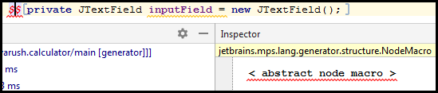

Между двумя знаками доллара введём **LOOP**. Инспектор отобразит сразу настройки:

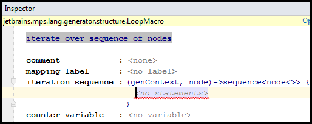

Укажем **node.inputField**. Как мы помним, node для нас - концепт Calculator (указан у нас в input). А inputField указан в children:

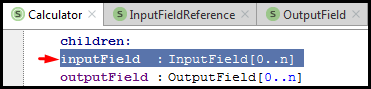

Но это ещё не всё. Давайте добавим каждому полю уникальное имя. Для этого снова добавим Property Macro (Alt+Enter на inputField, "Add Property Macro"). Далее вместо "no statements" введём волшебную фразу:
``genContext.unique name from ("inputField") in context(<no node>)``
Аналогично необходимо поступить с outputField.

Вернёмся к CalculatorImpl конструктору и добавим туда перед update() :
```
{
	inputField.getDocument().addDocumentListener(listener);
	add(new JLabel("Title"));
	add(inputField);
}
```
В фигурные скобки мы поместили это для того, чтобы это воспринималось как единый блок кода. Тогда его можно поместить в цикл. Выделим скобку и через меню Intention (Alt + Enter) выберем Add Node Macro. Укажем цикл для **node.inputField**.
Вместо "Title" укажем Property Macro для node.name.

Далее переходим к описанию ссылок на "Field Declaration".
Field Declaration - это такие описания, который связаны с самим Field и генерируются JetBrains MPS на основе этих Field. Зачем это нужно?
Нужно это потому что с одной стороны у нас есть InputField, а с другой стороны у нас есть соответствующий ему JTextField, который MPS сгенерирetn по этому InputField. Нам нужно со ссылки на InputField сгенерировать ссылку на JTextField. Чтобы это сделать, нужен label для FieldDeclaration, чтобы по этому Label находить поле. Немного запутанно, но рано или поздно это станет нам понятно =)

Для начала, нам нужно описать хранилище (storage) для сгенерированных FieldDeclaration. Label для inputField будет ссылаться на FieldDeclaration сгенерированный по InputField.
Возвращаемся в main@generator и укажем **mapping labels** - это и есть наш storage.
Встанем на ``` << ... >> ```, нажмём Enter и теперь заполним:

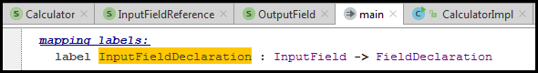

Теперь, мы можем в нашем классе (где у нас написан код) указать label:

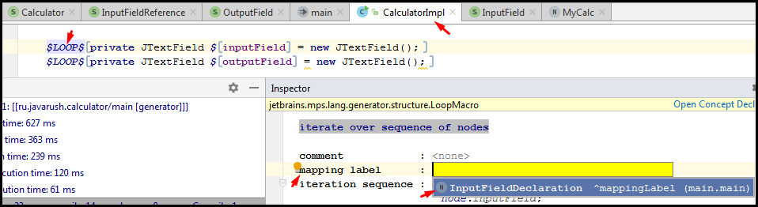

Теперь нам нужно заменить ссылку на inputField на ссылку найденную через label. Для этого нам нужно использовать **"Reference Macro"**:

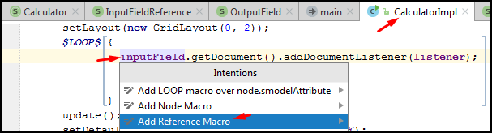

После этого у нас откроется окно инспектора. В нём нам нужно выбрать следующее:

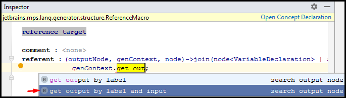

Вместо ``choose mapping label`` указываем **InputFieldDeclaration**, а вместо ``inputNode`` вписываем **node**.
Аналогичные действия повторяем для второй ссылки на inputField внизу макроса LOOP.
Далее аналогично повторяет и для OutputField.
Добавим блок кода:
```java
{
  add(new JLabel("Output"));
  add(outputField);
}
```
Встаём на фигурные скобки и через меню Intention (Alt + Enter) добавляем Node Macro. Указываем макро ``$LOOP$`` и итерируемся по **node.outputField**.
Повторяем для outputField, который во второй строке с add тоже, что делали для inputField.

Теперь, нам остаётся только реализовать код, который обновляет результат расчёта.
Нас интересует метод update. Добавим:

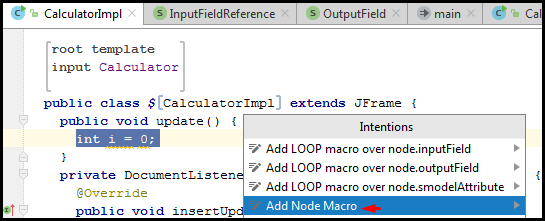

Создаём LOOP макро. В обучающей статье умудрились немного пропустить это. Но т.к. сказано, что "int local variable for each input node", то наш LOOP будет по **node.inputField**.
Также укажем каждой локальной переменной уникальное имя. Для этого выберем i и через контекстное Intention меню (Alt + Enter) создадим **Property Macro**.
Укажем значение макро:
``` genContext.unique name from ("i") in context

Чтобы ссылаться на переменные нам нужны наши любимые label. Добавим к input и output лэйблам новый:


Теперь добавим новое макро к нашей локальной переменной:

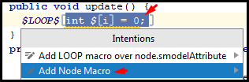

Называться макро должен ``$MAP_SRC$``. В **Mapping label** укажем **LocalVar**.
Далее добавим Try-catch блок ниже:

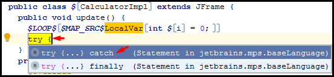

Перехватываться будем **NumberFormatException**, а в try блоке добавим:
```java
i = Integer.parseInt(inputField.getText());
```
Кроме того, выделив эту строку добавим ей Node Macro $LOOP$ через Intention меню.
Итерируемся мы всё так же по **node.inputField**.

Теперь, созаздим ссылку на label. Выбираем в try-catch блоке переменную i и через контекстное меню Intention выбираем **Add Reference Macro**, как мы делали до этого.
Указываем в инспекторе statement для referent'а:
``genContext.get output LocalVar for (node)``

Аналогичную reference добавляет в этой же строчке для inputField, но в referent'е укажем не LocalVar, а **InputFieldDeclaration**.

И теперь добавляем выходное поле ниже и делаем по нему Node Macro цикла $LOOP$, но уже по OutputValue:

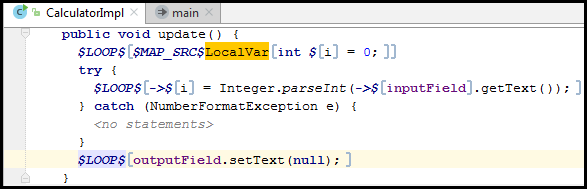

Далее выбираем outputField и добавляем Reference Macro через Intention меню.
В качестве referent указываем:
``genContext.get output OutputFieldDeclaration for (node);``

Далее заменим аргумент setText с null на ``"" + (null)``.
Пусть не пугает null. Выберем его и добавим Node Macro со значеним ``$COPY_SRC$``.
Это хитрый макро, который заменяет null на значение из инспектора.
Добавим mapped node со значением **node.expression**.

Осталось описать обработку InputFieldReference. Нам нужно заменить ссылку значением, полученным из JTextField соответствующему ссылающемуся на него inputField.

The only thing that's left is handling the InputFieldReference. We don't have a generator for it yet. We need to replace the reference with the value retrieved from the JTextField corresponding to the refered input field.

Соответствующая переменная i хранится в LocalVar label. Чтобы создать генератор для InputFieldReference вы должны определить **"Reduction Rule"**. Эти Rule применяются ко всем node, которые копируется во время генерации (например, в макро $COPY_SRC$).

Создадим такое Reduction Rule в main@generator'е:

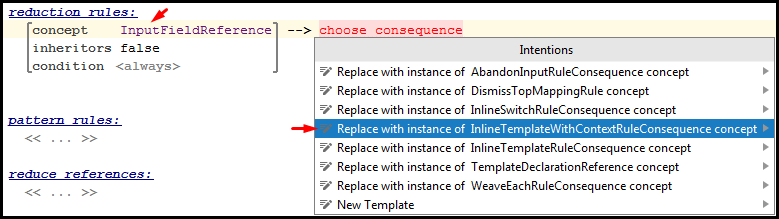

Далее нам нужно указать context node, который будет содержать нашу local variable reference. Укажем **BlockStatement** в качестве content node. BlockStatement автоматически превращается в блок:
```java
{
<no statement>
}
```
Заполним блок следующим простым кодом:
```java
int i;
i = 1 + i;
```
Эта ссылка на локальную переменную i (local variable i), которую мы будем использовать как результат in-line template. Поэтому, мы должны пометить её как template fragment.
Выбираем здесь в выражении суммирования нашу переменную i, которая после плюса. Через контекстное меню Intention выбираем **"Create Template Fragment"**.
Кроме того, делаем на ней же через контекстное меню Intention новый Reference Macro. В качестве referent указываем:
``genContext.get output LocalVar for (node.field)``

Осталось только пересобрать наш язык. Для этого нажимаем правой кнопкой мыши по нашему языку (помечен иконкой с буквой L) и выбираем **Rebuild Language**.

## [↑](#Home) <a name="run"></a> Запуск генератора
Мы проделали долги путь. И нам осталось только запустить и проверить, что всё работает правильно.
Предположим, у нас в Solution есть следующий экземпляр калькулятора:

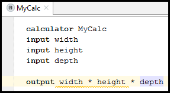

Через контекстное меню Solution для начала выполняем сборку (Make Model).
