# <a name="Home"></a> JetBrains MPS Intro

## Table of Content:
- [Intro](#intro)
- [Знакомство с MPS. Концепты](#concepts)
- [Base Language](#base)
- [Generator](#generator)
- [Запуск генератора](#run)


## [↑](#Home) <a name="intro"></a> Intro
Предлагаю окунуться в дебри одной интересной темы. Представим себе программиста Василия, к которому обратился кто-то (назовём его заказчиком) с просьбой написать калькулятор некоторых величин. Программист вынужден вникнуть в то, какие величины нужно посчитать заказчику и для чего и реализовать это. Далее, появился другой заказчик, который захотел в калькулятор добавить что-то. А потом это повторялось снова и снова. И тогда Василий подумал, что было бы здорово, чтобы заказчик мог сам смог сделать то, что он хочет, не трогая программиста. Было бы здорово, чтобы заказчик говоря в терминах своей предметной области смог не умея программировать как-то получить результат. И тогда на помощь решил прийти JetBrains MPS:


Таким образом JetBrains MPS позволяет предоставить заказчику понятный этому заказчику предметно-ориентирированный язык (DSL - Domain-specific Language), на котором заказчик может описать свою задачу и получить результат. На эту тему можно посмотреть короткий промо ролик от JetBrains: [Intro Video of JetBrains MPS](https://www.youtube.com/watch?v=1yQ5kj6svRM).

Чтобы понять, как это работаем, воспользуемся материалом:
"[MPS Calculator Language Tutorial](https://www.jetbrains.com/help/mps/mps-calculator-language-tutorial.html)".

## [↑](#Home) <a name="concepts"></a> Знакомство с MPS. Концепты
Итак, нам понадобится с вами среда разработки - JetBrains MPS. Её можно скачать с официального сайта, из раздела: "[Download MPS](https://www.jetbrains.com/mps/download/#section=windows)".

Запускаем JetBrains MPS и создаём новый проект: "Create New Project".
Так как мы собираемся создавать Domain Specific Language, то очевидно, что нам нужно создать именно "Language Project".

Имя проекта (Project Name) укажем "Calculator". Название языка (Language Name) укажем в стиле, похожим на то, как мы именуем пакеты в Java: **ru.javarush.calculator**. Так же поставим галку на "Create Sandbox Solution". Sandbox Solution - это так называемая "песочница", в которой мы сможем протестировать наш язык. Нажимаем "ОК" и начинаем наш путь познания JetBrains MPS.

Структуру DSL, описываемого в JetBrains MPS, формируют так называемые концепты (concepts). Сгруппированные концепты формируют модель языка, описывающую структуру. Поэтому, в JetBrains MPS мы увидим в дереве на вкладке "Project", а в нём раздел "Structure".
В нём мы сейчас начнём описывать концепты, из которых состоит наш калькулятор.
И прежде всего, создадим концепт самого калькулятора. Для этого через контекстное меню модели "structure" (будет называть этот раздел в терминах MPS) выберем **"New → Concept"**.
Вместо **"no name"** укажем название "Calculator".
Далее, сразу стоит запомнить (это действительно важно), что JetBrains MPS подобно IntelliJ Idea IDE умеет подсказывать варианты, которыми можно использовать в том или ином месте.
Для этого нужно в месте, где нужна подсказка, нажать **Ctrl + Space**:

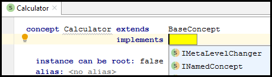

Выберем для концепта калькулятора интерфес INamedConcept, что будет означать, что наш концепт будет именованным. То есть будет иметь property с названием name, т.е. имя.
Узлы, представленные концептами, формируют дерево. Таким образом, нам нужен корневой узел. Этим корневым узлом будет наш калькулятор. Поэтому, поставим **"Instance can be root"** в значение **true**.

Итак, у нас есть концепт калькулятора. Теперь надо описать, как с ним взаимодействовать пользователю нашего DSL. И для этого есть редакторы концептов (Editor). В редактор проще всего переходить непосредственно из описаний концептов. В нижней части экрана с нашим концептом калькулятора перейдём на вкладку **"Editor"**. Так как у нас нет ещё редактора, то мы увидим предложение **"Click to create new aspect"**. Выбираем в появившемся меню пункт **"Concept Editor"**. Перед нами появится созданный новый редактор концепта нашего калькулятора:

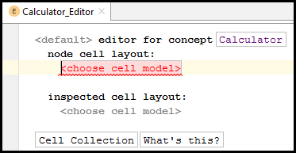

Интересно, что Concept Editor оперирует понятием ячейка (**cell**). Это ячейки и представляют узлы. Cell Collection - это набор или коллекция из различных cell.
Мы можем нажать на рамку **Cell collection** и будет добавлена новая коллекция. Как мы видим, набор ячеек начинается с "**[-**" и заканчивается "**-]**". Кроме рамки Cell Collection можно поставить курсор под **"Node cell layout"**, набрать "**[-**" и MPS автоматически завершит "**-]**", а внутри коллекции предложит **"choose cell model"**, т.е. выбрать, из каких ячеек состоит коллекция.

Так как это калькулятор, нужно ему дать заголовок. Давайте позволим пользователю нашего DSL указать название калькулятора. Для этого кликнем в **"choose cell model"**, наберём **"const"** и нажать **"Ctrl + Space"**. Нам предложат вариант **"constant"**, который представляет ячейку для описания **"text label"**:

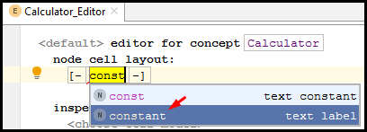

Выбираем его и наша ячейка превращается в "constant" ячейку:

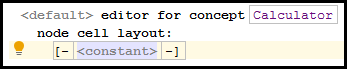

Введём теперь значение text label - константное значение calculator.

Теперь нам нужна ещё ячейка, в которой будет вводиться название калькулятора. Для добавления новой ячейке нажмём Enter. Как видно, в коллекции появилась новая ячейка.
Как мы помним, наш концепт калькулятора стал именнованным концептом (т.е. концептом, у которого есть имя) благодаря тому, что он реализует интерфейса **INamedConcept**.
Чтобы в редакторе использовать property из концепта используются фигурные скобки. Ввдём символ **{** и вызовем подсказку при помощи **Ctrl + Space**.
Выберем property с названием name:

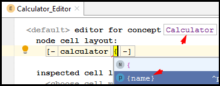

Отлично, теперь наш редактор калькулятора готов. Давайте сразу посмотрим, для чего мы описывали такой редактор. Но прежде чем использовать наш DSL мы должны его собрать. Для этого выберем в нашем проекте Calculator модуль языка, который помечен буквой "L" и в контекстном меню выбираем **"Make"**:

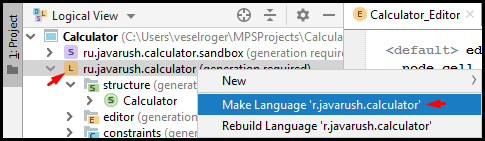

После этого в контекстном меню нашего модуля Sandbox Solution, который помечен буквой "S", выбираем модель **sandbox**.
В контекстном меню выбираем **"Model properties"** на вкладке **"Used Languages"** убедимся, что есть наш язык калькулятора:

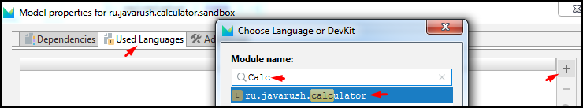

Далее в контекстном меню модели sanbox'а выбрать **New → Calculator**.
И мы получим форму, для описания Calculator так, как это указано в Calculator Editor:

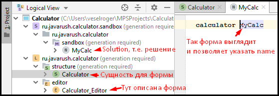

Теперь, добавим возможность указать поля ввода. Добавим концепт InputField:

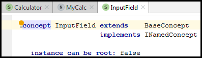

И позволим пользователю нашего DSL с ним взаимодействовать:

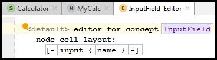

Теперь надо добавить в концепт нашего калькулятора поля воода. Для этого в концепте калькулятора нужно кликнуть на содержание элемента **"children"** и нажать Enter.
После этого нужно указать, что калькулятор содержит n штук нашего InputField:

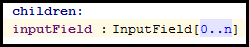

Теперь, концепт калькулятора "знает" про поля ввода. Надо теперь научить редактор позволять манипулировать этим. Переходим в концепт калькулятора, а от туда через вкладку в нижней части экрана в редактор концепта калькулятора.
Мы хотим добавить новую строку после уже имеющейся. Это наше намериение, то есть Intention. Чтобы это сделать выбираем последнюю cell и нажимаем **Alt + Enter**:

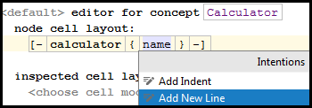

Теперь для добавления новой строки выберем ячейку с name и нажмём находясь на ней Enter. Это добавит новую ячейку, но уже на новой строке.
В появившемся **"choose cell model"** наберём знак **%** и нажмём **Ctrl + Space**, далее выберем **%inputField%**. Как мы можем догадаться, с **{** начинаются property, а с **%** начинаются дочерние элементы.
Далее, мы хотим, чтобы все добавленные поля шли вертикально вниз. Для этого нажмём **Alt + Enter** на ячейке с inputField и укажем **"Add new line for children"**:

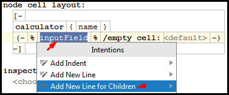

Теперь, добавим новый концепт для описания поля вывода - **OutputField**.
Наш концепт будет немного отличаться от InputField:

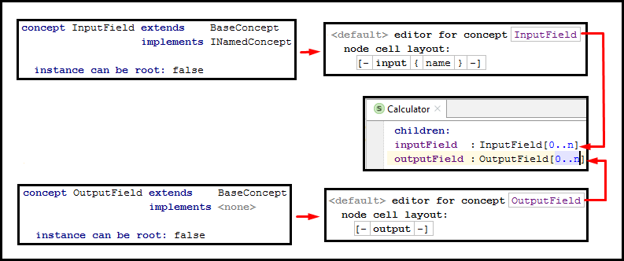

Теперь нам надо добавит OutputField в калькулятор. Для этого переходим в концепт калькулятора, а из него в редактор концепта.
Далее выбираем строку:

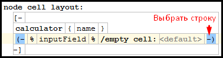

Нажимаем Ctrl+C, затем Ctrl+V. Переименовываем в новой строке inputField на outputField.
Чтобы разделить теперь inputField и outputField встанем на ячейку с inputField и нажмём Enter. В добавленной ячейке выберем constant. Нажмём на новой ячейке Alt+Enter и выберем **Add New Line**. Теперь inputField и outputField разделены пустой строкой.

Теперь можно выбрать модуль языка (помним, что он помечен буквой L) и нажать **"Ctrl + F9"** для выполнения пересборки.
Вернувшись в наш Solution мы теперь можем сделать следующее:

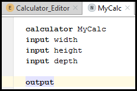

## [↑](#Home) <a name="base"></a> Base Language
Интересно, что JetBrains MPS может расширять или использовать концепты из так называемого **BaseLanguage**, которым является язык Java.
Как мы помним, мы добавляли наш язык описания калькулятора в Solution. Точно таким же образом мы можем добавить язык в наш модуль Language, где мы описываем наш DSL.

Выберем наш модуль с иконкой L и в контекстном меню перейдём в Module Properties.
После этого на вкладке **"Dependencies"** мы добавляем **"jetbrains.mps.baseLanguage"** и указываем, что **Scope - Extends**.

После этого добавляем концепт из BaseLanguage в свой концепт OutputField:

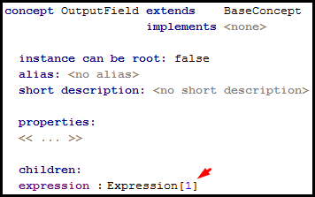

Как Вы могли догадаться, для OutputField мы хотим иметь возможность описать выражение, которое укажет, что же нужно вывести.
Теперь в OutputField Editor мы можем нажать Enter на ячейке с константой output, чтоб добавить новую, как мы делали ранее. И как мы делали ранее, сошлёмся на expression как на children элемент, то есть через символ "%":

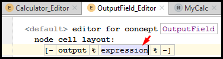

Теперь мы можем в solution указать что-нибудь вроде:
> output 2 + 2 + 5

Это, конечно хорошо, но что если мы захотим ссылаться в output на другие поля? Тут нам просто Expression недостаточно. Нам нужно созадть "расширение" для него. Выразим это расширение при помощи концепта "Ссылка на поле ввода", т.е. InputFieldReference:

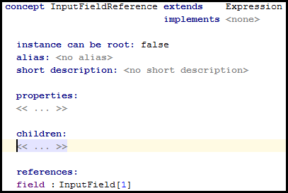

Теперь перейдём в редактор InputFieldReference:

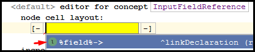

В качестве node укажем **{name}**. Таким образом мы получим:
> ( %field% -> {name} )

Такая хитрая конструкция позволяет показывать имя node, на который ссылается наша FieldReference.
**Важно** ещё сказать, что концепты, которые имеют только одну ссылку на 1-cardinality называются **smart references** и имеют особую поддержку редактором.
Теперь мы можем использовать в sandbox'е выражение вида:
> output 2 + 2 + width

Такое возможно из-за этих самых "smart reference". Так как концепт который является smart reference доступен в текущем контексте, то MPS попробует пройтись по списку возможных узлов (node), на которые MPS смог бы сделать ссылку (reference). И добавляет их в "completion list", т.е. в список, из которого мы можем выбрать. Немного кажется магией, но её в JetBrains MPS много )

## [↑](#Home) <a name="generator"></a> Generator
Наш DSL - не является самоцелью. Нам нужен DSL чтобы описать какой-то результат. JetBrains MPS использует для этого генератор. То есть на основе описания DSL генерируется некоторый результат.

Генератор предоставляется языком. Поэтому, выберем модуль языка и в контекстном меню выберем **"New → Generator"**. Если его нет в контекстном меню, значит он уже создан.
Когда генератор создан, найдём в дереве структуры нашего языка модуль "generator" (имеет иконку с буквой G).
Внутри раскроем элемент "main@generator", и откроем main.
Это - точка входа (**entry point**) в генератор. Здесь указано какие узлы нужны трансфорировать и как.

Давайте реализовывать генератор калькулятора. Выберем **main@generator** и в контекстном меню выберем **"New → j.mps.baseLanguage → class"**. Мы увидим интересную конструкцию:

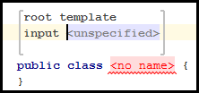

В input мы указываем node, для которого необходимо выполнить генерацию. Укажем здесь Calculator.
Так же укажем название классу. Например: **CalculatorImpl**.

Далее, вернёмся к точке входа в генератор. Нам необходимо указать правила (**rule**), по которым будет выполнена генерация. Добавим правило:

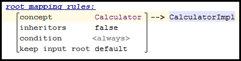

А теперь приступаем к реализации CalculatorImpl.
Для начала, давайте воспользуемся такой штукой, как Property Macro.
Выделим название класса CalculatorImpl, нажмём Alt+Enter и выберем **"Add property Macro"**. Имя класса изменится на ${CalculatorImpl}, а внизу в окне инспектора (Inspector) появится возможность настроить Property Macro:


Вместо no statements укажем node.name. Как указано в нашем CalculatorImpl, на вход мы получаем узел Calculator. Он является INamedConcept, т.е. у него есть name. Соответственно, его мы и получим как Property Macro.

Далее, приступаем к написанию GUI. Для него мы воспользуемся Java Swing. Для этого нам понадобятся следующие зависимости:
- javax.swing@java_stub
- javax.swing.event@java_stub
- java.awt@java_stub
- javax.swing.text@java_stub

Чтобы их импортировать откроем контекстное меню для **main@generator** и выберем **"Model Properties"**. Зависимости - это не язык. Поэтому, воспользуемся вкладкой "Dependencies". Добавим там вышеуказанные зависимости.

Теперь мы можем отнаследовать наш класс CalculatorImpl от JFrame.
Добавим метод update:
```
public void update() {
}
```

Добавим далее DocumentListener, который будет следить за изменением в полях ввода:
```
private DocumentListener listener = new DocumentListener() {
	public void insertUpdate(DocumentEvent event) { update(); }
    public void removeUpdate(DocumentEvent event) { update(); }
    public void changeUpdate(DocumentEvent event) { update(); }
}
```

И теперь опишем сам main метод:
```
public static void main(string[] args) {
	SwingUtilities.invokeLater(new Runnable() {
    	public void run() {
        	new CalculatorImpl();
        }
    })
}
```

Теперь реализуем конструктор калькулятора, который настроит нам JFrame:
```
public CalculatorImpl() {
	setTitle("Calculator");
    setLayout(new GridLayout(0, 2));
    update();
    setDefaultCloseOperation(JFrame.EXIT_ON_CLOSE);
    pack();
    setVisible(true);
}
```
Мы теперь умеем пользоваться макро. Хотим вместо Calculator использовать название калькулятора. Легко. Встаём внутрь кавычек, нажимаем Alt+Enter, Add Property Macro и выбираем node.name.

Теперь, займёмся полями ввода. Добавим создание одного InputField:
```
private JTextField inputField = new JTextField();
```
Но у нас ведь должны быть inputField для каждого поля. Поэтому, выбираем inputField, нажимаем Alt+Enter и выбираем **"Add Node Macro"**:


Между двумя знаками доллара введём **LOOP**. Инспектор отобразит сразу настройки:


Укажем **node.inputField**. Как мы помним, node для нас - концепт Calculator (указан у нас в input). А inputField указан в children:


Но это ещё не всё. Давайте добавим каждому полю уникальное имя. Для этого снова добавим Property Macro (Alt+Enter на inputField, "Add Property Macro"). Далее вместо "no statements" введём волшебную фразу:
``genContext.unique name from ("inputField") in context(<no node>)``
Аналогично необходимо поступить с outputField.

Вернёмся к CalculatorImpl конструктору и добавим туда перед update() :
```
{
	inputField.getDocument().addDocumentListener(listener);
	add(new JLabel("Title"));
	add(inputField);
}
```
В фигурные скобки мы поместили это для того, чтобы это воспринималось как единый блок кода. Тогда его можно поместить в цикл. Выделим скобку и через меню Intention (Alt + Enter) выберем Add Node Macro. Укажем цикл для **node.inputField**.
Вместо "Title" укажем Property Macro для node.name.

Далее переходим к описанию ссылок на "Field Declaration".
Field Declaration - это такие описания, который связаны с самим Field и генерируются JetBrains MPS на основе этих Field. Зачем это нужно?
Нужно это потому что с одной стороны у нас есть InputField, а с другой стороны у нас есть соответствующий ему JTextField, который MPS сгенерирetn по этому InputField. Нам нужно со ссылки на InputField сгенерировать ссылку на JTextField. Чтобы это сделать, нужен label для FieldDeclaration, чтобы по этому Label находить поле. Немного запутанно, но рано или поздно это станет нам понятно =)

Для начала, нам нужно описать хранилище (storage) для сгенерированных FieldDeclaration. Label для inputField будет ссылаться на FieldDeclaration сгенерированный по InputField.
Возвращаемся в main@generator и укажем **mapping labels** - это и есть наш storage.
Встанем на ``` << ... >> ```, нажмём Enter и теперь заполним:


Теперь, мы можем в нашем классе (где у нас написан код) указать label:


Теперь нам нужно заменить ссылку на inputField на ссылку найденную через label. Для этого нам нужно использовать **"Reference Macro"**:


После этого у нас откроется окно инспектора. В нём нам нужно выбрать следующее:


Вместо ``choose mapping label`` указываем **InputFieldDeclaration**, а вместо ``inputNode`` вписываем **node**.
Аналогичные действия повторяем для второй ссылки на inputField внизу макроса LOOP.
Далее аналогично повторяет и для OutputField.
Добавим блок кода:
```java
{
  add(new JLabel("Output"));
  add(outputField);
}
```
Встаём на фигурные скобки и через меню Intention (Alt + Enter) добавляем Node Macro. Указываем макро ``$LOOP$`` и итерируемся по **node.outputField**.
Повторяем для outputField, который во второй строке с add тоже, что делали для inputField.

Теперь, нам остаётся только реализовать код, который обновляет результат расчёта.
Нас интересует метод update. Добавим:


Создаём LOOP макро. В обучающей статье умудрились немного пропустить это. Но т.к. сказано, что "int local variable for each input node", то наш LOOP будет по **node.inputField**.
Также укажем каждой локальной переменной уникальное имя. Для этого выберем i и через контекстное Intention меню (Alt + Enter) создадим **Property Macro**.
Укажем значение макро:
``` genContext.unique name from ("i") in context

Чтобы ссылаться на переменные нам нужны наши любимые label. Добавим к input и output лэйблам новый:


Теперь добавим новое макро к нашей локальной переменной:


Называться макро должен ``$MAP_SRC$``. В **Mapping label** укажем **LocalVar**.
Далее добавим Try-catch блок ниже:


Перехватываться будем **NumberFormatException**, а в try блоке добавим:
```java
i = Integer.parseInt(inputField.getText());
```
Кроме того, выделив эту строку добавим ей Node Macro $LOOP$ через Intention меню.
Итерируемся мы всё так же по **node.inputField**.

Теперь, созаздим ссылку на label. Выбираем в try-catch блоке переменную i и через контекстное меню Intention выбираем **Add Reference Macro**, как мы делали до этого.
Указываем в инспекторе statement для referent'а:
``genContext.get output LocalVar for (node)``

Аналогичную reference добавляет в этой же строчке для inputField, но в referent'е укажем не LocalVar, а **InputFieldDeclaration**.

И теперь добавляем выходное поле ниже и делаем по нему Node Macro цикла $LOOP$, но уже по OutputValue:


Далее выбираем outputField и добавляем Reference Macro через Intention меню.
В качестве referent указываем:
``genContext.get output OutputFieldDeclaration for (node);``

Далее заменим аргумент setText с null на ``"" + (null)``.
Пусть не пугает null. Выберем его и добавим Node Macro со значеним ``$COPY_SRC$``.
Это хитрый макро, который заменяет null на значение из инспектора.
Добавим mapped node со значением **node.expression**.

Осталось описать обработку InputFieldReference. Нам нужно заменить ссылку значением, полученным из JTextField соответствующему ссылающемуся на него inputField.

The only thing that's left is handling the InputFieldReference. We don't have a generator for it yet. We need to replace the reference with the value retrieved from the JTextField corresponding to the refered input field.

Соответствующая переменная i хранится в LocalVar label. Чтобы создать генератор для InputFieldReference вы должны определить **"Reduction Rule"**. Эти Rule применяются ко всем node, которые копируется во время генерации (например, в макро $COPY_SRC$).

Создадим такое Reduction Rule в main@generator'е:


Далее нам нужно указать context node, который будет содержать нашу local variable reference. Укажем **BlockStatement** в качестве content node. BlockStatement автоматически превращается в блок:
```java
{
<no statement>
}
```
Заполним блок следующим простым кодом:
```java
int i;
i = 1 + i;
```
Эта ссылка на локальную переменную i (local variable i), которую мы будем использовать как результат in-line template. Поэтому, мы должны пометить её как template fragment.
Выбираем здесь в выражении суммирования нашу переменную i, которая после плюса. Через контекстное меню Intention выбираем **"Create Template Fragment"**.
Кроме того, делаем на ней же через контекстное меню Intention новый Reference Macro. В качестве referent указываем:
``genContext.get output LocalVar for (node.field)``

Осталось только пересобрать наш язык. Для этого нажимаем правой кнопкой мыши по нашему языку (помечен иконкой с буквой L) и выбираем **Rebuild Language**.

## [↑](#Home) <a name="run"></a> Запуск генератора
Мы проделали долги путь. И нам осталось только запустить и проверить, что всё работает правильно.